Currently, Hextra supports [Mermaid](#mermaid) for diagrams.

<!--more-->

## Mermaid

[Mermaid](https://github.com/mermaid-js/mermaid#readme) is a JavaScript based diagramming and charting tool that takes Markdown-inspired text definitions and creates diagrams dynamically in the browser. For example, Mermaid can render flow charts, sequence diagrams, pie charts and more.

Using Mermaid in Hextra is as simple as writing a code block with language set `mermaid`:

````markdown

````

will be rendered as:


### Diagram Code 👨‍💻

````markdown

````




```mermaid
flowchart TD
    A[Christmas] -->|Get money| B(Go shopping)
    B --> C{Let me think}
    C -->| 1️⃣ One | D[💻 Laptop]
    C -->|Two| E[📱 iPhone]
    C -->|Three| F[fa:fa-car Car 🚗]

```

```meramid
flowchart RL
    A@{ shape: manual-file, label: "File Handling"}
    B@{ shape: manual-input, label: "User Input"}
    C@{ shape: docs, label: "Multiple Documents"}
    D@{ shape: procs, label: "Process Automation"}
    E@{ shape: paper-tape, label: "Paper Records"}
```


### 🐭 Animate Arrow


````markdown

````


### Ⓜ️ Markdown in Mermaid 

````markdown
```mermaid
flowchart LR
subgraph "One"
 a("`The **cat**
 in the hat`") -- "edge label" --> b{{"`The **dog** in the hog`"}}
end
subgraph "`**Two**`"
 c("`The **cat**
 in the hat`") -- "`Bold **edge label**`" --> d("The dog in the hog")
end
```
````

```mermaid
flowchart LR
subgraph "One"
 a("`The **cat**
 in the hat`") -- "edge label" --> b{{"`The **dog** in the hog`"}}
end
subgraph "`**Two**`"
 c("`The **cat**
 in the hat`") -- "`Bold **edge label**`" --> d("The dog in the hog")
end

```

```mermaid
flowchart LR
 A-->B
 B-->C
 C-->D
 click A callback "Tooltip for a callback"
 click B "https://www.github.com" "This is a tooltip for a link"
 click C call callback() "Tooltip for a callback"
 click D href "https://www.github.com" "This is a tooltip for a link"
```

### 💅 CSS Styling in Mermaid 

````markdown
```mermaid
flowchart LR
 id1(Start)-->id2(Stop)
 style id1 fill:#f9f,stroke:#333,stroke-width:4px
 style id2 fill:#bbf,stroke:#f66,stroke-width:2px,color:#fff,stroke-dasharray: 5 5
```
````

```mermaid
flowchart LR
 id1(Start)-->id2(Stop)
 style id1 fill:#f9f,stroke:#333,stroke-width:4px
 style id2 fill:#bbf,stroke:#f66,stroke-width:2px,color:#fff,stroke-dasharray: 5 5
```

```mermaid
flowchart LR
 A:::someclass --> B
 classDef someclass fill:#f96
```

```mermaid
flowchart LR
 A:::foo & B:::bar --> C:::foobar
 classDef foo stroke:#f00
 classDef bar stroke:#0f0
 classDef foobar stroke:#00f

```

## Squence Diagram 

Sequence diagram:

```mermaid
sequenceDiagram
    participant Alice
    participant Bob
    Alice->>John: Hello John, how are you?
    loop Healthcheck
        John->>John: Fight against hypochondria
    end
    Note right of John: Rational thoughts <br/>prevail!
    John-->>Alice: Great!
    John->>Bob: How about you?
    Bob-->>John: Jolly good!
```

```mermaid
sequenceDiagram
    actor Alice
    actor Bob
    Alice->>Bob: Hi Bob
    Bob->>Alice: Hi Alice
```

## Mindmaps 🗺️

```mermaid
mindmap
  root((mindmap))
    Origins
      Long history
      ::icon(fa fa-book)
      Popularisation
        British popular psychology author Tony Buzan
    Research
      On effectiveness<br/>and features
      On Automatic creation
        Uses
            Creative techniques
            Strategic planning
            Argument mapping
    Tools
      Pen and paper
      Mermaid


```

## TImeline ⌛

```mermaid
timeline
    title History of Social Media Platform
    2002 : LinkedIn
    2004 : Facebook
         : Google
    2005 : YouTube
    2006 : Twitter
```

## Pie Chart 🍰

```mermaid
pie title Pets adopted by volunteers
    "Dogs" : 386
    "Cats" : 85
    "Rats" : 15
```

### 🅱️ Basic Pie Chart

````markdown
```mermaid
pie title What Voldemort doesn't have?
         "FRIENDS" : 2
         "FAMILY" : 3
         "NOSE" : 45
```
````

```mermaid
pie title What Voldemort doesn't have?
         "FRIENDS" : 2
         "FAMILY" : 3
         "NOSE" : 45
```

## State Diagram

```mermaid
stateDiagram-v2
    [*] --> Still
    Still --> [*]

    Still --> Moving
    Moving --> Still
    Moving --> Crash
    Crash --> [*]
```

## Entity Relationship Diagram

```mermaid
erDiagram
    CUSTOMER ||--o{ ORDER : places
    ORDER ||--|{ LINE-ITEM : contains
    CUSTOMER }|..|{ DELIVERY-ADDRESS : uses
```

## Architectpure 

```mermaid
architecture-beta
    group api(cloud)[API]

    service db(database)[Database] in api
    service disk1(disk)[Storage] in api
    service disk2(disk)[Storage] in api
    service server(server)[Server] in api

    db:L -- R:server
    disk1:T -- B:server
    disk2:T -- B:db
```

## Radar ☢️ 

```mermaid
radar-beta
  axis m["Math"], s["Science"], e["English"]
  axis h["History"], g["Geography"], a["Art"]
  curve a["Alice"]{85, 90, 80, 70, 75, 90}
  curve b["Bob"]{70, 75, 85, 80, 90, 85}

  max 100
  min 0
```


## More info ♾️ 

For more information, please refer to [Mermaid Documentation](https://mermaid-js.github.io/mermaid/#/).