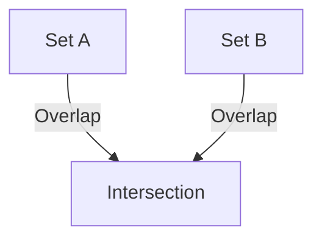
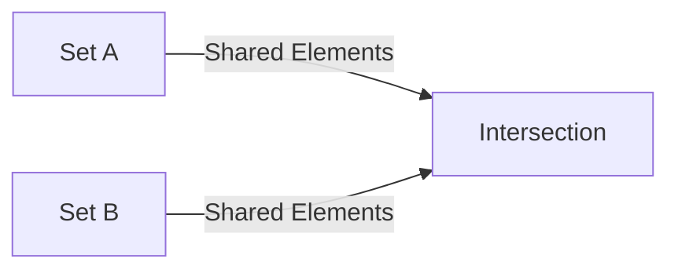

## Venn Diagrams in Mermaid.js: Current Status and Alternatives

### **Can You Create Venn Diagrams in Mermaid.js?**

**Direct support for Venn diagrams is NOT currently available in Mermaid.js.**

- As of May 2025, Mermaid.js supports many diagram types (flowcharts, sequence diagrams, ER diagrams, etc.), but Venn diagrams are not yet implemented in the official syntax or documentation[^2][^3][^4][^5].
- There is an open feature request and discussion about adding Venn/Euler diagram support, but it has not been merged or released[^1].

> venn and euler can be two different directives... using this MIT licensed library, it should be easy to add venn: https://github.com/benfred/venn.js ... just need to parse the syntax and use the lib syntax...
> - [GitHub Issue \#2583][^1]

### **What Are Your Options?**

#### **1. Use Mermaid.js for Other Diagrams**

- You can use Mermaid.js for flowcharts, graphs, and other set-like representations, but not for true Venn diagrams[^2][^4][^5].
- Example (not a Venn diagram, but a basic set relation):




#### **2. Use External Libraries for Venn Diagrams**

- For actual Venn diagrams, use a specialized library like [venn.js](https://github.com/benfred/venn.js)[^1].
- These libraries allow you to create interactive and accurate Venn diagrams with multiple sets and intersections.


#### **3. Diagram Workarounds**

- You can visually approximate a Venn diagram in Mermaid.js using subgraphs or overlapping nodes, but this is not true Venn logic and will not scale or look correct for complex diagrams.


#### **4. Keep Track of Mermaid.js Updates**

- The Mermaid.js community is aware of the demand for Venn diagrams, and this feature may be added in the future[^1].
- Watch the [official GitHub issue](https://github.com/mermaid-js/mermaid/issues/2583) for progress.

---

## **Summary Table**

| Feature | Mermaid.js Support | Workaround/Alternative |
| :-- | :-- | :-- |
| Venn Diagrams | ❌ Not supported | Use venn.js or similar |
| Euler Diagrams | ❌ Not supported | Use venn.js or similar |
| Set Relations (basic) | ✔️ Supported | Use graph or flowchart types |
| Official Syntax | ❌ | N/A |


---

## **Example: Mermaid.js Flowchart (Not a True Venn Diagram)**




---

```mermaid
    vennDiagram(
      a,b
      b,c
      a,c
      a,b,c
    );
```    

## **Conclusion**

- **You cannot create true Venn diagrams in Mermaid.js as of now.**
- Use [venn.js](https://github.com/benfred/venn.js) or other visualization libraries for Venn diagrams.
- For set relationships, use Mermaid’s flowcharts or graphs as a workaround[^2][^4][^5].
- Stay tuned to the [GitHub issue](https://github.com/mermaid-js/mermaid/issues/2583) for future updates on this feature.

---

**References:**
[^1] GitHub Issue: Venn Diagram Syntax
[^2] Swimm.io Mermaid.js Guide
[^3][^4][^5] Mermaid.js Official Documentation

<div style="text-align: center">⁂</div>

[^1]: https://github.com/mermaid-js/mermaid/issues/2583

[^2]: https://swimm.io/learn/mermaid-js/mermaid-js-a-complete-guide

[^3]: https://mermaid.js.org

[^4]: https://mermaid.js.org/intro/syntax-reference.html

[^5]: https://mermaid.js.org/syntax/examples.html

[^6]: https://mermaid.js.org/config/usage.html

[^7]: https://mermaid.js.org/syntax/sequenceDiagram.html

[^8]: https://www.drawio.com/blog/mermaid-diagrams

[^9]: https://mermaid.js.org/syntax/block.html

[^10]: https://css-tricks.com/making-mermaid-diagrams-in-markdown/

