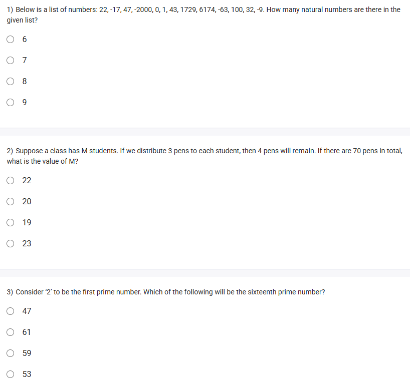
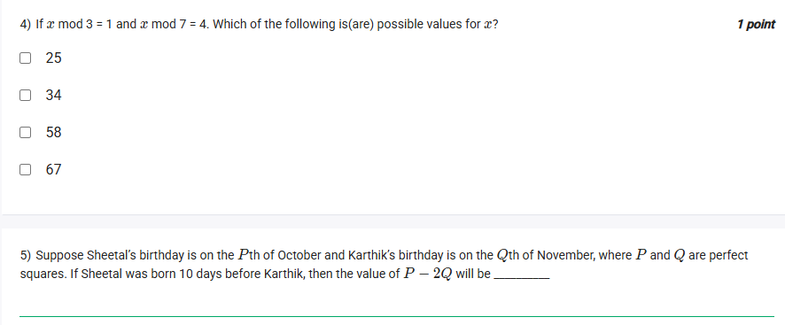

Of course! Let's dive deep into the world of Natural Numbers and their operations. We'll start from the very basics and build up to the properties that govern them.



## Identifying Natural Numbers and Integers

**Natural numbers** are positive whole numbers, used for counting: 1, 2, 3, 4, 5, ....[^1][^2]
**Integers** include all positive and negative whole numbers and zero: ..., -3, -2, -1, 0, 1, 2, 3, ....[^3]

- Example images: Diagrams often show natural numbers on a number line starting at 1, with integers extending in both directions to negative numbers.[^4][^1]
[^4]
- Natural numbers set: $\mathbb{N} = \{1, 2, 3, 4, 5, \dots\}$.[^2][^1]
- Integers set: $\mathbb{Z} = \{\dots, -2, -1, 0, 1, 2, \dots\}$.[^5][^3]

## Distinguishing Between Notations: ($\mathbb{N}$), ($\mathbb{Z}$), ($\mathbb{Z}_n$)

- **N** ($\mathbb{N}$): Natural numbers set ($1, 2, 3, ...$).[^6][^1]
- **Z** ($\mathbb{Z}$): Integers set ($..., -2, -1, 0, 1, 2, ...$).[^6]
- **ZN** ($\mathbb{Z}_n$): Modular integers—the set of possible remainders when dividing by $n$ ($0,1,\ldots, n-1$).

Example: Venn diagram notation can show relationships; N could fit inside Z on a diagram.[^7][^6]
[^4]

## Multiplication and Division as Addition/Subtraction

- **Multiplication** is repeated addition:

$$
3 \times 4 = 3 + 3 + 3 + 3 = 12
$$

Imagine four groups, each with three objects—adding up all objects gives the same as multiplication.[^8]
- **Division** is repeated subtraction:

$$
15 \div 5: 15 - 5 = 10, 10 - 5 = 5, 5 - 5 = 0
$$

The number of times 5 is subtracted until reaching zero is the quotient (here, 3).[^9][^8]

Visual: Diagrams often show sets of objects grouped or repeatedly removed, or jumps on a number line illustrating subtraction.
[^4]

## Quotient, Remainder, and Modulus

- **Quotient**: The result of division (number of times divisor "fits" in dividend).
- **Remainder**: What’s left after dividing as far as possible.
- **Modulus (mod)**: The remainder after division.

Example: $14 \div 5 = 2$ remainder $4$, so $14$ mod $5 = 4$.

Visual: Number lines or division diagrams often show repeated subtraction steps, grouping leftover items as remainder.[^9]

## Factors and Prime Factorization

- **Factors**: Numbers that divide another exactly. Example: 12’s factors are 1, 2, 3, 4, 6, 12.
- **Prime Factorization**: Breaking a number into prime numbers multiplied together.
Example: 12 = 2 × 2 × 3 = $2^2 \times 3$.

Visual: Factor trees are diagrams showing branches, each end-point is a prime number.[^1]
[^4]

***

### Table: Sets and Concepts

| Concept | Notation | Example | Image Reference |
| :-- | :-- | :-- | :-- |
| Natural numbers | $\mathbb{N}$ | 1,2,3,... | [^4] |
| Integers | $\mathbb{Z}$ | ..., -1,0,1 | [^5] |
| Modular integers | $\mathbb{Z}_n$ | 0,1,...,n-1 | [^4] |
| Factors of 12 | n/a | 1,2,3,4,6,12 | [^4] |
| Prime factorization | n/a | 12 = $2^2\times3$ | [^4] |

---

## Exercise Questions 🤯



### 1) How many natural numbers are there in the given list?

**List:** 22, -17, 47, -2000, 0, 1, 43, 1729, 6174, -63, 100, 32, -9.

**Solution:**
Natural numbers ($\mathbb{N}$) are positive whole numbers: $\{1, 2, 3, ...\}$, and do not include 0 or negatives.[^1][^2]
Filtering the list:

- **22** — Yes
- -17 — No
- **47** — Yes
- -2000 — No
- 0 — No
- **1** — Yes
- **43** — Yes
- **1729** — Yes
- **6174** — Yes
- -63 — No
- **100** — Yes
- **32** — Yes
- -9 — No

There are **8 natural numbers**: 22, 47, 1, 43, 1729, 6174, 100, 32.[^2]
[^3]





### 2) If we distribute 3 pens to each student and 4 pens remain, what is the value of M?

**Solution:**
Given: Total pens = 70, pens per student = 3, pens left over = 4, number of students = $M$.

Use Division Algorithm:

$$
\text{Total} = (\text{Pens per student} \times M) + \text{Remainder}
$$

So:

$$
70 = (3 \times M) + 4 \implies 66 = 3M \implies M = \frac{66}{3} = 22
$$

Thus, **M = 22**.[^4]





### 3) Which of the following will be the sixteenth prime number?

**Solution:**
List out the first sixteen primes:[^5]
2, 3, 5, 7, 11, 13, 17, 19, 23, 29, 31, 37, 41, 43, 47, **53**

Therefore, the **sixteenth prime number is 53**.





### 4) If z mod 31 and z mod 74. Which of the following is (are) possible values for z?

**Solution:**
Possible remainders from modulus operations must be between 0 and one less than the divisor:[^4]

- For $z \mod 31$: remainder must be in \$\$
- For $z \mod 74$: remainder must be in \$\$

Test options:

- $z = 25$: Valid for both
- $z = 34$: Invalid for mod 31
- $z = 58$: Invalid for mod 31
- $z = 67$: Invalid for mod 31

Thus, **25** is the only possible value.





### 5) If Sheetal's birthday is on the Pth of October and Karthik's is on the Qth of November... find the value of P + 20.

**Solution:**
P and Q are perfect squares, October/November birthdays, and Sheetal is 10 days before Karthik:

Perfect squares up to 31: 1, 4, 9, 16, 25
Let $P = 25$ (25th October).

If Karthik is born 10 days later:
Days left in October after 25th = 31-25 = 6; Karthik's birthday is 4th November, which is also a perfect square.

Thus:
P = 25, Q = 4
$P + 20 = 25 + 20 = 45$



⁂

[^1]: https://byjus.com/maths/natural-numbers/

[^2]: https://www.cuemath.com/numbers/natural-numbers/

[^3]: https://www.pinterest.com/pin/633387438370444/

[^4]: https://www.vedantu.com/maths/division-is-a-process-of-repeated-subtraction

[^5]: https://study.com/academy/lesson/classification-of-numbers.html

