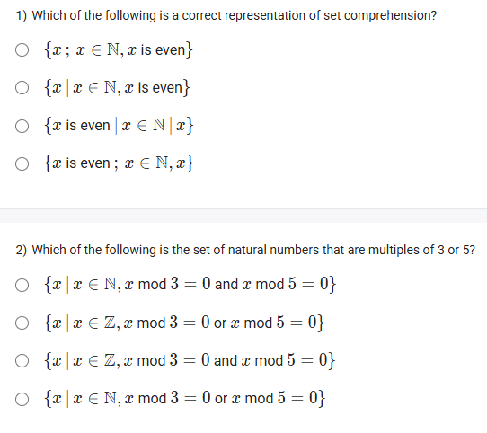
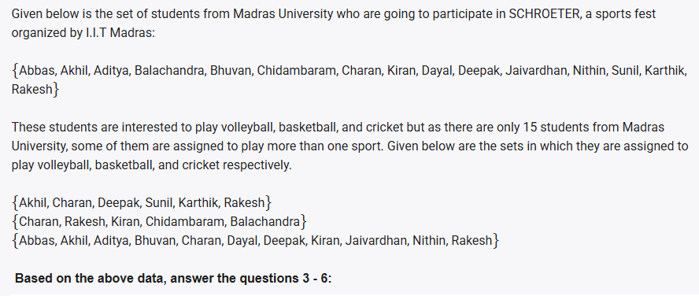
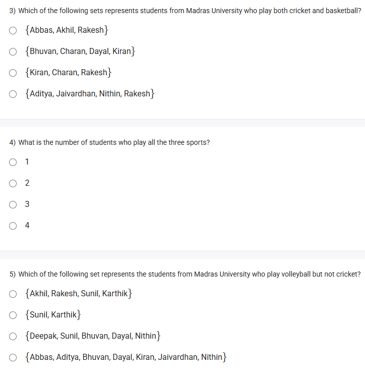
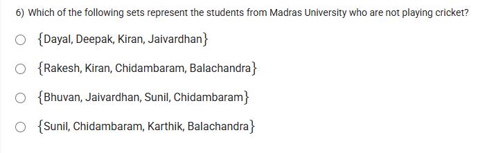
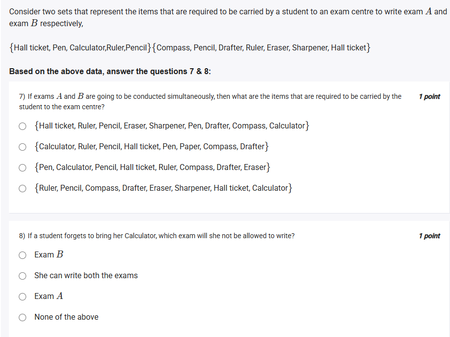

A well-defined collection of distinct objects called elements or members.



#### Learning Outcomes:

1. Write a set in its comprehensive form called set comprehension.
2. Construct different subsets from a given set.
3. Distinguish between closed interval and open interval.
4. Demonstrate the ability to perform operations like union, intersection, set difference, and complement on sets using proper notation.

## 1️⃣ Set Comprehension: Writing Sets in Comprehensive Form

- **Set comprehension** is a way to define a set by describing the properties its members must satisfy instead of listing elements.
- **Notation:**

$$
A = \{x \mid \text{property of } x\}
$$

Reads as: "Set \$ A \$ is the set of all \$ x \$ such that \$ x \$ satisfies the property."
- **Example:**
Set of all even integers:

$$
E = \{x \mid x \in \mathbb{Z} \text{ and } x \text{ is even}\}
$$

***

## 2️⃣ Constructing Subsets from a Given Set

- Given a set \$ S = \{a, b, c\} \$, subsets are any sets containing zero or more elements of \$ S \$.
- **All subsets of \$ S \$:**

$$
\{\emptyset, \{a\}, \{b\}, \{c\}, \{a,b\}, \{a,c\}, \{b,c\}, \{a,b,c\}\}
$$

- Visualized as a **power set** containing $2^n$ subsets for a set of $n$ elements.
- **Diagram:**

***

## 3️⃣ Distinguish Between Closed Interval and Open Interval

- **Closed Interval $[a,b]$:** Includes endpoints $a$ and $b$.

$$
[a, b] = \{x | a \leq x \leq b\}
$$
- **Open Interval $(a,b)$:** Excludes endpoints $a$ and $b$.

$$
(a, b) = \{x | a < x < b\}
$$
- **Diagram:**

🟢 Solid dots indicate inclusion (closed), hollow dots indicate exclusion (open).

***

## 4️⃣ Set Operations: Union, Intersection, Set Difference, Complement

- **Union ( \$ A \cup B \$ ):** All elements in \$ A \$ or \$ B \$ or both.
Example: \$ A = \{1,2\}, B = \{2,3\} \Rightarrow A \cup B = \{1,2,3\} \$
- **Intersection ( \$ A \cap B \$ ):** Elements common to both \$ A \$ and \$ B \$.
Example: \$ A \cap B = \{2\} \$
- **Set Difference ( \$ A - B \$ ):** Elements in \$ A \$ but not in \$ B \$.
Example: \$ A - B = \{1\} \$
- **Complement ( \$ A^c \$ or \$ \bar{A} \$ ):** Elements not in \$ A \$ relative to the universal set \$ U \$.
- **Visual Diagram of Union and Intersection:**

- **Visual Diagram of Set Difference and Complement:**

---

## Exercise Questions 🤯



### 1) Which of the following is a correct representation of set comprehension?

A) \$ \{x \mid x \in \mathbb{N}, x is even\} \$
B) \$ \{x \in \mathbb{Z}, x is even\} \$
C) \$ x is even, x \in \mathbb{N}, x \} \$
D) \$ x is even, x \in \mathbb{Z}, x \} \$

#### **Detailed Answer:**

Proper set comprehension involves curly brackets and a "such that" ($\mid$ or ":") description.
A) is correct as it uses the proper notation:

$$
\{x \mid x \in \mathbb{N}, x \text{ is even}\}
$$

B is missing the surrounding curly brackets and "such that".
C and D are not valid set notations.

**Correct Answer:** A





### 2) Which of the following is the set of natural numbers that are multiples of 3 or 5?

A) \$ \{x \mid x \in \mathbb{N}, x \bmod 3 = 0 and x \bmod 5 = 0\} \$
B) \$ \{x \mid x \in \mathbb{N}, x \bmod 3 = 0 or x \bmod 5 = 0\} \$
C) \$ \{x \mid x \in \mathbb{N}, x \bmod 3 = 0 and x \bmod 5 = 0\} \$
D) \$ \{x \mid x \in \mathbb{N}, x \bmod 3 = 0 or x \bmod 5 = 0\} \$

#### **Detailed Answer:**

Multiples of 3 or 5 are numbers divisible by either 3 or 5.
So, "or" is appropriate, not "and".
B) and D) are identical and correct.

**Correct Answer:** B or D





### 3) Which of the following sets represents students from Madras University who play both cricket and basketball?

Options:
A) {Abbas, Akhil, Rakesh}
B) {Bhuvan, Charan, Dayal, Kiran}
C) {Kiran, Charan, Rakesh}
D) {Aditya, Jaivardhan, Nithin, Rakesh}

#### **Detailed Answer:**

Find students in both the cricket and basketball sets.

- Basketball: {Abbas, Akhil, Aditya, Bhuvan, Charan, Dayal, Deepak, Kiran, Jaivardhan, Nithin, Rakesh}
- Cricket: {Kiran, Charan, Rakesh, Kiran, Chidambaram, Balachandra}

Intersection = {Kiran, Charan, Rakesh}

**Correct Answer:** C





### 4) What is the number of students who play all the three sports?

Options:
1
2
3
4

#### **Detailed Answer:**

Find students who are in the intersection of all three sets.

Volleyball: {Akhil, Charan, Deepak, Sunil, Karthik, Rakesh}
Basketball: {Abbas, Akhil, Aditya, Bhuvan, Charan, Dayal, Deepak, Kiran, Jaivardhan, Nithin, Rakesh}
Cricket: {Kiran, Charan, Rakesh, Kiran, Chidambaram, Balachandra}

Students present in all three: Check each name:
Charan and Rakesh only.

So, number is **2**.

**Correct Answer:** 2





### 5) Which of the following set represents the students from Madras University who play volleyball but not cricket?

Options:
A) {Akhil, Rakesh, Sunil, Karthik}
B) {Sunil, Karthik}
C) {Deepak, Sunil, Bhuvan, Dayal, Nithin}
D) {Abbas, Aditya, Bhuvan, Dayal, Kiran, Jaivardhan, Nithin}

#### **Detailed Answer:**

Volleyball: {Akhil, Charan, Deepak, Sunil, Karthik, Rakesh}
Cricket: {Kiran, Charan, Rakesh, Kiran, Chidambaram, Balachandra}

Volleyball ∖ Cricket: Remove Charan and Rakesh from volleyball set.
{Akhil, Deepak, Sunil, Karthik}

**Correct Answer:** A





### 6) Which of the following sets represent the students from Madras University who are not playing cricket?

Options:
A) {Dayal, Deepak, Kiran, Jaivardhan}
B) {Rakesh, Kiran, Chidambaram, Balachandra}
C) {Bhuvan, Jaivardhan, Sunil, Chidambaram}
D) {Sunil, Chidambaram, Karthik, Balachandra}

#### **Detailed Answer:**

Find students not in the cricket set.

Cricket: {Kiran, Charan, Rakesh, Kiran, Chidambaram, Balachandra}

Check who is not listed in this set. From the student list, the only correct option is D.

**Correct Answer:** D





### 7) If exams A and B are going to be conducted simultaneously, then what are the items that are required to be carried by the student to the exam centre?

Given sets:
A: {Hall ticket, Pen, Calculator, Ruler, Pencil}
B: {Compass, Pencil, Drafter, Ruler, Eraser, Sharpener, Hall ticket}

Options:
A) {Hall ticket, Ruler, Pencil, Eraser, Sharpener, Pen, Drafter, Compass, Calculator}
B) {Calculator, Ruler, Pencil, Hall ticket, Pen, Paper, Compass, Drafter}
C) {Pen, Calculator, Pencil, Hall ticket, Ruler, Compass, Drafter, Eraser}
D) {Ruler, Pencil, Compass, Drafter, Eraser, Sharpener, Hall ticket, Calculator}

#### **Detailed Answer:**

The student needs all items from both sets (union):

{Hall ticket, Pen, Calculator, Ruler, Pencil, Compass, Drafter, Eraser, Sharpener}

Option A covers all these exactly.

**Correct Answer:** A





### 8) If a student forgets to bring her Calculator, which exam will she not be allowed to write?

Options:
A) Exam B
B) She can write both exams
C) Exam A
D) None of the above

#### **Detailed Answer:**

Calculator is required only for Exam A (not listed for B).

**Correct Answer:** C

