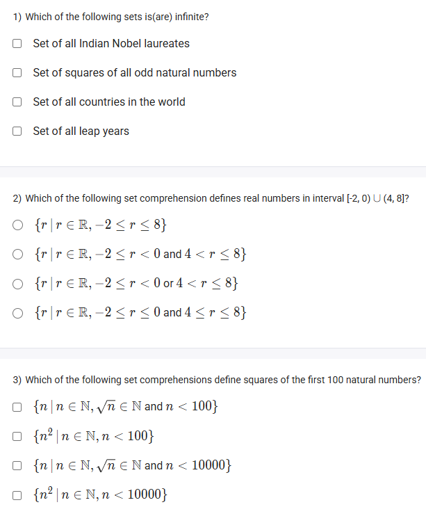
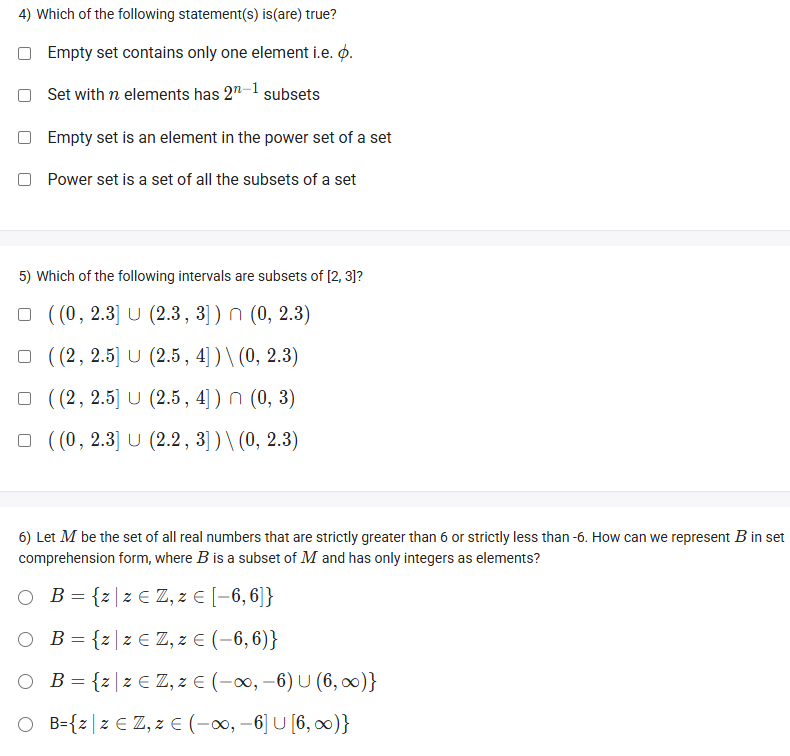
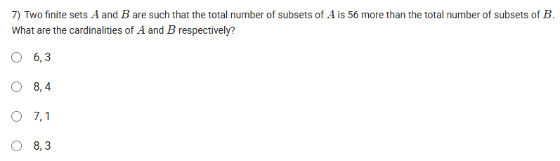

A well-defined collection of distinct objects called elements or members.



#### Learning Outcomes:

1. Describe the membership of sets.
2. Recognize that set comprehension combines generators, filters, and transformations to produce new sets from old sets.

## 1️⃣ Describe the Membership of Sets

- **Membership** refers to whether an element belongs to a set or not.
- **Notation:**
    - If $x$ is an element of set $A$, we write:

$$
x \in A
$$

pronounced as “$x$ belongs to $A$.”
    - If $x$ is not an element of $A$, write:

$$
x \notin A
$$

pronounced as “$x$ does not belong to $A$.”
- **Example:**
$A = \{2, 4, 6, 8\}$, then $4 \in A$, but $5 \notin A$.

***

### Diagram Showing Membership:

*The circles represent sets. The arrows indicate membership from elements to the set.*

***

## 2️⃣ Recognize Set Comprehension as Generators, Filters, and Transformations

- **Set comprehension** is a powerful method to **create new sets** from existing ones using:
    - **Generators:** Specify where elements come from (like a base set)
    - **Filters:** Conditions to **select** certain elements
    - **Transformations:** Expressions to **transform** elements before including them in the new set
- **Form:**

$$
\{ \text{transform}(x) \mid x \in \text{base set}, \text{filter condition on } x \}
$$
- **Example:**

Given set $S = \{1, 2, 3, 4, 5\}$, create a new set of squares of even numbers:

$$
A = \{ x^2 \mid x \in S, x \text{ is even} \} = \{4, 16\}
$$
- The process:
    - **Generator:** $x \in S$
    - **Filter:** $x \text{ is even}$
    - **Transformation:** $x^2$

***

### Diagram Example of Set Comprehension:

*Elements filtered and transformed from a base set into a new set.*

***

This explanation covers how to understand set membership and the multiple components combined in set comprehension visually and conceptually.

***

## Excercise Questions 🤯



### 1) Which of the following sets is(are) infinite?

- Set of all Indian Nobel laureates
- Set of squares of all odd natural numbers
- Set of all countries in the world
- Set of all leap years

#### **Detailed Answer:**

- Set of Indian Nobel laureates: Finite (limited individuals).
- Set of squares of all odd natural numbers: **Infinite** (there are infinitely many odd numbers).
- Set of all countries in the world: Finite.
- Set of all leap years: **Infinite** (calendar continues indefinitely).

**Correct Answers:**

- Set of squares of all odd natural numbers
- Set of all leap years





### 2) Which of the following set comprehension defines real numbers in interval $[-2,0) \cup (4,8]$?

A: \$ \{r \mid r \in \mathbb{R}, -2 \le r < 8\} \$
B: \$ \{r \mid r \in \mathbb{R}, -2 \le r < 0 and 4 < r \le 8\} \$
C: \$ \{r \mid r \in \mathbb{R}, -2 \le r < 0 or 4 < r \le 8\} \$
D: \$ \{r \mid r \in \mathbb{R}, -2 \le r < 0 and 4 \le r \le 8\} \$

#### **Detailed Answer:**

We require $r$ to be in $[-2,0)$ **or** in $(4,8]$. This means "or," not "and".

**Correct Answer:** C





### 3) Which of the following set comprehensions define squares of the first 100 natural numbers?

- \$ \{ n \mid n \in \mathbb{N}, \sqrt{n} \in \mathbb{N} and n < 100 \} \$
- \$ \{ n^2 \mid n \in \mathbb{N}, n < 100 \} \$
- \$ \{ n \mid n \in \mathbb{N}, \sqrt{n} \in \mathbb{N} and n < 10000 \} \$
- \$ \{ n^2 \mid n \in \mathbb{N}, n < 10000 \} \$

#### **Detailed Answer:**

The set of all numbers that can be written as \$ n^2 \$, with \$ n \$ a natural number less than 100:

$$
\{ n^2 \mid n \in \mathbb{N}, n < 100 \}
$$

This gives us all squares from $1^2 = 1$ to $99^2 = 9801$, a total of 99 numbers.

**Correct Answer:** Second option





### 4) Which of the following statement(s) is(are) true?

- Empty set contains only one element i.e. \$ \phi \$.
- Set with \$ n \$ elements has $2^n-1$ subsets.
- Empty set is an element in the power set of a set.
- Power set is a set of all the subsets of a set.

#### **Detailed Answer:**

- Empty set contains **no elements** (so the first is FALSE).
- Power set contains $2^n$ subsets (not $2^n-1$), so this is FALSE.
- The empty set is always an element of the power set (TRUE).
- The power set is indeed the set of all subsets (TRUE).

**Correct Answers:**

- Empty set is an element in the power set of a set.
- Power set is a set of all the subsets of a set.





### 5) Which of the following intervals are subsets of ?[^1]

- $((0, 2.3] \cup (2.3, 3]) \cap (0, 2.3))$
- $((2, 2.5] \cup (2.5, 4]) \setminus (0, 2.3))$
- $((2, 2.5] \cup (2.5, 4]) \cap (0, 3))$
- $((0, 2.3] \cup (2.2, 3)) \setminus (0, 2.3))$

#### **Detailed Answer:**

Looking for intervals entirely contained in.[^1]

- (2, 2.5] is within ; (2.5, 4] is not because 4 > 3.[^1]
- The only part within  is (2, 2.5].[^1]
- Option 3 only keeps pieces within (0, 3):
(2, 2.5] is kept; (2.5, 4] gets cut to (2.5, 3).

Thus, interval $((2, 2.5] \cup (2.5, 4]) \cap (0, 3)) = (2, 2.5] \cup (2.5, 3)$ is a subset of.[^1]

**Correct Answer:** Third option





### 6) Let \$ M \$ be the set of all real numbers that are strictly greater than 6 or strictly less than -6. How can we represent \$ B \$ in set comprehension form, where \$ B \$ is a subset of \$ M \$ and has only integers as elements?

- \$ B = \{ z \mid z \in \mathbb{Z}, z \in [-6, 6]\} \$
- \$ B = \{ z \mid z \in \mathbb{Z}, z \in (-6, 6)\} \$
- \$ B = \{ z \mid z \in \mathbb{Z}, z \in (-\infty, -6) \cup (6, \infty)\} \$
- \$ B = \{z \mid z \in \mathbb{Z}, z \in (-\infty, -6] \cup [6, \infty)\}\$

#### **Detailed Answer:**

\$ M = \{x \in \mathbb{R} \mid x < -6 or x > 6\} \$.
\$ B \$ is the subset consisting only of integers.

So, \$ B = \{ z \mid z \in \mathbb{Z}, z < -6 or z > 6\} = \{ z \mid z \in \mathbb{Z}, z \in (-\infty, -6) \cup (6, \infty)\} \$.

**Correct Answer:** Third option.





### 7) Two finite sets \$ A \$ and \$ B \$ are such that the total number of subsets of \$ A \$ is 56 more than that of \$ B \$. What are the cardinalities of \$ A \$ and \$ B \$ respectively?

Options:

- 6, 3
- 8, 4
- 7, 1
- 8, 3

#### **Detailed Answer:**

Let \$ |A| = m, |B| = n \$.

Number of subsets: \$ 2^m = 2^n + 56 \$

Try possible combinations:

\$ n = 3: 2^3 = 8 \$
\$ m = 6: 2^6 = 64; 64 - 8 = 56 \$

So, \$ |A| = 6, |B| = 3 \$.

**Correct Answer:** 6, 3


[^2]

⁂

[^1]: image.jpg

[^2]: image.jpg

