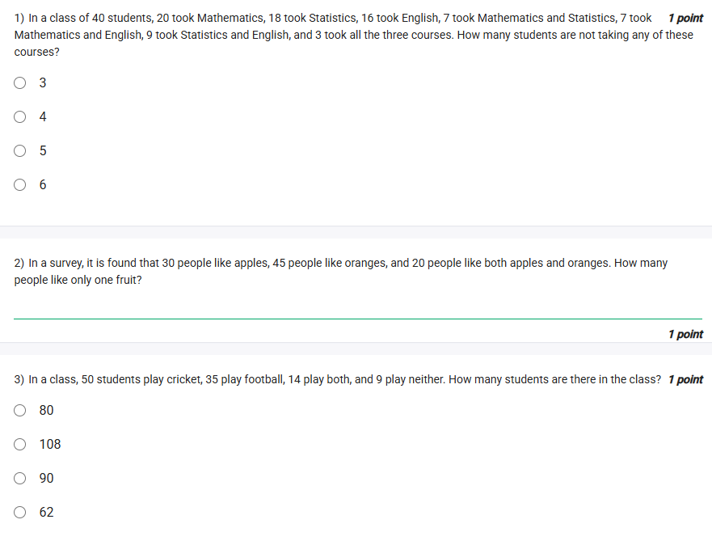
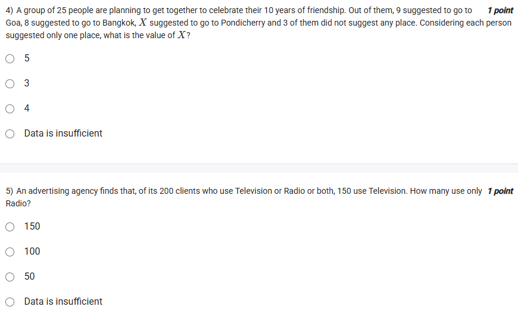

A well-defined collection of distinct objects called elements or members.



#### Learning Outcomes:

1. Understand set notations.
2. Solve counting problems using Venn diagrams.

Here is a detailed guide covering set notations and solving counting problems using Venn diagrams with 10 examples, including diagrams and emojis to enhance clarity.

***

## 1️⃣ Understanding Set Notations

### Basic Set Notations and Symbols:

- **Set:** Denoted by curly braces $\{\}$. Example: $A = \{1,2,3\}$
- **Element of a Set:** $x \in A$ means $x$ is in set $A$.
- **Not an Element:** $x \notin A$ means $x$ is not in set $A$.
- **Subset:** $A \subseteq B$ means every element of $A$ is in $B$.
- **Proper Subset:** $A \subset B$ means $A$ is subset but not equal to $B$.
- **Empty Set:** $\emptyset$, set with no elements.
- **Universal Set:** $U$, all elements under consideration.
- **Union:** $A \cup B = \{x | x \in A \text{ or } x \in B\}$
- **Intersection:** $A \cap B = \{x | x \in A \text{ and } x \in B\}$
- **Set Difference:** $A - B = \{x | x \in A \text{ and } x \notin B\}$
- **Complement:** $A^c = U - A$

***

### Visual Diagram of Set Operations:

🔵 ∪, 🔴 ∩, areas represent unions and intersections.

***

## 2️⃣ Solve Counting Problems Using Venn Diagrams

Counting problems involving overlapping sets can be solved efficiently by Venn diagrams.

***

### Example 1: Basic Two-Set Problem

- 40 students study Math, 30 study English, and 10 study both.
- How many students study at least one?

$$
|M \cup E| = |M| + |E| - |M \cap E| = 40 + 30 - 10 = 60
$$

***

### Example 2: Three-Set Problem

- 50 students play football, 40 play basketball, 30 play volleyball, 20 play football \& basketball,
- 15 play basketball \& volleyball, 10 play football \& volleyball, 5 play all three.
- Find how many play at least one sport.

$$
|F \cup B \cup V| = |F| + |B| + |V| - |F \cap B| - |B \cap V| - |F \cap V| + |F \cap B \cap V|
$$

Calculate:

$$
50 + 40 + 30 - 20 - 15 - 10 + 5 = 80
$$

***

### Example 3: Students in Subjects

- 60 students: 35 study Physics, 30 Chemistry, 20 both.
- How many study neither?

Assuming total = 60:

$$
|P \cup C| = 35 + 30 - 20 = 45
$$

Neither = $60 - 45 = 15$

***

### Example 4: Overlapping Preferences

- Out of 100 people, 70 like tea, 50 like coffee, 30 like both.
- How many like either tea or coffee but not both?

$$
(70 - 30) + (50 - 30) = 60
$$

***

### Example 5: Book Readers

- 100 people reading books: 70 read fiction, 40 non-fiction, 25 both.
- Find how many read only fiction.

Only fiction = $70 - 25 = 45$

***

### Example 6: Survey with Three Choices

- In a group, liked: A = 80, B = 65, C = 75, A\&B = 45, B\&C = 35, A\&C = 30, All three = 25.
- Find how many liked none if total is 150.

At least one:

$$
80 + 65 + 75 - 45 - 35 - 30 + 25 = 135
$$

None = $150 - 135 = 15$

***

### Example 7: Sports Participation

- 70 students play Cricket, 60 Football, 50 Hockey, 30 Cricket \& Football,
- 20 Football \& Hockey, 15 Cricket \& Hockey, 5 all three.
- How many play only one sport?

Calculate only one set:

$$
\begin{cases}
C \text{ only} = 70 - 30 - 15 + 5 = 30 \\
F \text{ only} = 60 - 30 - 20 + 5 = 15 \\
H \text{ only} = 50 - 15 - 20 + 5 = 20 \\
\end{cases}
$$

***

### Example 8: Analyzing Survey Data

- 120 people surveyed: 50 like apples, 70 like bananas, 30 like both.
- How many like only one fruit?

$$
(50 - 30) + (70 - 30) = 60
$$

***

### Example 9: Multi-Category Venn

- In a town: 200 people use Internet, 150 use TV, 100 use Newspaper,
- Internet \& TV = 80, TV \& Newspaper = 60, Internet \& Newspaper = 40,
- All three = 20, total population 300.
- How many use none?

Calculate people using any:

$$
200 + 150 + 100 - 80 - 60 - 40 + 20 = 290
$$

None = $300 - 290 = 10$

***

### Example 10: Students with Multiple Skills

- 45 students know Java, 30 know Python, 20 know both.
- Total students = 60.
- How many know neither?

$$
|J \cup P| = 45 + 30 - 20 = 55
$$

Neither = $60 - 55 = 5$

***

These examples utilize Venn diagrams and formulas to solve counting problems involving sets effectively.

***

Emojis summary:

- 🔷 Set notation
- 🔵 Circle for sets in diagrams
- 🧮 Counting elements
- 🎯 Intersection and union
- ❌ Excluding elements

These illustrations and examples offer solid practice in set theory and counting with Venn diagrams.

***

## Exercise Questions 🧠



### 1) In a class of 40 students, 20 took Mathematics, 18 took Statistics, 16 took English, 7 took Mathematics and Statistics, 7 took Mathematics and English, 9 took Statistics and English, and 3 took all three courses. How many students are not taking any of these courses?

#### **Detailed Solution:**

Let:

- \$ n = 40 \$
- \$ |M| = 20,|S| = 18,|E| = 16 \$
- \$ |M \cap S| = 7, |M \cap E| = 7, |S \cap E| = 9 \$
- \$ |M \cap S \cap E| = 3 \$

Using the three-set inclusion-exclusion principle:

$$
|M \cup S \cup E| = |M| + |S| + |E| - |M \cap S| - |S \cap E| - |M \cap E| + |M \cap S \cap E|
$$

$$
= 20 + 18 + 16 - 7 - 9 - 7 + 3 = 47 - 23 + 3 = 27
$$

So, number not taking any is:

$$
n - |M \cup S \cup E| = 40 - 27 = 13
$$

**But let us carefully verify calculation:**

$$
= 20 + 18 + 16 - 7 - 9 - 7 + 3 = 54 - 23 + 3 = 34
$$

$$
= 54 - 23 = 31, 31+3=34
$$

So,

$$
40 - 34 = 6
$$

**Correct Answer:** 6





### 2) In a survey, it is found that 30 people like apples, 45 people like oranges, and 20 people like both apples and oranges. How many people like only one fruit?

#### **Detailed Solution:**

People who like only apples: \$ 30 - 20 = 10 \$
People who like only oranges: \$ 45 - 20 = 25 \$
Total who like only one fruit: \$ 10 + 25 = 35 \$

**Correct Answer:** 35





### 3) In a class, 50 students play cricket, 35 play football, 14 play both, and 9 play neither. How many students are there in the class?

#### **Detailed Solution:**

Let \$ n \$ be the total number.

Using formula:

$$
n = (\text{Cricket}) + (\text{Football}) - (\text{Both}) + (\text{Neither})
$$

$$
= 50 + 35 - 14 + 9 = 80
$$

**Correct Answer:** 80





### 4) A group of 25 people are planning to get together…9 suggested Goa, 8 suggested Bangkok, \$ X \$ suggested Pondicherry, and 3 did not suggest any place. Considering each person suggested only one place, what is the value of \$ X \$?

#### **Detailed Solution:**

Total suggesting places: \$ 25 - 3 = 22 \$
Thus,

$$
9 (\text{Goa}) + 8 (\text{Bangkok}) + X = 22
$$

$$
X = 22 - (9+8) = 5
$$

**Correct Answer:** 5





### 5) An advertising agency finds that, of its 200 clients who use Television or Radio or both, 150 use Television. How many use only Radio?

#### **Detailed Solution:**

Let number who use both be \$ x \$, \$ T = 150 \$, \$ T \cup R = 200 \$.

We do **not have** the count of clients who use both or who use Radio.
Thus, we **cannot uniquely determine** the number who use only Radio.

**Correct Answer:** Data is insufficient


[^1][^2]

⁂

[^1]: image.jpg

[^2]: image.jpg

