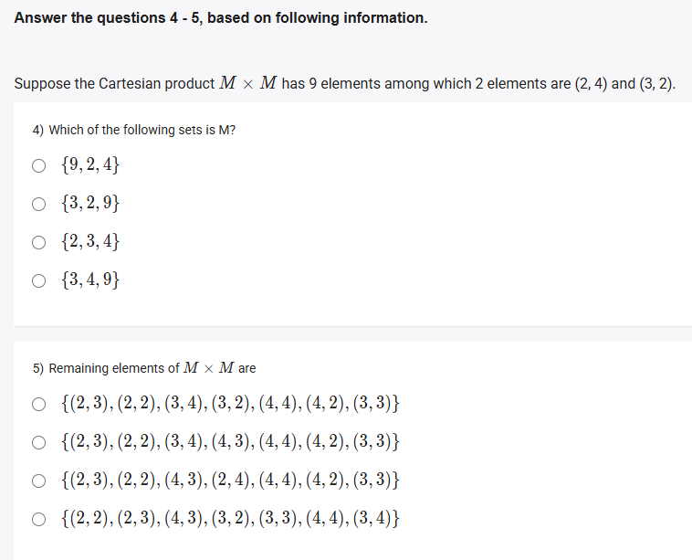
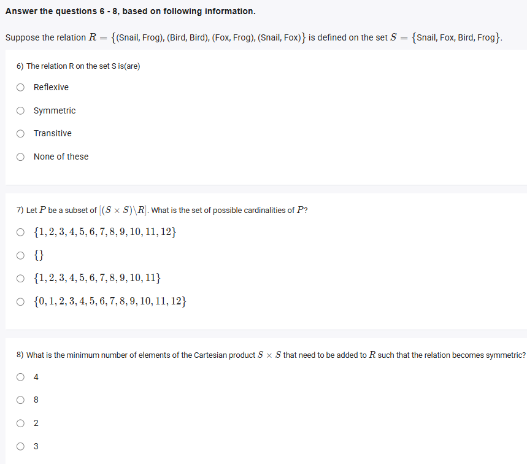

A well-defined collection of distinct objects called elements or members.



#### Learning Outcomes:

1. List the number of elements in the cartesian product of two finite sets.
2. Interpret relations as a subset of the cartesian product.
3. Represent data tables as relations.

## Exercise Questions

