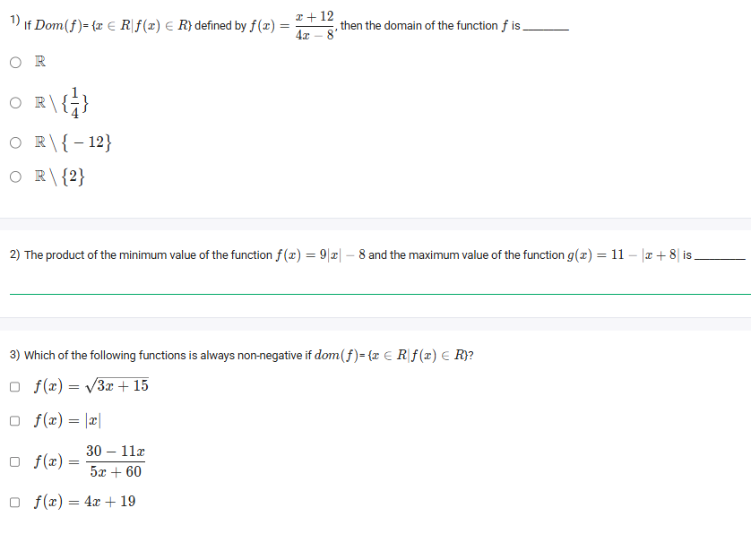
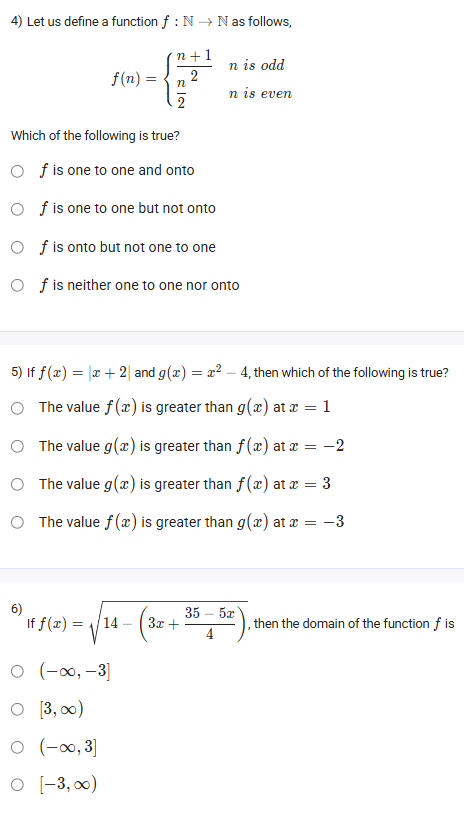
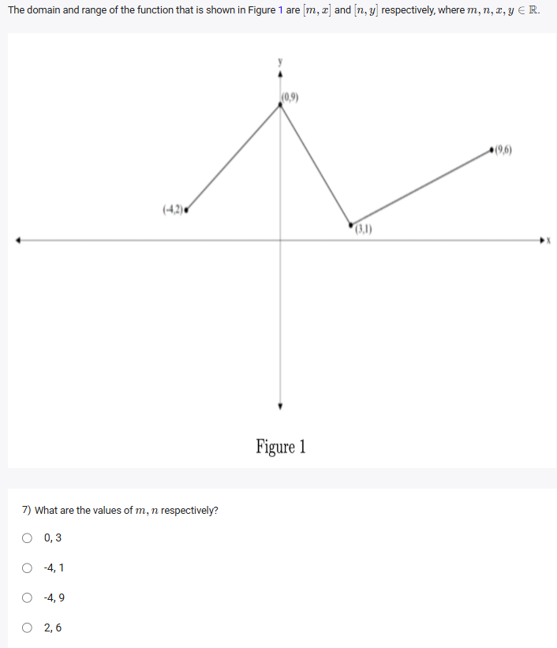
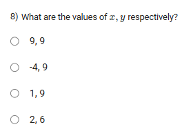

A well-defined collection of distinct objects called elements or members.



https://youtu.be/6YrUx0bAnuQ

#### Learning Outcomes:

1. Find the domain and range of a given function.
2. Understand what is the maximum value, minimum value of a function.
3. Understand ​local maximum​ and ​local minimum​.
4. Identify whether one function grows faster than another.

## Exercise Questions

