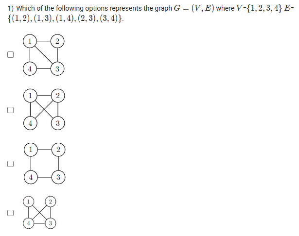
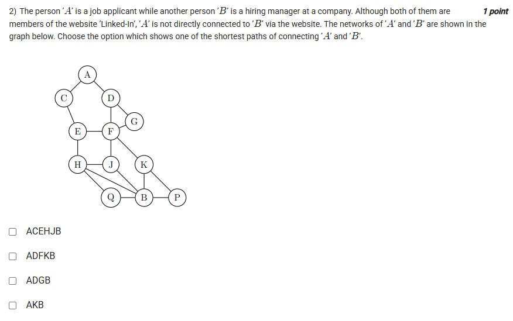
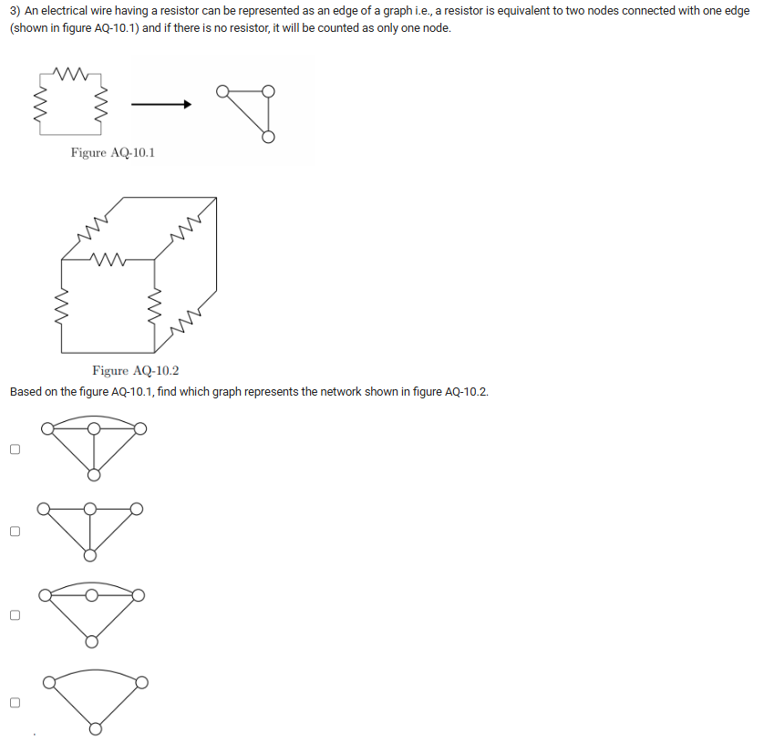
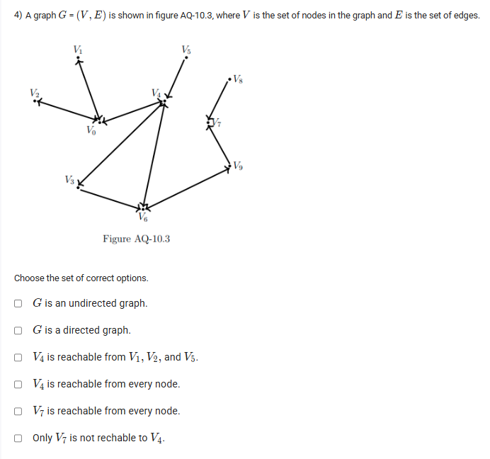

A well-defined collection of distinct objects called elements or members.



https://youtu.be/wtQ6RtTwCVk

#### Learning Outcomes:

To explain the relation as a subset of the Cartesian product

Formal introduction to graphs: vertices, edges, directed and undirected graph, path, walk

Concept of path and reachability in directed graphs

## Exercise Questions 

