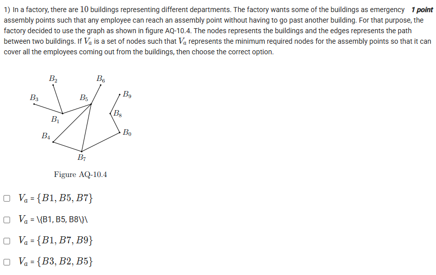
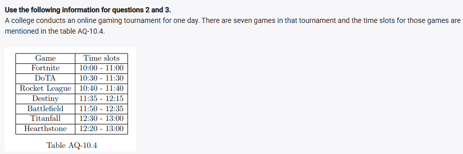
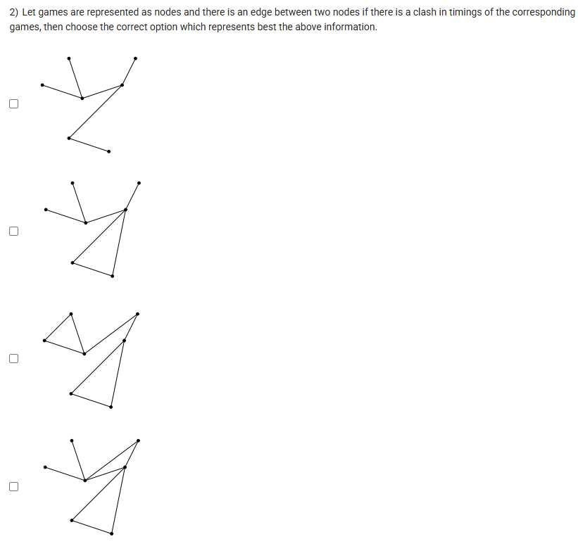
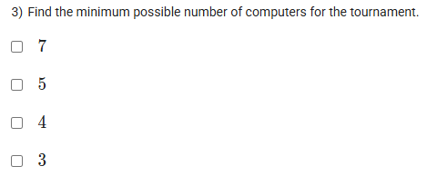
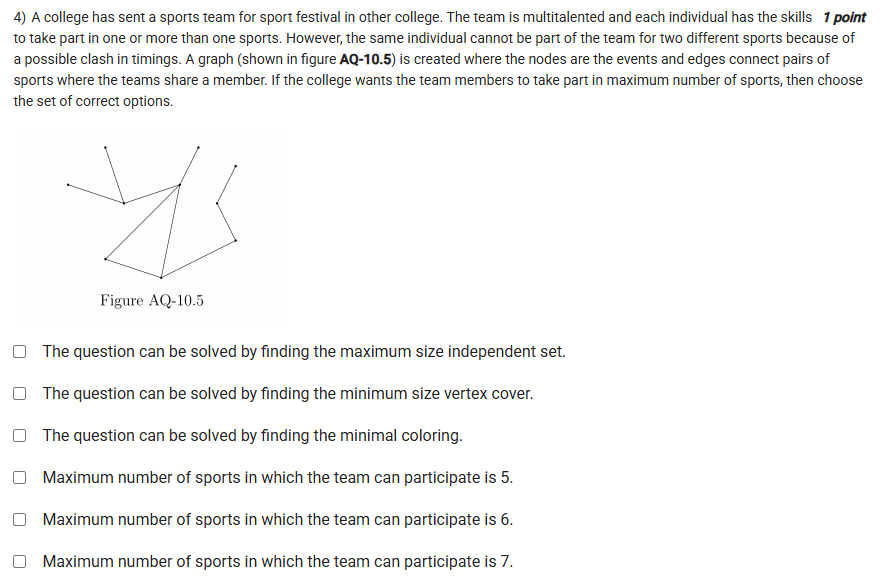

A well-defined collection of distinct objects called elements or members.



https://youtu.be/4K2wZkFKqIY

#### Learning Outcomes:

To learn the abstraction of the graph

To learn the 4 color theorem, the concepts of covering the vertex, independent sets

To learn the concepts of matching and find the maximal matching of a graph

## Exercise QUestions 🧠

