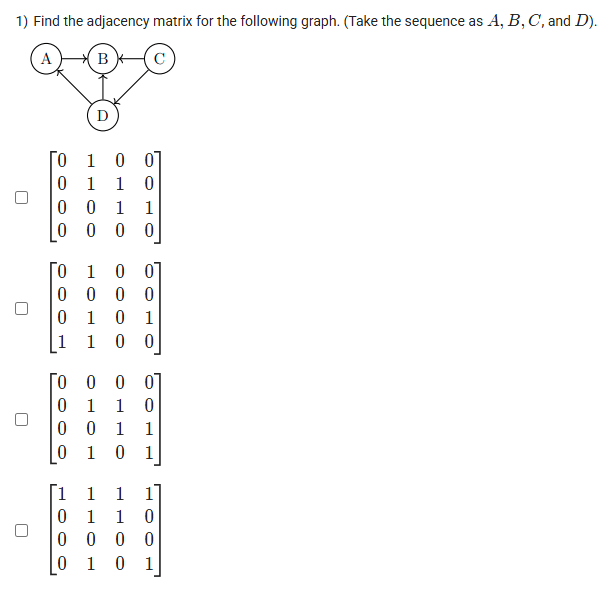
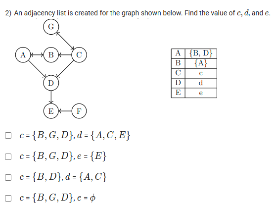
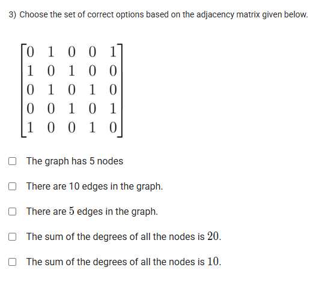

A well-defined collection of distinct objects called elements or members.



https://youtu.be/4M-1F4DORps

#### Learning Outcomes:

To learn the concept of adjacency matrix; for directed and undirected graphs

To calculate the degree of vertex, outdegree and indegree in a directed graph

## Exercise Questions 🧠

