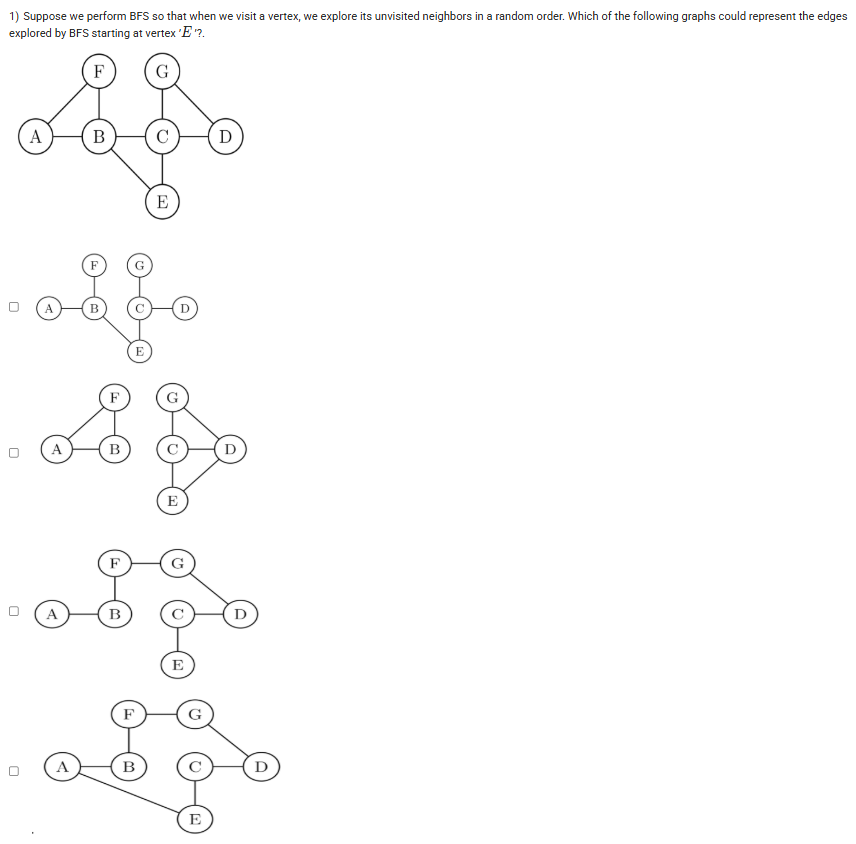
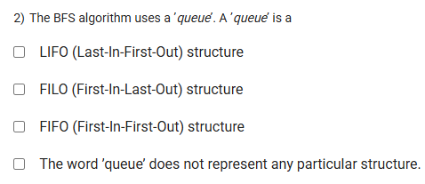

A well-defined collection of distinct objects called elements or members.



https://youtu.be/WPaX9PFJY_4

#### Learning Outcomes:

To explore reachability of a vertex in a graph- breadth first and depth first approaches

To learn the ‘breadth first search’(BFS) algorithm, concept of ‘queue’

To calculate distance of a vertex from the source vertex with help of BFS

## Exercise Questions 🧠

