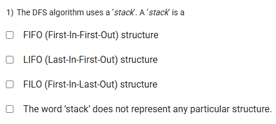
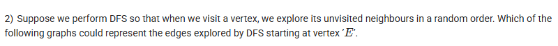
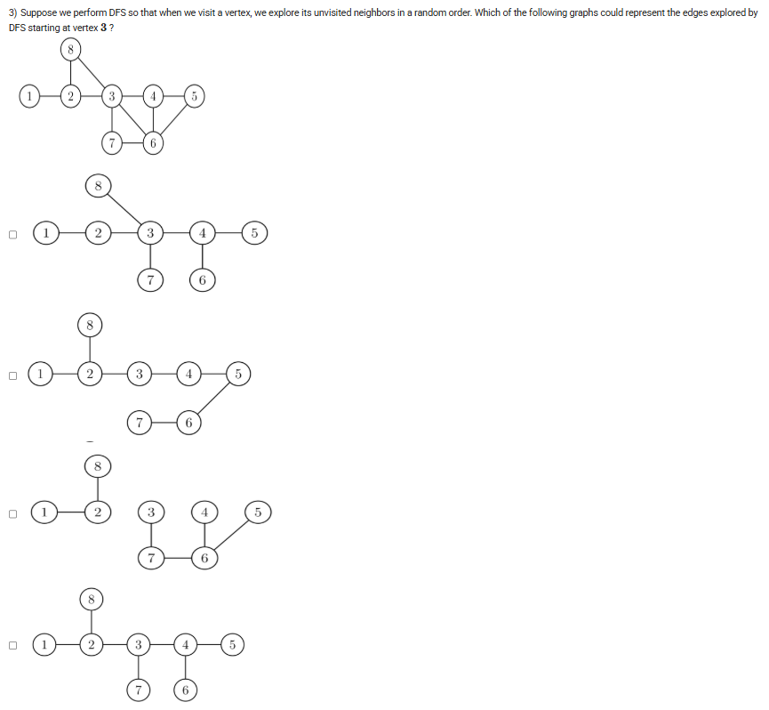

A well-defined collection of distinct objects called elements or members.



https://youtu.be/1BvUzBkyD_o

#### Learning Outcomes:

To learn ‘depth first search’(DFS) algorithm and introduction to the concept of ‘stack’.

Utilization of DFS to find cut vertices and bridges

## Exercise QUestions

