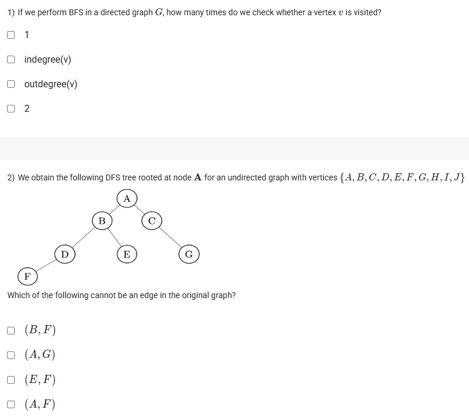
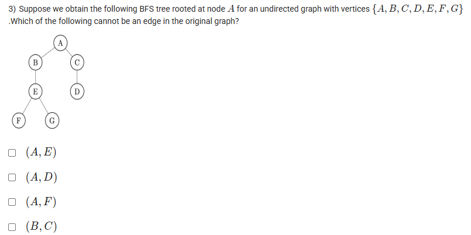

A well-defined collection of distinct objects called elements or members.



https://youtu.be/l56BfAgi5LA

#### Learning Outcomes:

To learn the applications of DFS and BFS

To compare between DFS and BFS and to identify the connected components with BFS/ DFS

To construct a cycle, tree(with BFS and DFS) and forest

## Exercise Questions

