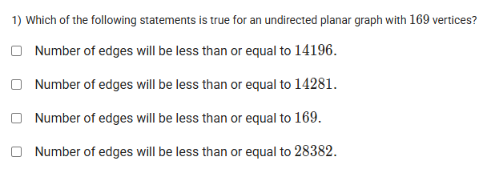

A well-defined collection of distinct objects called elements or members.



https://youtu.be/rCiV-4ceYRU

#### Learning Outcomes:

The students will be able to understand the complexity involved in BFS/DFS with respect to time and steps for finding the reachability.

## Exercise Questions

