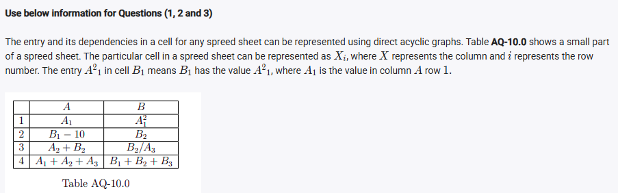
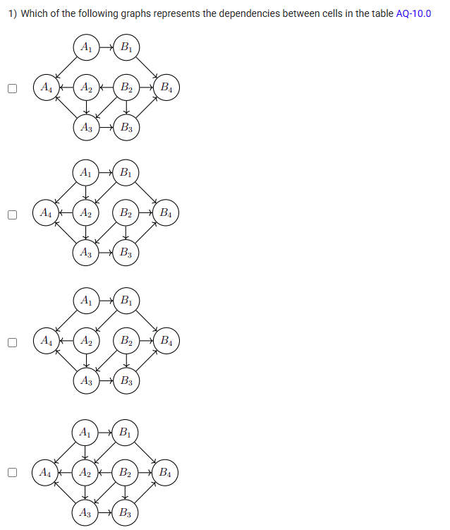
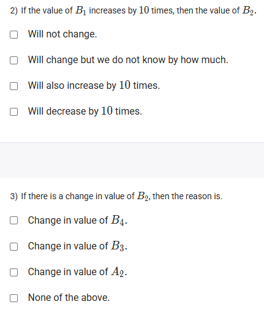
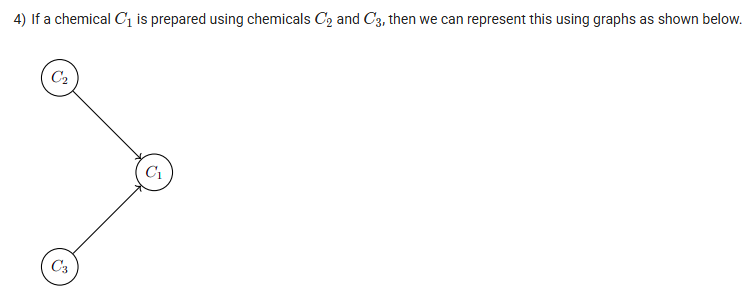
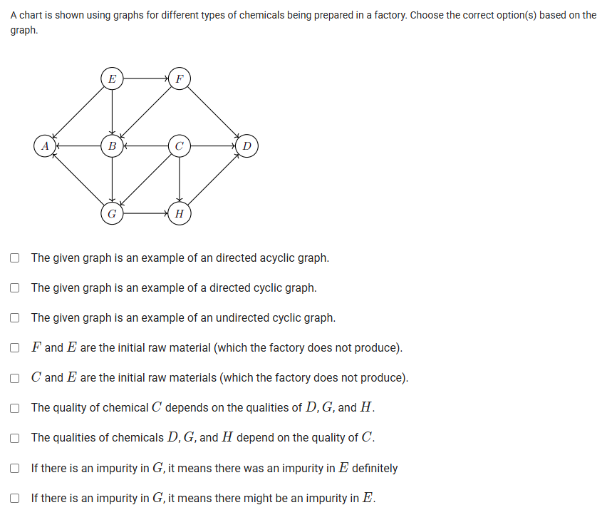

A well-defined collection of distinct objects called elements or members.



https://youtu.be/-VKVovlBnwE

#### Learning Outcomes:

The students will be able to understand the applications of directed acyclic graphs (DAGs) in daily life.

## Exercise Questions

