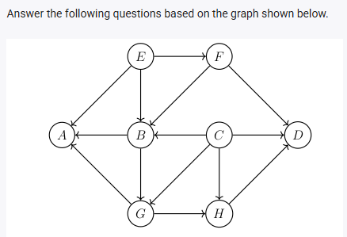
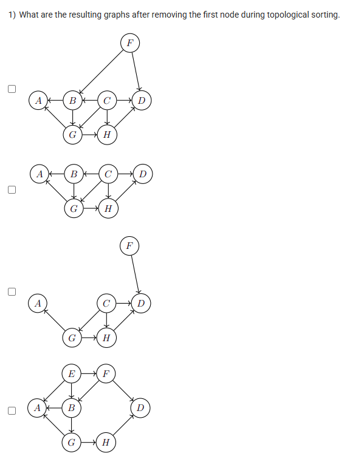
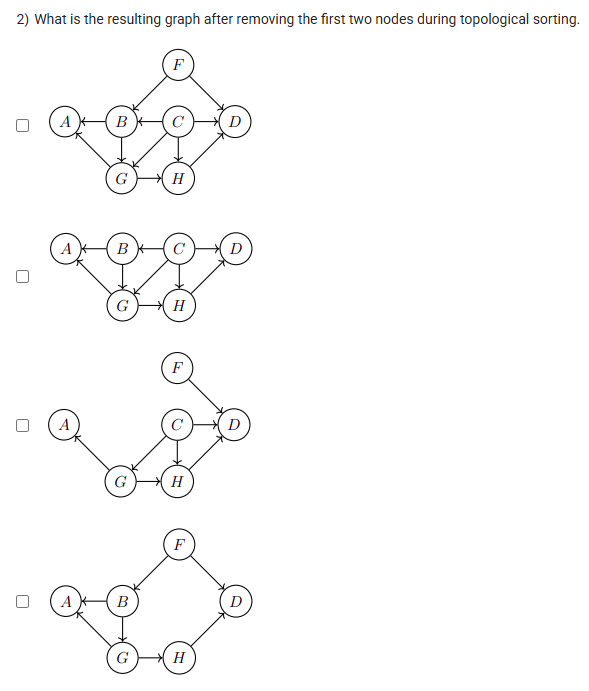
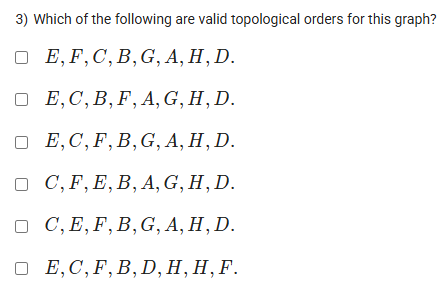

A well-defined collection of distinct objects called elements or members.



https://youtu.be/Rax3k-rCYkY

#### Learning Outcomes:

learn about topological sorting.

find the possible sorting orders of DAGs.

## Exercise Questions

