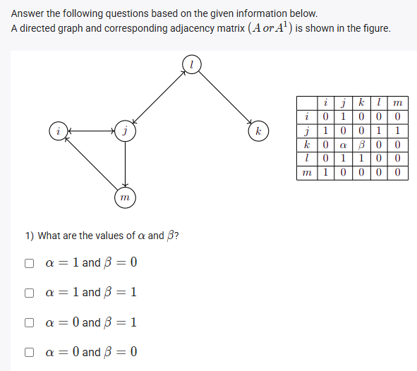
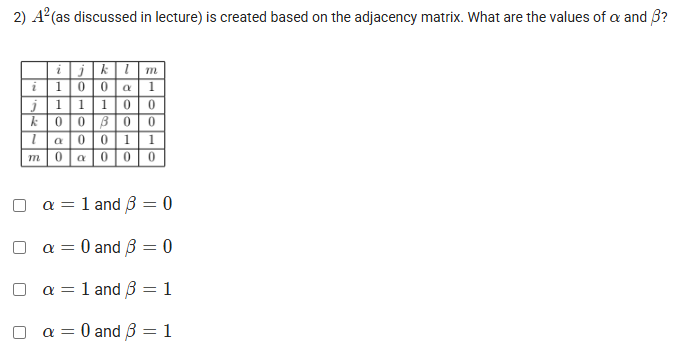

A well-defined collection of distinct objects called elements or members.



https://youtu.be/6Ax9K7gSuJE

#### Learning Outcomes:

Understand the representation of relationships using graphs.

Understand the concept of transitive closure and finding the reachability.

## Exercise Questions

