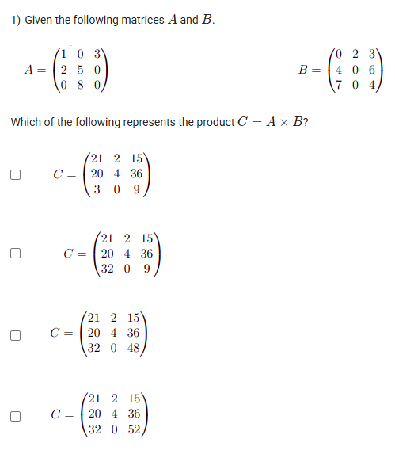
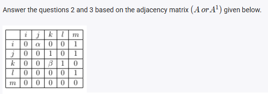
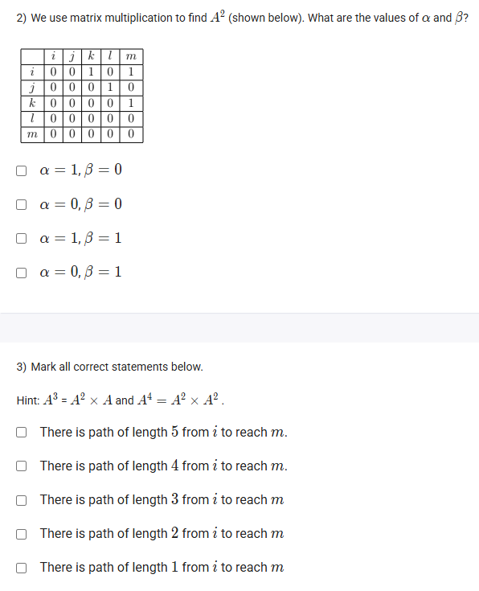

A well-defined collection of distinct objects called elements or members.



https://youtu.be/N_PvNrQXUg4

#### Learning Outcomes:

Understand the operation of matrix multiplication and its use in finding reachability.

## Exercise QUestions

