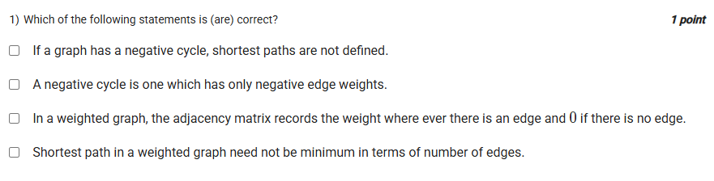

A well-defined collection of distinct objects called elements or members.



https://youtu.be/4l_g6IQz6Go

#### Learning Outcomes:

The student will be able to:

the shortest path problems such as single source shortest paths and all pair shortest paths. 

negative edge weights. 

## Exercise Questions

