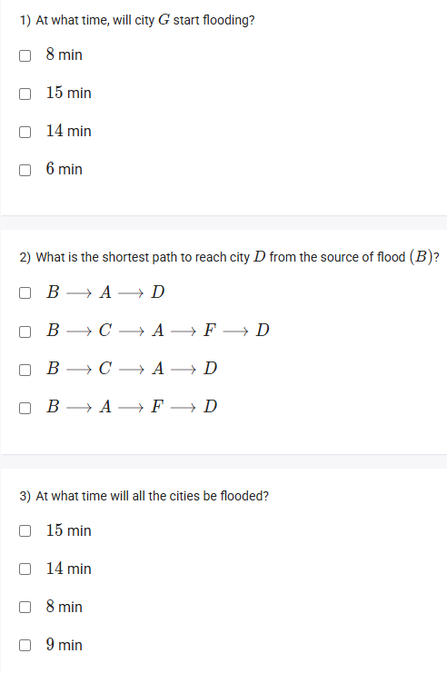

A well-defined collection of distinct objects called elements or members.



https://youtu.be/XXFcZyP2KlM

#### Learning Outcomes:

The students will be able to understand the conceptual numerical on single source shortest paths and Dijkstra’s algorithm.

## Exercise Questions

