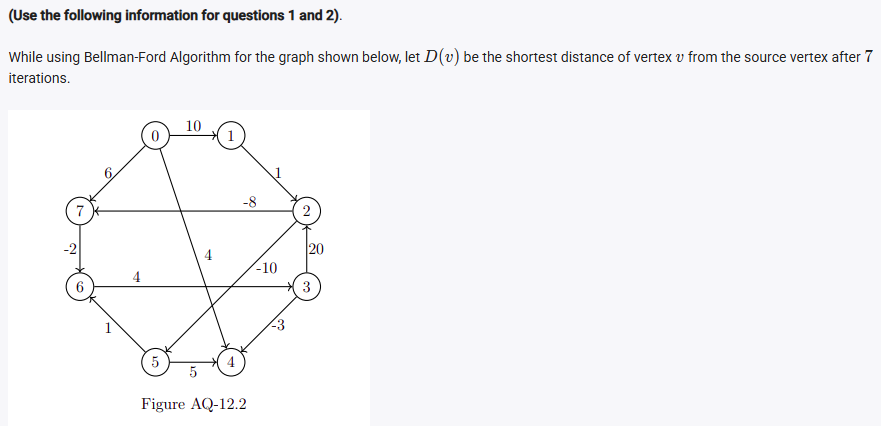
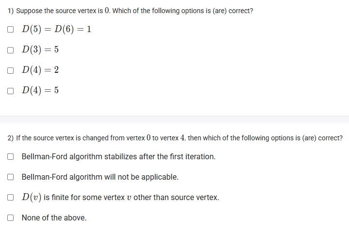
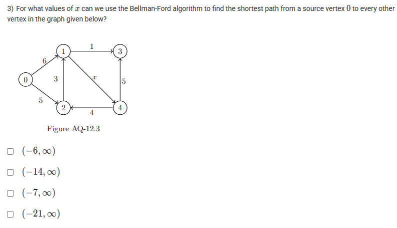

A well-defined collection of distinct objects called elements or members.



https://youtu.be/FGGMybRD4O4

#### Learning Outcomes:

The students will be able to understand the conceptual numerical on single source shortest paths with negative weights using the Bellman-Ford algorithm.

## Exercise Questions

