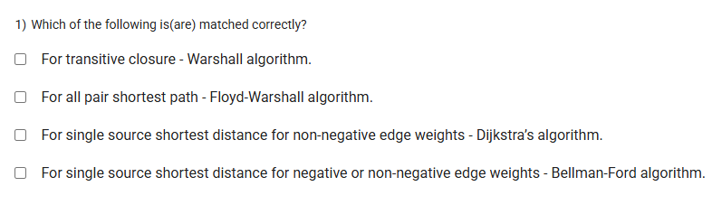
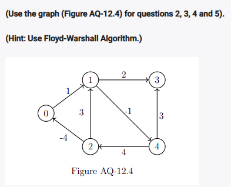
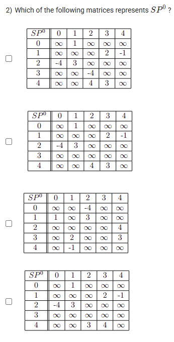
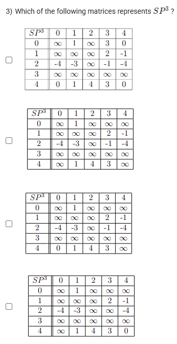
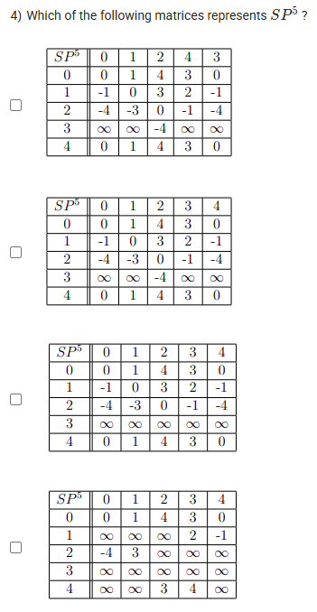
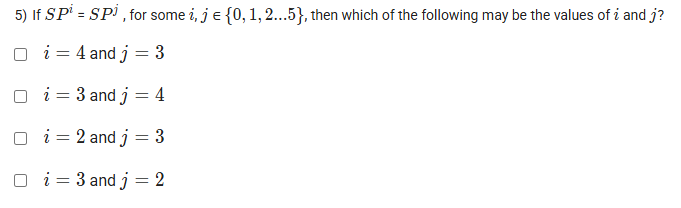

A well-defined collection of distinct objects called elements or members.



https://youtu.be/Rhm-0SD-NfE

#### Learning Outcomes:

The student will be able to:

use Warshall’s algorithm as an alternative way to compute transitive closure.. 

use Floyd-Warshall algorithm to compute all pairs shortest path.

## Exercise Questions

