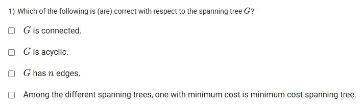
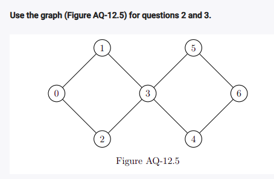
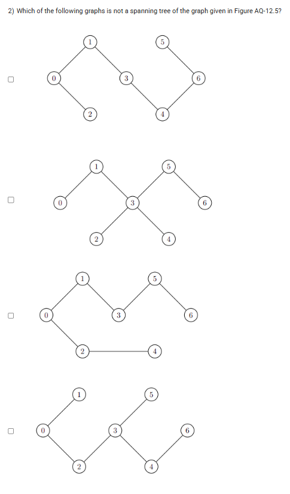
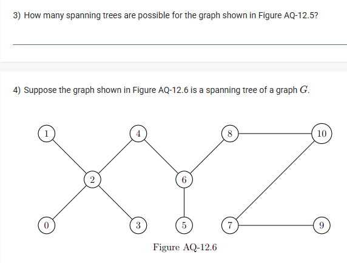
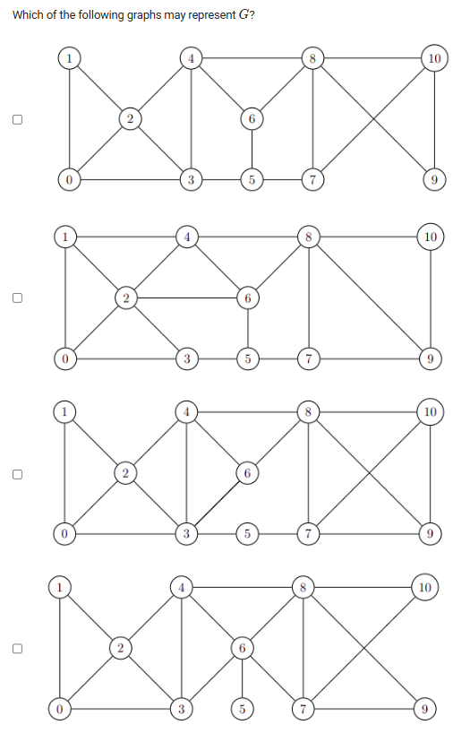

A well-defined collection of distinct objects called elements or members.



https://youtu.be/3GwJAstzzBk

#### Learning Outcomes:

The student will be able to understand the concept of spanning tree, minimum cost spanning tree and its characteristics . 

## Exercise Questions

