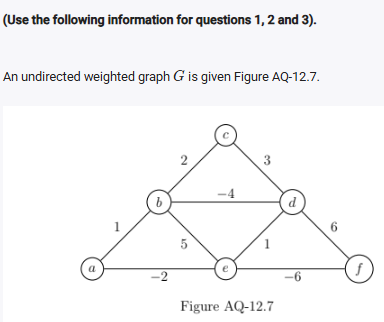
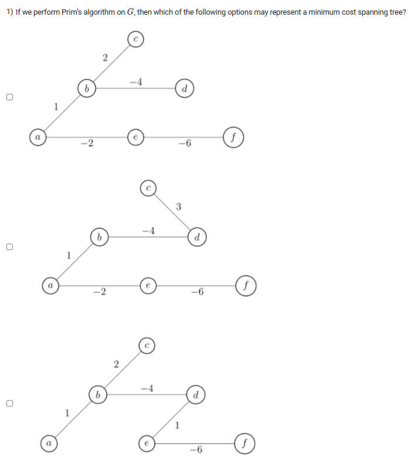
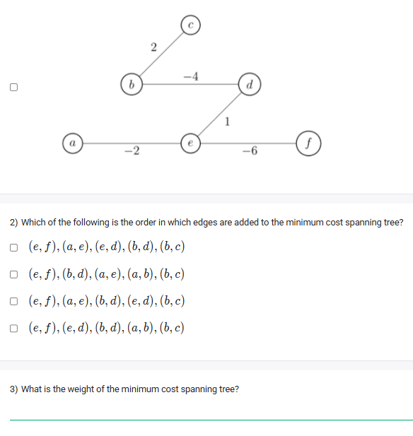

A well-defined collection of distinct objects called elements or members.



https://youtu.be/btr8zJBgaQg

#### Learning Outcomes:

The student will be able to compute minimum cost spanning trees using Prim’s algorithm and the concept of correctness of Prim’s algorithm.

## Exercise Questions

