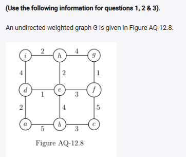
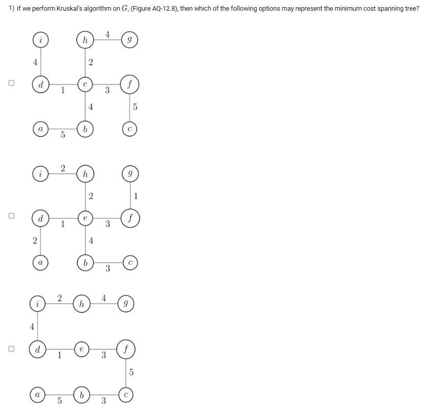
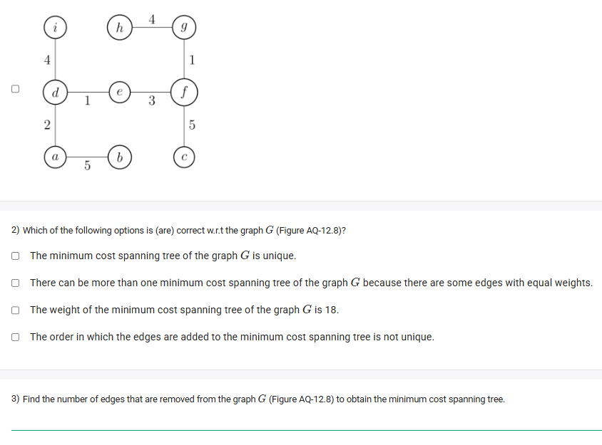
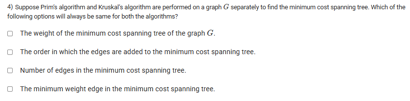

A well-defined collection of distinct objects called elements or members.



https://youtu.be/-0diRWTGgk8

#### Learning Outcomes:

The student will be able to compute minimum cost spanning trees using Kruskal’s algorithm and the concept of correctness of Kruskal’s algorithm.

## Exercise Questions

