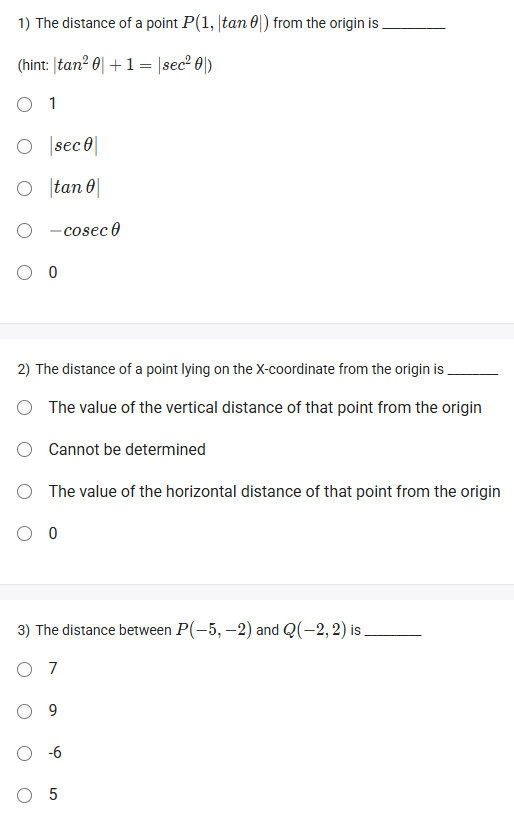
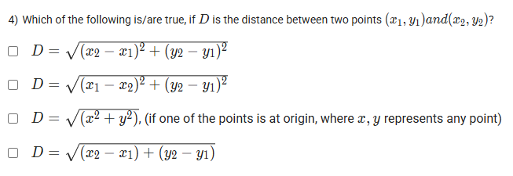

A well-defined collection of distinct objects called elements or members.



https://youtu.be/aDhyAkXiDOY

#### Learning Outcomes

1. Compute the distance of a point from the origin in the rectangular coordinate system.
2. Derive a general distance formula between any two points on the coordinate plane.

## 1️⃣ Distance of a Point from the Origin

To compute the distance of a point $P(x, y)$ from the **origin** $(0, 0)$ in the rectangular coordinate system, use the **distance formula**:

$$
OP = \sqrt{x^2 + y^2}
$$

This formula comes straight from the Pythagorean Theorem, since the movement from $(0, 0)$ to $(x, y)$ forms the two right-angle legs.

**Example:**
For the point $P(3, 4)$:

$$
OP = \sqrt{3^2 + 4^2} = \sqrt{9 + 16} = \sqrt{25} = 5
$$

**Image:**

[source: cuemath.com](https://www.cuemath.com/geometry/coordinate-geometry/)
*The blue line shows the distance from the origin to a point \$ (x, y) \$.*

***

## 2️⃣ General Distance Formula Between Two Points

The **distance between any two points** $A(x_1, y_1)$ and $B(x_2, y_2)$ on the coordinate plane is:

$$
AB = \sqrt{(x_2 - x_1)^2 + (y_2 - y_1)^2}
$$

**Derivation:**

- Draw a horizontal and vertical to create a right triangle:
    - One leg is $|x_2-x_1|$ (horizontal distance).
    - Other leg is $|y_2-y_1|$ (vertical distance).
- By the Pythagorean theorem, the straight-line (hypotenuse) distance is as above.

**Example:**
Find the distance between points $A(2, 1)$ and $B(7, 5)$:

$$
AB = \sqrt{(7 - 2)^2 + (5 - 1)^2} = \sqrt{5^2 + 4^2} = \sqrt{25 + 16} = \sqrt{41}
$$

**Image:**

[source: byjus.com](https://byjus.com/maths/distance-formula/)

***

**Summary:**

- The distance from the *origin* to \$ (x, y) \$ uses \$ \sqrt{x^2 + y^2} \$.
- The distance between *any two points* \$ (x_1, y_1) \$ \& \$ (x_2, y_2) \$ is \$ \sqrt{(x_2 - x_1)^2 + (y_2 - y_1)^2} \$.
[^1][^2][^3][^4][^5][^6][^7][^8][^9]

⁂

[^1]: https://math.libretexts.org/Bookshelves/Algebra/Elementary_Algebra_(LibreTexts)/03:_Graphing_Lines/3.01:_Rectangular_Coordinate_System

[^2]: https://byjus.com/jee/how-to-find-rectangular-coordinate-system-in-space/

[^3]: https://testbook.com/maths/how-to-find-rectangular-coordinate-system-in-space

[^4]: https://en.wikipedia.org/wiki/Cartesian_coordinate_system

[^5]: https://byjus.com/maths/distance-formula/

[^6]: https://openstax.org/books/college-algebra-2e/pages/2-1-the-rectangular-coordinate-systems-and-graphs

[^7]: https://www.askiitians.com/iit-jee-3d-geometry/rectangular-co-ordinate-system-in-space/

[^8]: https://nios.ac.in/media/documents/srsec311new/311_maths_eng/311_maths_eng_lesson13.pdf

[^9]: https://www.cuemath.com/geometry/coordinate-geometry/

## Exercise Questions 🤯

Hello! On this Wednesday evening here in India, I would be happy to help you with these questions on the rectangular coordinate system. Let's break them down one by one.


### **Question 1: Locating Points**

**The Question:**
Choose the correct option with respect to the points $P(5, -3)$, $Q(-3, 3)$, $R(0, -100)$, and $S(-2.5, 0)$ on the rectangular coordinate system.
* Point R does not lie in any quadrant
* Points P and R lie in Quadrant III
* Points S and Q lie in Quadrant II
* Points R and S cannot be represented on the rectangular coordinate system

**Core Concepts: Quadrants and Axes**

To solve this, we need to know where points are located based on the signs of their x and y coordinates.

* **Quadrant I:** x is positive (+), y is positive (+)
* **Quadrant II:** x is negative (-), y is positive (+)
* **Quadrant III:** x is negative (-), y is negative (-)
* **Quadrant IV:** x is positive (+), y is negative (-)
* **On an Axis:** If either the x or y coordinate is 0, the point is not in a quadrant but lies on one of the axes.
    * If x = 0, the point is on the y-axis.
    * If y = 0, the point is on the x-axis.

**Detailed Solution:**

Let's analyze the location of each point:

1.  **P(5, -3):** The x-coordinate (5) is positive, and the y-coordinate (-3) is negative. A (+, -) point lies in **Quadrant IV**.
2.  **Q(-3, 3):** The x-coordinate (-3) is negative, and the y-coordinate (3) is positive. A (-, +) point lies in **Quadrant II**.
3.  **R(0, -100):** The x-coordinate is 0. This means the point lies directly on the **y-axis**. Points on an axis are not in any quadrant.
4.  **S(-2.5, 0):** The y-coordinate is 0. This means the point lies directly on the **x-axis**. Points on an axis are not in any quadrant.

Now let's evaluate the given options:

* **Point R does not lie in any quadrant:** This is **TRUE**. As we determined, R(0, -100) lies on the y-axis.
* **Points P and R lie in Quadrant III:** This is **FALSE**. P is in Quadrant IV, and R is on the y-axis.
* **Points S and Q lie in Quadrant II:** This is **FALSE**. Q is in Quadrant II, but S is on the x-axis.
* **Points R and S cannot be represented on the rectangular coordinate system:** This is **FALSE**. Any ordered pair of real numbers, including those with zero, can be precisely located on the plane.

**Final Answer:** The only correct option is **"Point R does not lie in any quadrant"**.



### **Question 2: Fundamentals of the Coordinate System**

**The Question:**
Which of the following is/are correct with respect to the rectangular coordinate system? (Multiple Select Question)
* The horizontal line is called Y-axis
* The point of intersection of the X and Y axes is called the origin
* The vertical line is called X-axis
* Any point on the coordinate plane can be represented as an ordered pair (x, y)

**Core Concepts: Definitions**

* **x-axis:** The horizontal number line that passes through the origin.
* **y-axis:** The vertical number line that passes through the origin.
* **Origin:** The specific point $(0, 0)$ where the x-axis and y-axis intersect.
* **Ordered Pair:** The standard notation $(x, y)$ that gives the unique "address" of any point by specifying its horizontal distance (x) and vertical distance (y) from the origin.

**Detailed Solution:**

Let's check each statement against the definitions:

1.  **The horizontal line is called Y-axis:** This is **FALSE**. The horizontal line is the x-axis.
2.  **The point of intersection of the X and Y axes is called the origin:** This is **TRUE**. This is the definition of the origin.
3.  **The vertical line is called X-axis:** This is **FALSE**. The vertical line is the y-axis.
4.  **Any point on the coordinate plane can be represented as an ordered pair (x, y):** This is **TRUE**. This is the fundamental purpose of the coordinate system.

**Final Answer:** The two correct statements are **"The point of intersection of the X and Y axes is called the origin"** and **"Any point on the coordinate plane can be represented as an ordered pair (x, y)"**.



### **Question 3: Identifying Incorrect Representations**

**The Question:**
Identify the incorrect options for the representation of a point on the coordinate plane. (Multiple Select Question)

**Core Concepts: Coordinate Conventions**

This question tests the same concepts as Question 1 but asks you to find the mistakes. Let's list the correct conventions first:
* Quadrant I: (+, +)
* Quadrant II: (-, +)
* Quadrant III: (-, -)
* Quadrant IV: (+, -)
* On X-axis: (x, 0) or (±, 0)
* On Y-axis: (0, y) or (0, ±)
* Origin: (0, 0)

**Detailed Solution:**

Now we will evaluate each option to see if it's correct or incorrect. The goal is to identify the **incorrect** ones.

1.  **Quadrant I : (+, +)**: This statement is **CORRECT**.
2.  **Quadrant IV : (-, -)**: This statement is **INCORRECT**. Quadrant IV points have a positive x and a negative y, so the form is (+, -).
3.  **Quadrant II : (-, -)**: This statement is **INCORRECT**. Quadrant II points have a negative x and a positive y, so the form is (-, +).
4.  **Quadrant III : (-, +)**: This statement is **INCORRECT**. Quadrant III points have a negative x and a negative y, so the form is (-, -).
5.  **On X-axis: (0, ±)**: This statement is **INCORRECT**. For any point on the x-axis, the y-coordinate is always 0. The correct form is (±, 0).
6.  **On Y-axis: (±, 0)**: This statement is **INCORRECT**. For any point on the y-axis, the x-coordinate is always 0. The correct form is (0, ±).
7.  **Origin (0,0)**: This statement is **CORRECT**.

**Final Answer:** The incorrect options are:
* Quadrant IV : (-, -)
* Quadrant II : (-, -)
* Quadrant III : (-, +)
* On X-axis: (0, ±)
* On Y-axis: (±, 0)
