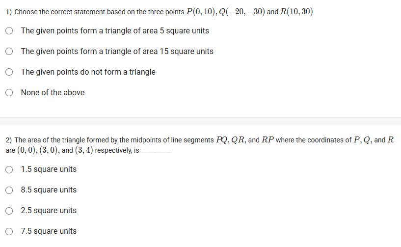
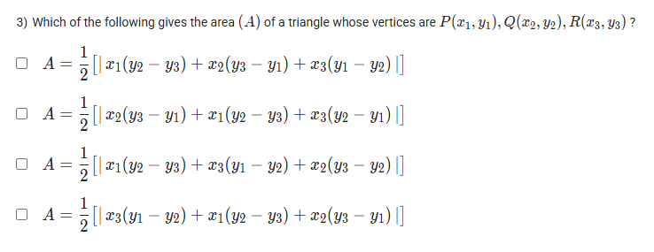

A well-defined collection of distinct objects called elements or members.



https://youtu.be/x62fodF7ezk

#### Learning Outcomes

1. Compute the area of a trapezium.
2. Compute the area of a triangle using coordinates of its vertices.

### 1️⃣ Compute the Area of a Trapezium

A **trapezium** (or trapezoid) is a quadrilateral with at least one pair of parallel sides called the **bases**.

- Let the lengths of the parallel sides be \$ a \$ and \$ b \$.
- Let the height (distance between the parallel sides) be \$ h \$.

The **area \$ A \$** of the trapezium is given by:

$$
A = \frac{1}{2} (a + b) \times h
$$

**Example:**
If \$ a = 6 \$ units, \$ b = 4 \$ units, and \$ h = 5 \$ units, then

$$
A = \frac{1}{2} (6 + 4) \times 5 = 5 \times 5 = 25 \text{ sq. units}
$$

***

**Image:**

***

### 2️⃣ Compute the Area of a Triangle Using Coordinates of its Vertices

For a triangle with vertices at \$ A(x_1, y_1) \$, \$ B(x_2, y_2) \$, and \$ C(x_3, y_3) \$, the **area \$ \Delta \$** is given by the **coordinate geometry formula**:

$$
\Delta = \frac{1}{2} \left| x_1(y_2 - y_3) + x_2(y_3 - y_1) + x_3(y_1 - y_2) \right|
$$

- The absolute value ensures the area is always positive.
- This formula derives from the determinant of a matrix formed by the points.

**Example:**
For vertices \$ A(1, 2) \$, \$ B(4, 6) \$, and \$ C(5, 2) \$:

$$
\Delta = \frac{1}{2} | 1(6 - 2) + 4(2 - 2) + 5(2 - 6) | = \frac{1}{2} | 1 \times 4 + 4 \times 0 + 5 \times (-4) | = \frac{1}{2} | 4 + 0 - 20 | = \frac{1}{2} | -16 | = 8
$$

***

**Image:**

***

**Summary:**

| Shape | Formula |
| :-- | :-- |
| Trapezium | \$ A = \frac{1}{2} (a + b) \times h \$ |
| Triangle | \$ \Delta = \frac{1}{2} |

These formulas help find areas using lengths or coordinates precisely.

## Exercise Questions 🤯

Good evening! On this Wednesday here in India, I can certainly help you with these questions about calculating the area of triangles in a coordinate system. Let's break down each problem.


### **Question 1: Area of a Triangle and Collinearity**

**The Question:**
Choose the correct statement based on the three points $P(0, 10)$, $Q(-20, -30)$, and $R(10, 30)$.
* The given points form a triangle of area 5 square units
* The given points form a triangle of area 15 square units
* The given points do not form a triangle
* None of the above

**Core Concepts: Area of a Triangle Formula & Collinearity**

To find the area of a triangle when you know the coordinates of its three vertices $(x_1, y_1)$, $(x_2, y_2)$, and $(x_3, y_3)$, you can use the following formula:

$$Area = \frac{1}{2} |x_1(y_2 - y_3) + x_2(y_3 - y_1) + x_3(y_1 - y_2)|$$

The absolute value bars $|...|$ are used because area must always be a positive value.

A crucial related concept is **collinearity**. Three points are said to be collinear if they all lie on the same straight line. If points are collinear, they cannot form a triangle, and the area calculated using the formula will be **zero**.

**Detailed Solution:**

1.  **Assign the coordinates:**
    * Let $P(0, 10)$ be $(x_1, y_1)$.
    * Let $Q(-20, -30)$ be $(x_2, y_2)$.
    * Let $R(10, 30)$ be $(x_3, y_3)$.

2.  **Substitute the values into the area formula:**
    $$Area = \frac{1}{2} |0(-30 - 30) + (-20)(30 - 10) + 10(10 - (-30))|$$

3.  **Simplify the expression inside the absolute value:**
    $$Area = \frac{1}{2} |0(-60) + (-20)(20) + 10(10 + 30)|$$   $$Area = \frac{1}{2} |0 - 400 + 10(40)|$$   $$Area = \frac{1}{2} |-400 + 400|$$   $$Area = \frac{1}{2} |0|$$   $$Area = 0$$

4.  **Interpret the result:**
    Since the calculated area is 0, the points P, Q, and R are collinear. Therefore, they lie on a single straight line and cannot form a triangle.

**Final Answer:** The correct statement is **"The given points do not form a triangle"**.



### **Question 2: Area of a Triangle Formed by Midpoints**

**The Question:**
The area of the triangle formed by the midpoints of line segments $PQ$, $QR$, and $RP$, where the coordinates of $P$, $Q$, and $R$ are $(0, 0)$, $(3, 0)$, and $(3, 4)$ respectively, is \_\_\_\_\_\_\_\_\_\_.

**Core Concepts: Midpoint Formula and Area Properties**

1.  **Midpoint Formula:** The midpoint of a line segment with endpoints $(x_1, y_1)$ and $(x_2, y_2)$ is $\left( \frac{x_1 + x_2}{2}, \frac{y_1 + y_2}{2} \right)$.
2.  **Area of a Triangle Formed by Midpoints:** A key theorem in geometry states that the area of a triangle formed by joining the midpoints of the sides of another triangle is exactly **one-fourth (1/4)** of the area of the original triangle.

**Detailed Solution:**

We can solve this in two ways.

**Method 1: The Shortcut (Using the Theorem)**

1.  **Find the area of the original triangle PQR.**
    * P(0,0), Q(3,0), R(3,4).
    * Notice that the line segment PQ lies on the x-axis and the line segment QR is a vertical line. This means PQR is a right-angled triangle.
    * The length of the base PQ is the distance between (0,0) and (3,0), which is 3 units.
    * The height is the vertical distance from the base to R, which is 4 units.
    * Area of PQR = $\frac{1}{2} \times \text{base} \times \text{height} = \frac{1}{2} \times 3 \times 4 = 6$ square units.

2.  **Calculate the area of the midpoint triangle.**
    * Area of midpoint triangle = $\frac{1}{4} \times (\text{Area of PQR})$
    * Area = $\frac{1}{4} \times 6 = 1.5$ square units.

**Method 2: Direct Calculation (Finding Midpoints First)**

1.  **Find the midpoints of the sides:**
    * Midpoint of PQ (let's call it D) = $\left(\frac{0+3}{2}, \frac{0+0}{2}\right) = (1.5, 0)$.
    * Midpoint of QR (let's call it E) = $\left(\frac{3+3}{2}, \frac{0+4}{2}\right) = (3, 2)$.
    * Midpoint of RP (let's call it F) = $\left(\frac{3+0}{2}, \frac{4+0}{2}\right) = (1.5, 2)$.

2.  **Calculate the area of triangle DEF using the area formula:**
    * $D(1.5, 0) \rightarrow (x_1, y_1)$
    * $E(3, 2) \rightarrow (x_2, y_2)$
    * $F(1.5, 2) \rightarrow (x_3, y_3)$
    * Area = $\frac{1}{2} |1.5(2 - 2) + 3(2 - 0) + 1.5(0 - 2)|$
    * Area = $\frac{1}{2} |1.5(0) + 3(2) + 1.5(-2)|$
    * Area = $\frac{1}{2} |0 + 6 - 3|$
    * Area = $\frac{1}{2} |3| = 1.5$ square units.

**Final Answer:** The area is **1.5 square units**.



### **Question 3: Identifying the Area Formula**

**The Question:**
Which of the following gives the area (A) of a triangle whose vertices are $P(x_1, y_1)$, $Q(x_2, y_2)$, $R(x_3, y_3)$?

**Core Concept: The Area of a Triangle Formula (Shoelace Formula variation)**

This question is a direct test of your knowledge of the standard coordinate geometry formula for the area of a triangle. The formula follows a specific cyclical pattern.

**Detailed Solution:**

The correct formula is:
$$A = \frac{1}{2} |x_1(y_2 - y_3) + x_2(y_3 - y_1) + x_3(y_1 - y_2)|$$

Let's break down the pattern to see why:
* The entire expression is multiplied by $\frac{1}{2}$ and is inside an absolute value.
* There are three terms added together.
* The first term starts with $x_1$. It is multiplied by the difference of the *other two* y-coordinates, $(y_2 - y_3)$.
* The second term starts with $x_2$. It is multiplied by the difference of the *other two* y-coordinates in a cycle, $(y_3 - y_1)$.
* The third term starts with $x_3$. It is multiplied by the difference of the *other two* y-coordinates in a cycle, $(y_1 - y_2)$.

Now, let's examine the options given in the image:

1.  $A = \frac{1}{2} |x_1(y_2 - y_3) + x_2(y_3 - y_1) + x_3(y_1 - y_2)|$
    * This option perfectly matches the standard formula and its cyclical pattern. **This is correct.**
2.  The other options break this pattern. For example, the second option starts with $x_1(y_3 - y_1)$, which is incorrect. The others have similar structural errors.

**Final Answer:** The first option is the correct formula for the area of a triangle.
