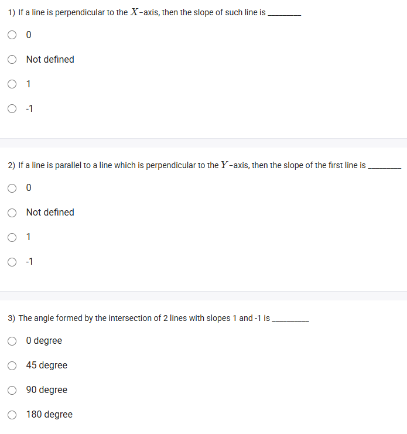
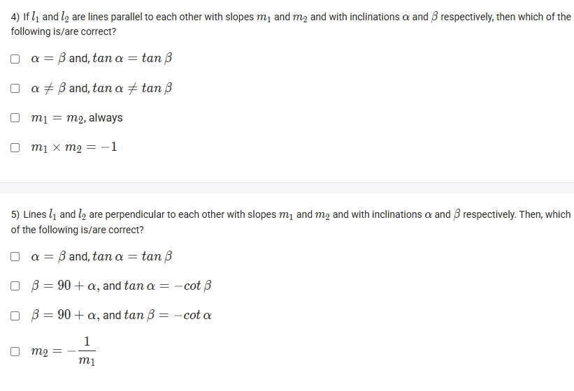
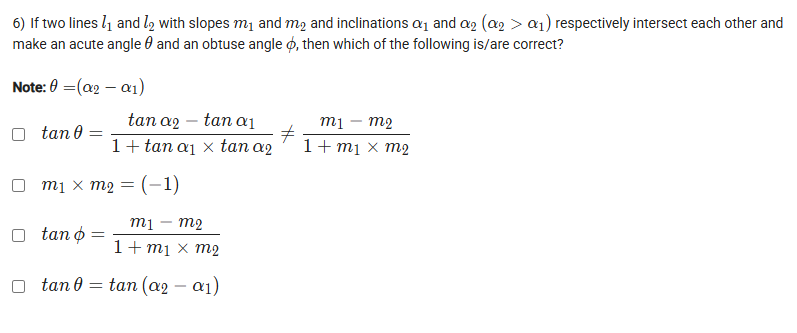

A well-defined collection of distinct objects called elements or members.



https://youtu.be/CXhBGVfmtBg

#### Learning Outcomes

1. Explain why the slope of a line does not uniquely determine the line.
2. Characterize parallel and perpendicular lines using the slope.
3. Compute the angle between 2 lines using their slopes.

### 1️⃣ Why the Slope of a Line Does Not Uniquely Determine the Line

The **slope** measures the steepness and direction of a line but does **not** uniquely determine a line by itself.

- **Reason:**
Many different lines can share the same slope but differ in their **y-intercept** (where they cross the y-axis). Changing the y-intercept shifts the line up or down without changing the slope.
- **Example:**
Lines $y = 2x + 3$ and $y = 2x - 1$ both have slope 2 but are distinct because their y-intercepts differ.

***

### 2️⃣ Characterize Parallel and Perpendicular Lines Using Slope

- **Parallel Lines:**
    - Have the **same slope** but different y-intercepts.
    - They never intersect.

$$
\text{If } m_1, m_2 \text{ are slopes, then } m_1 = m_2 \implies \text{lines are parallel}
$$
- **Perpendicular Lines:**
    - Intersect at right angles (90°).
    - Slopes are **negative reciprocals** of each other.

$$
m_1 \times m_2 = -1
$$

For example, if one line has slope $\frac{3}{4}$, a line perpendicular to it has slope $-\frac{4}{3}$.

***

### 3️⃣ Compute the Angle Between Two Lines Using Their Slopes

The angle $\theta$ between two lines with slopes $m_1$ and $m_2$ is given by:

$$
\tan \theta = \left| \frac{m_1 - m_2}{1 + m_1 m_2} \right|
$$

- Special Case:
    - If $m_1 m_2 = -1$, then $\tan \theta$ is undefined (since denominator is zero), meaning $\theta = 90^\circ$, lines are perpendicular.

***

### Images and Markdown URLs

**Image 1: Slope and parallel lines**

**Image 2: Negative reciprocals for perpendicular slopes**

**Image 3: Angle between two lines with slopes $m_1$ and $m_2$**

***

These concepts help in understanding the relationship between the slopes of lines, how lines intersect, and how to calculate the angle between them.
[^1][^2][^3][^4][^5][^6][^7][^8]

⁂

[^1]: https://math.libretexts.org/Courses/Hawaii_Community_College/Hawaii_Community_College_MA82X_Textbook/04:_Graphing_Lines/4.06:_Parallel_and_Perpendicular_Lines

[^2]: https://www.youtube.com/watch?v=vdcGpuAywi4

[^3]: https://www.cuemath.com/geometry/parallel-and-perpendicular-lines/

[^4]: https://www.splashlearn.com/math-vocabulary/slope-of-perpendicular-lines

[^5]: https://study.com/skill/learn/how-to-find-the-slopes-of-lines-parallel-perpendicular-to-a-line-given-in-the-form-ax-plus-by-c-explanation.html

[^6]: https://courses.lumenlearning.com/waymakercollegealgebra/chapter/parallel-and-perpendicular-lines-2/

[^7]: https://www.khanacademy.org/math/geometry/hs-geo-analytic-geometry/hs-geo-parallel-perpendicular-lines/v/classify-lines

[^8]: https://www.slideshare.net/slideshow/parallel-and-perpendicular-slopes-lines/27811834

## Exercise Questions

Good evening! On this Wednesday here in India, I'd be glad to walk you through these questions, which cover the important relationships between slope, inclination, and parallel and perpendicular lines.


### **Question 1: Slope of a Perpendicular Line** (from file `image_0e1da5.png`)

**The Question:**
If a line is perpendicular to the X-axis, then the slope of such a line is \_\_\_\_\_\_\_\_\_\_.
* 0
* Not defined
* 1
* -1

**Core Concept: Slopes of Horizontal and Vertical Lines**

* **X-axis:** This is a perfectly horizontal line. Its slope is 0.
* **Y-axis:** This is a perfectly vertical line.
* **Perpendicular Lines:** Lines that intersect at a right angle (90 degrees).
* **Slope of a Vertical Line:** A vertical line has a "run" (horizontal change) of 0. Since the slope formula is $m = \frac{\text{rise}}{\text{run}}$, this would involve division by zero, which is not allowed. Therefore, the slope of any vertical line is **undefined**.

**Detailed Solution:**

1.  The X-axis is a horizontal line.
2.  A line perpendicular to a horizontal line must be a **vertical line**.
3.  As explained in the concept above, the slope of any vertical line is undefined.

**Final Answer:** The correct option is **"Not defined"**.



### **Question 2: Parallel and Perpendicular Logic** (from file `image_0e1da5.png`)

**The Question:**
If a line is parallel to a line which is perpendicular to the Y-axis, then the slope of the first line is \_\_\_\_\_\_\_\_\_\_.
* 0
* Not defined
* 1
* -1

**Core Concepts: Parallel and Perpendicular Slopes**

* **Parallel Lines:** Have the **same slope**.
* **Perpendicular Lines:** Their slopes are negative reciprocals (e.g., 2 and -1/2). A horizontal line (slope 0) is perpendicular to a vertical line (undefined slope).

**Detailed Solution:**

This is a two-step logic problem. Let's break down the description from the end to the beginning.

1.  **"a line which is perpendicular to the Y-axis"**: The Y-axis is a vertical line. A line perpendicular to a vertical line must be a **horizontal line**. The slope of this horizontal line is **0**.
2.  **"a line is parallel to..."**: The question asks for the slope of a line that is parallel to the horizontal line we just identified.
3.  Since parallel lines have the same slope, the slope of this first line must also be **0**.

**Final Answer:** The slope of the first line is **0**.



### **Question 3: Angle Between Two Lines** (from file `image_0e1da5.png`)

**The Question:**
The angle formed by the intersection of 2 lines with slopes 1 and -1 is \_\_\_\_\_\_\_\_\_\_.
* 0 degree
* 45 degree
* 90 degree
* 180 degree

**Core Concept: Condition for Perpendicular Lines**

Two non-vertical lines are perpendicular to each other if and only if the product of their slopes is equal to -1.
$$m_1 \times m_2 = -1$$
Perpendicular lines intersect at a right angle, which is **90 degrees**.

**Detailed Solution:**

1.  **Identify the slopes:**
    * $m_1 = 1$
    * $m_2 = -1$
2.  **Calculate the product of the slopes:**
    * $m_1 \times m_2 = 1 \times (-1) = -1$
3.  **Interpret the result:**
    * Since the product of the slopes is -1, the two lines are perpendicular.
    * Therefore, the angle formed at their intersection is 90 degrees.

**Final Answer:** The angle is **90 degree**.



### **Question 4: Properties of Parallel Lines** (from file `image_0e1da5.png`)

**The Question:**
If $l_1$ and $l_2$ are lines parallel to each other with slopes $m_1$ and $m_2$ and with inclinations $\alpha$ and $\beta$ respectively, then which of the following is/are correct?
* $\alpha = \beta$ and $\tan \alpha = \tan \beta$
* $\alpha \neq \beta$ and $\tan \alpha \neq \tan \beta$
* $m_1 = m_2$ always
* $m_1 \times m_2 = -1$

**Core Concepts: Parallel Lines and Inclination**

* **Parallel Lines:** Two lines are parallel if they have the exact same steepness and never intersect.
* **Slope:** The numerical measure of a line's steepness. For parallel lines, their slopes must be equal ($m_1 = m_2$).
* **Angle of Inclination:** The angle ($\alpha$) a line makes with the positive direction of the x-axis. It is directly related to the slope by the formula $m = \tan(\alpha)$. If two lines are parallel, they must have the same angle of inclination.

**Detailed Solution:**

Given that lines $l_1$ and $l_2$ are parallel:

1.  **Slopes:** The fundamental condition for parallel lines is that their slopes are equal. Therefore, the statement **"$m_1 = m_2$ always" is CORRECT**.
2.  **Inclinations:** Since the lines have the same steepness, their angles of inclination must be the same. Therefore, $\alpha = \beta$.
3.  **Tangents of Inclinations:** If the angles are equal ($\alpha = \beta$), then the tangent of the angles must also be equal ($\tan \alpha = \tan \beta$). So the statement **"$\alpha = \beta$ and $\tan \alpha = \tan \beta$" is CORRECT**.
4.  **Incorrect Options:** The statement "$\alpha \neq \beta$ and $\tan \alpha \neq \tan \beta$" describes non-parallel lines and is false. The statement "$m_1 \times m_2 = -1$" is the condition for perpendicular lines and is false.

**Final Answer:** The correct options are **"$\alpha = \beta$ and $\tan \alpha = \tan \beta$"** and **"$m_1 = m_2$ always"**.



### **Question 5: Properties of Perpendicular Lines** (from file `image_0e1d81.png`)

**The Question:**
Lines $l_1$ and $l_2$ are perpendicular to each other with slopes $m_1$ and $m_2$ and with inclinations $\alpha$ and $\beta$ respectively. Then, which of the following is/are correct?
* $\alpha = \beta$ and, $\tan \alpha = \tan \beta$
* $\beta = 90 + \alpha$, and $\tan \alpha = -\cot \beta$
* $\beta = 90 + \alpha$, and $\tan \beta = -\cot \alpha$
* $m_2 = -\frac{1}{m_1}$

**Core Concepts: Perpendicular Lines, Slopes, and Inclinations**

* **Slopes:** Two lines are perpendicular if the product of their slopes is -1 ($m_1 \times m_2 = -1$). This can be rewritten as $m_2 = -1/m_1$.
* **Inclinations:** If two lines are perpendicular, their angles of inclination differ by 90 degrees. For example, $\beta = \alpha + 90^{\circ}$.
* **Trigonometric Identity:** From trigonometry, we know that $\tan(\theta + 90^{\circ}) = -\cot(\theta)$.

**Detailed Solution:**

Given that lines $l_1$ and $l_2$ are perpendicular:

1.  **First Option:** `α = β and, tan α = tan β`. This is the condition for parallel lines. **FALSE**.
2.  **Fourth Option:** `$m_2 = -1/m_1$`. This is the definition of the relationship between slopes of perpendicular lines. **TRUE**.
3.  **Third Option:** `β = 90 + α, and tan β = -cot α`. The first part, `β = 90 + α`, correctly states that the inclinations differ by 90 degrees. Let's check the second part using trigonometry: if $\beta = 90 + \alpha$, then $\tan(\beta) = \tan(90 + \alpha)$. The identity states this is equal to $-\cot(\alpha)$. So this entire statement is **TRUE**.
4.  **Second Option:** `β = 90 + α, and tan α = -cot β`. We know from above that $\beta = 90 + \alpha$ is correct. Let's check the second part. From `β = 90 + α`, we can write `α = β - 90`. Then `tan(α) = tan(β - 90)`. Using trigonometric identities, this simplifies to `-cot(β)`. So this statement is also **TRUE**.

**Final Answer:** The second, third, and fourth options are all mathematically correct statements describing perpendicular lines.



### **Question 6: Angle Between Two Lines** (from file `image_0e1d81.png`)

**The Question:**
If two lines $l_1$ and $l_2$ with slopes $m_1$ and $m_2$ and inclinations $\alpha_1$ and $\alpha_2$ ($\alpha_2 > \alpha_1$) respectively intersect each other and make an acute angle $\theta$ and an obtuse angle $\phi$, then which of the following is/are correct?
**Note:** $\theta = (\alpha_2 - \alpha_1)$

**Core Concepts: Angle Between Two Lines**

* **Angle and Inclinations:** The angle $\theta$ between two lines is the difference in their angles of inclination: $\theta = \alpha_2 - \alpha_1$. Applying the tangent function to both sides gives $\tan(\theta) = \tan(\alpha_2 - \alpha_1)$.
* **Tangent Difference Formula:** From trigonometry, $\tan(A - B) = \frac{\tan A - \tan B}{1 + \tan A \tan B}$.
* **Relation to Slopes:** Since $m = \tan(\alpha)$, we can write the formula as:
    $$\tan \theta = \frac{m_2 - m_1}{1 + m_1 m_2}$$
* **Acute and Obtuse Angles:** The acute angle $\theta$ and obtuse angle $\phi$ are supplementary ($\theta + \phi = 180^{\circ}$). This means $\tan \phi = \tan(180^{\circ} - \theta) = -\tan \theta$.

**Detailed Solution:**

Let's evaluate each option based on these formulas and the note $\theta = (\alpha_2 - \alpha_1)$.

1.  **First Option:** $\tan \theta = \frac{\tan \alpha_2 - \tan \alpha_1}{1 + \tan \alpha_1 \times \tan \alpha_2} \neq \frac{m_1 - m_2}{1 + m_1 \times m_2}$
    * The left part is $\tan \theta = \frac{m_2 - m_1}{1 + m_1 m_2}$.
    * The right part is $\frac{m_1 - m_2}{1 + m_1 m_2} = - \left( \frac{m_2 - m_1}{1 + m_1 m_2} \right) = -\tan \theta$.
    * The statement says $\tan \theta \neq -\tan \theta$. This is true as long as $\tan \theta \neq 0$ (i.e., the lines are not parallel). This is a correct but confusingly written statement.

2.  **Second Option:** `$m_1 \times m_2 = (-1)$`. This is only true for the special case where the lines are perpendicular ($\theta = 90^{\circ}$). It is not true for all intersecting lines. **FALSE**.

3.  **Third Option:** $\tan \phi = \frac{m_1 - m_2}{1 + m_1 m_2}$.
    * We know $\tan \phi = -\tan \theta$.
    * We also know $\tan \theta = \frac{m_2 - m_1}{1 + m_1 m_2}$.
    * Therefore, $\tan \phi = - \left( \frac{m_2 - m_1}{1 + m_1 m_2} \right) = \frac{-(m_2 - m_1)}{1 + m_1 m_2} = \frac{m_1 - m_2}{1 + m_1 m_2}$.
    * This statement is **TRUE**.

4.  **Fourth Option:** $\tan \theta = \tan(\alpha_2 - \alpha_1)$.
    * The note explicitly states $\theta = (\alpha_2 - \alpha_1)$. If two angles are equal, their tangents must also be equal. This statement is **TRUE**.

**Final Answer:** The first, third, and fourth options are correct statements.
