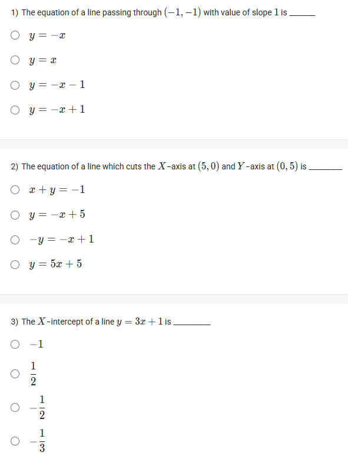
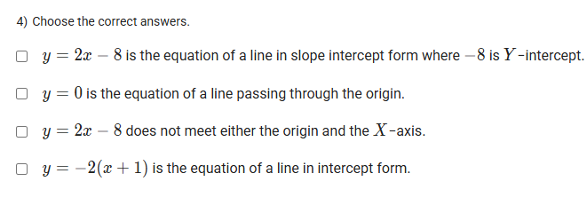

A well-defined collection of distinct objects called elements or members.



https://youtu.be/zM0q4y-y4so

#### Learning Outcomes

1. Find the equation of a line in slope-intercept form and intercept form.

#### Exercise Questions

Hello! On this Wednesday evening here in India, let's work through these questions about the different forms of linear equations.


### **Question 1: Equation from a Point and Slope**

**The Question:**
The equation of a line passing through $(-1, -1)$ with value of slope 1 is \_\_\_\_\_\_\_\_\_\_.
* $y = -x$
* $y = x$
* $y = -x - 1$
* $y = -x + 1$

**Core Concept: The Point-Slope Form**

When you are given a point $(x_1, y_1)$ on a line and its slope ($m$), the most direct way to find the equation is using the point-slope form:
$$y - y_1 = m(x - x_1)$$
You can then simplify this equation into the more common slope-intercept form ($y = mx + c$).

**Detailed Solution:**

1.  **Identify the given information:**
    * The point is $(x_1, y_1) = (-1, -1)$.
    * The slope is $m = 1$.

2.  **Substitute these values into the point-slope formula:**
    $$y - (-1) = 1 \times (x - (-1))$$

3.  **Simplify the equation:**
    $$y + 1 = 1(x + 1)$$ $$y + 1 = x + 1$$
    Subtract 1 from both sides:
    $$y = x$$

**Final Answer:** The equation of the line is **$y = x$**.



### **Question 2: Equation from Two Intercepts**

**The Question:**
The equation of a line which cuts the X-axis at $(5, 0)$ and Y-axis at $(0, 5)$ is \_\_\_\_\_\_\_\_\_\_.
* $x + y = -1$
* $y = -x + 5$
* $-y = -x + 1$
* $y = 5x + 5$

**Core Concept: The Intercept Form**

When a line's x-intercept (where it crosses the x-axis, at point $(a, 0)$) and y-intercept (where it crosses the y-axis, at point $(0, b)$) are known, you can use the intercept form:
$$\frac{x}{a} + \frac{y}{b} = 1$$

**Detailed Solution:**

We can solve this in two ways.

**Method 1: Using the Intercept Form**

1.  **Identify the intercepts:**
    * The x-intercept is at $(5, 0)$, so $a = 5$.
    * The y-intercept is at $(0, 5)$, so $b = 5$.
2.  **Substitute into the intercept formula:**
    $$\frac{x}{5} + \frac{y}{5} = 1$$
3.  **Simplify the equation:**
    * Multiply the entire equation by 5 to eliminate the denominators:
    * $x + y = 5$
    * To match the options, isolate y:
    * $y = -x + 5$

**Method 2: Using the Two-Point Form**

1.  **Find the slope ($m$)** using the points $(5, 0)$ and $(0, 5)$:
    * $m = \frac{y_2 - y_1}{x_2 - x_1} = \frac{5 - 0}{0 - 5} = \frac{5}{-5} = -1$.
2.  **Use the slope-intercept form ($y = mx + c$):**
    * We know the slope $m = -1$.
    * The y-intercept is given as the point $(0, 5)$, so $c = 5$.
    * Substitute the values: $y = (-1)x + 5$, which simplifies to $y = -x + 5$.

**Final Answer:** The equation of the line is **$y = -x + 5$**.



### **Question 3: Finding the X-Intercept**

**The Question:**
The X-intercept of a line $y = 3x + 1$ is \_\_\_\_\_\_\_\_\_\_.
* -1
* 1/2
* -1/2
* -1/3

**Core Concept: Finding Intercepts**

* **X-Intercept:** The point where a line crosses the x-axis. At this point, the **y-coordinate is always 0**. To find the x-intercept, set $y=0$ in the equation and solve for $x$.
* **Y-Intercept:** The point where a line crosses the y-axis. At this point, the **x-coordinate is always 0**.

**Detailed Solution:**

1.  **Start with the equation:**
    * $y = 3x + 1$
2.  **Set y = 0 to find the x-intercept:**
    * $0 = 3x + 1$
3.  **Solve the equation for x:**
    * Subtract 1 from both sides: $-1 = 3x$
    * Divide by 3: $x = -\frac{1}{3}$
    * The x-intercept is the point $(-1/3, 0)$. The question asks for the x-intercept value.

**Final Answer:** The X-intercept is **-1/3**.



### **Question 4: Analyzing Linear Equations**

**The Question:**
Choose the correct answers. (Multiple Select Question)
* $y = 2x - 8$ is the equation of a line in slope intercept form where -8 is Y-intercept.
* $y = 0$ is the equation of a line passing through the origin.
* $y = 2x - 8$ does not meet either the origin and the X-axis.
* $y = -2(x+1)$ is the equation of a line in intercept form.

**Core Concepts: Forms of Linear Equations**

* **Slope-Intercept Form:** $y = mx + c$, where $m$ is the slope and $c$ is the y-intercept.
* **Intercept Form:** $\frac{x}{a} + \frac{y}{b} = 1$, where $a$ is the x-intercept and $b$ is the y-intercept.
* **Passing through the Origin:** A line passes through the origin $(0, 0)$ if substituting $x=0$ and $y=0$ into the equation results in a true statement. For $y = mx + c$, this means $c=0$.

**Detailed Solution:**

Let's evaluate each statement:

1.  **"$y = 2x - 8$ is the equation of a line in slope intercept form where -8 is Y-intercept."**
    * The equation is in the form $y = mx + c$, with $m=2$ and $c=-8$.
    * This is the definition of the slope-intercept form, and the y-intercept is indeed -8. This statement is **TRUE**.

2.  **"$y = 0$ is the equation of a line passing through the origin."**
    * Let's check if the point $(0, 0)$ satisfies the equation. If we substitute $x=0$ and $y=0$, we get $0=0$, which is a true statement.
    * Therefore, the line $y=0$ (which is the x-axis) passes through the origin. This statement is **TRUE**.

3.  **"$y = 2x - 8$ does not meet either the origin and the X-axis."**
    * Let's check the origin $(0,0)$: $0 = 2(0) - 8 \implies 0 = -8$. This is false, so it **does not** meet the origin.
    * Let's check the X-axis (where $y=0$): $0 = 2x - 8 \implies 2x = 8 \implies x = 4$. The line **does** meet the X-axis at the point $(4,0)$.
    * Since the statement claims it meets neither, but it does meet the X-axis, the entire statement is **FALSE**.

4.  **"$y = -2(x+1)$ is the equation of a line in intercept form."**
    * The standard intercept form is $\frac{x}{a} + \frac{y}{b} = 1$.
    * Let's rewrite $y = -2(x+1)$ as $y = -2x - 2$. This is the slope-intercept form.
    * The given form is not the standard intercept form. This statement is **FALSE**.

**Final Answer:** The correct options are **"$y = 2x - 8$ is the equation of a line in slope intercept form where -8 is Y-intercept"** and **"$y = 0$ is the equation of a line passing through the origin"**.
