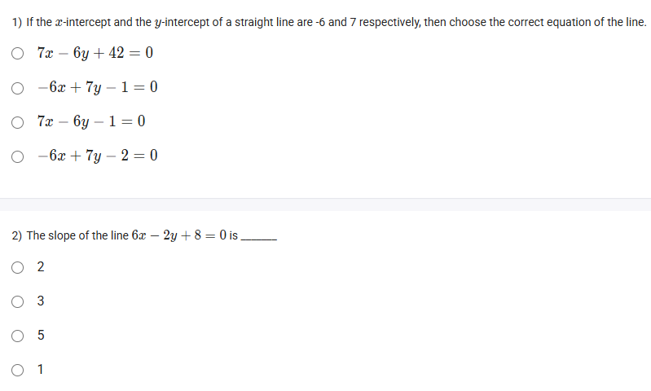
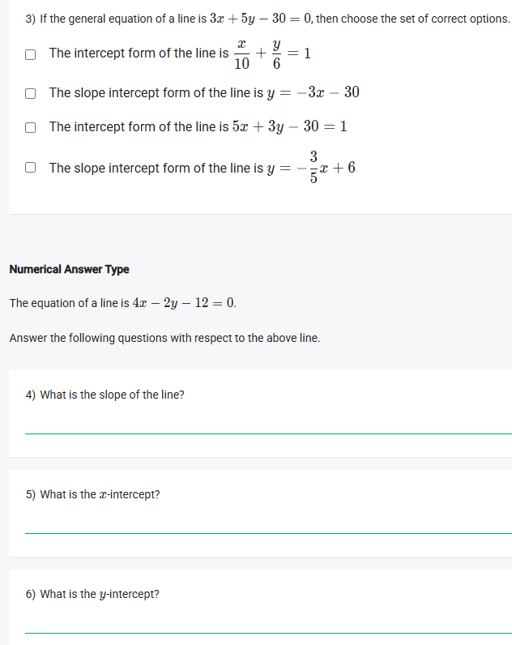

A well-defined collection of distinct objects called elements or members.



https://youtu.be/_3Iidm8NnbM

#### Learning Outcomes

● Understand the general equation of a line.
● Find the different forms of the equation of a line including slope-point form,
slope-intercept form, two-point form and intercept form from the general linear equation.

## Exercise Questions 🤯

Hello! On this Wednesday evening here in India, I'd be happy to guide you through these questions. They focus on converting the equation of a line between different forms to find its key properties like slope and intercepts.


### **Questions 4, 5, & 6: Analyzing a Linear Equation** (from file `image_0b5b27.png`)

**The Equation:**
The equation of a line is $4x - 2y - 12 = 0$. Answer the following questions.

**Core Concepts: General Form, Slope-Intercept Form, and Intercepts**

The given equation is in the **General Form**, $Ax + By + C = 0$. To easily find the slope and intercepts, we can convert it.

* **Slope-Intercept Form ($y = mx + c$):** By isolating $y$, we can directly find the **slope ($m$)** and the **y-intercept ($c$)**.
* **Finding the x-intercept:** This is the point where the line crosses the x-axis. At this point, the y-value is always 0. To find it, we set $y=0$ in the equation and solve for $x$.
* **Finding the y-intercept:** This is the point where the line crosses the y-axis. At this point, the x-value is always 0. We can find it by setting $x=0$ or by looking at the '$c$' value in the slope-intercept form.

---

#### **4) What is the slope of the line?**

**Detailed Solution:**

1.  **Start with the general form:**
    $4x - 2y - 12 = 0$
2.  **Isolate the y-term:**
    $-2y = -4x + 12$
3.  **Divide the entire equation by -2 to solve for y:**
    $y = \frac{-4x}{-2} + \frac{12}{-2}$
4.  **Simplify:**
    $y = 2x - 6$
5.  **Identify the slope:**
    This equation is now in the form $y = mx + c$. The slope ($m$) is the coefficient of $x$.

**Final Answer:** The slope of the line is **2**.

---

#### **5) What is the x-intercept?**

**Detailed Solution:**

1.  **Start with the original equation:**
    $4x - 2y - 12 = 0$
2.  **Set y = 0:**
    $4x - 2(0) - 12 = 0$
3.  **Simplify and solve for x:**
    $4x - 0 - 12 = 0$
    $4x = 12$
    $x = \frac{12}{4} = 3$

**Final Answer:** The x-intercept is **3**.

---

#### **6) What is the y-intercept?**

**Detailed Solution:**

**Method 1: Using the Slope-Intercept Form**
From our work in question 4, we converted the equation to $y = 2x - 6$. In the form $y = mx + c$, the y-intercept is the value of $c$.

**Final Answer:** The y-intercept is **-6**.

**Method 2: Setting x = 0**
1.  **Start with the original equation:**
    $4x - 2y - 12 = 0$
2.  **Set x = 0:**
    $4(0) - 2y - 12 = 0$
3.  **Simplify and solve for y:**
    $0 - 2y - 12 = 0$
    $-2y = 12$
    $y = \frac{12}{-2} = -6$

**Final Answer:** The y-intercept is **-6**.



### **Question 1: Equation from Intercepts** (from file `image_0b62af.png`)

**The Question:**
If the x-intercept and the y-intercept of a straight line are -6 and 7 respectively, then choose the correct equation of the line.
* $7x - 6y + 42 = 0$
* $-6x + 7y - 1 = 0$
* $7x - 6y - 1 = 0$
* $-6x + 7y - 2 = 0$

**Core Concept: The Intercept Form of a Line**

When you are given the x-intercept ($a$) and the y-intercept ($b$), the quickest way to find the equation is the intercept form:
$$\frac{x}{a} + \frac{y}{b} = 1$$

**Detailed Solution:**

1.  **Identify the intercepts:**
    * x-intercept $a = -6$
    * y-intercept $b = 7$
2.  **Substitute into the intercept formula:**
    $$\frac{x}{-6} + \frac{y}{7} = 1$$
3.  **Convert to the General Form ($Ax+By+C=0$) to match the options:**
    * To eliminate the denominators, multiply the entire equation by the least common multiple of -6 and 7, which is -42.
    * $(-42) \times \frac{x}{-6} + (-42) \times \frac{y}{7} = (-42) \times 1$
    * $7x - 6y = -42$
4.  **Rearrange the equation:**
    * Move all terms to one side to set the equation to 0.
    * $7x - 6y + 42 = 0$

**Final Answer:** The correct equation is **$7x - 6y + 42 = 0$**.



### **Question 2: Finding the Slope** (from file `image_0b62af.png`)

**The Question:**
The slope of the line $6x - 2y + 8 = 0$ is \_\_\_\_\_\_\_\_\_\_.
* 2
* 3
* 5
* 1

**Core Concept: Finding Slope from the General Form**

To find the slope of a line given in the general form $Ax + By + C = 0$, the most reliable method is to convert it to the slope-intercept form, $y = mx + c$, by solving for $y$. The coefficient of $x$ will be the slope, $m$.

**Detailed Solution:**

1.  **Start with the general equation:**
    $6x - 2y + 8 = 0$
2.  **Isolate the y-term:**
    $-2y = -6x - 8$
3.  **Divide the entire equation by -2 to solve for y:**
    $y = \frac{-6x}{-2} + \frac{-8}{-2}$
4.  **Simplify:**
    $y = 3x + 4$
5.  **Identify the slope:**
    The equation is now in $y = mx + c$ form. The slope $m$ is the coefficient of $x$.

**Final Answer:** The slope is **3**.



### **Question 3: Converting Linear Equation Forms** (from file `image_0b62af.png`)

**The Question:**
If the general equation of a line is $3x + 5y - 30 = 0$, then choose the set of correct options. (Multiple Select Question)
* The intercept form of the line is $\frac{x}{10} + \frac{y}{6} = 1$
* The slope intercept form of the line is $y = -3x - 30$
* The intercept form of the line is $5x + 3y - 30 = 1$
* The slope intercept form of the line is $y = -\frac{3}{5}x + 6$

**Core Concepts: Converting from General Form**

* **To Slope-Intercept Form ($y = mx + c$):** Isolate the $y$ variable.
* **To Intercept Form ($\frac{x}{a} + \frac{y}{b} = 1$):** Move the constant term to the right side, then divide the entire equation by that constant to make the right side equal to 1.

**Detailed Solution:**

Let's start with the given equation: $3x + 5y - 30 = 0$.

**Part 1: Convert to Intercept Form**
1.  Move the constant term to the right side:
    $3x + 5y = 30$
2.  Divide the entire equation by 30 to make the right side equal to 1:
    $\frac{3x}{30} + \frac{5y}{30} = \frac{30}{30}$
3.  Simplify each fraction:
    $\frac{x}{10} + \frac{y}{6} = 1$
    * This matches the **first option**. The third option is incorrect.

**Part 2: Convert to Slope-Intercept Form**
1.  Start with the general equation and isolate the y-term:
    $5y = -3x + 30$
2.  Divide the entire equation by 5 to solve for y:
    $y = \frac{-3x}{5} + \frac{30}{5}$
3.  Simplify:
    $y = -\frac{3}{5}x + 6$
    * This matches the **fourth option**. The second option is incorrect.

**Final Answer:** The correct options are **"The intercept form of the line is $\frac{x}{10} + \frac{y}{6} = 1$"** and **"The slope intercept form of the line is $y = -\frac{3}{5}x + 6$"**.




### 1) If the x-intercept and the y-intercept of a straight line are -6 and 7 respectively, then choose the correct equation of the line.

**Concept:**

- The intercept form of a line is:

$$
\frac{x}{a} + \frac{y}{b} = 1
$$

where \$ a \$ is the x-intercept and \$ b \$ the y-intercept.
- Here, \$ a = -6 \$, \$ b = 7 \$.

$$
\frac{x}{-6} + \frac{y}{7} = 1
$$

Multiply both sides by 42 (LCM of denominators):

$$
7x - 6y = 42
$$

Bring all terms to one side:

$$
7x - 6y - 42 = 0 \implies 7x - 6y + 42 = 0
$$

(since -42 = 0 and +42 = 0 both point to the same structure but check choices!)
- This matches the option: \$ 7x - 6y + 42 = 0 \$.

**Final Answer:** \$ \boxed{7x - 6y + 42 = 0} \$





### 2) The slope of the line \$ 6x - 2y + 8 = 0 \$ is ______

**Concept:**

- The general equation of a line is \$ Ax + By + C = 0 \$.
- The slope \$ m = -\frac{A}{B} \$.

Apply it:

$$
m = -\frac{6}{-2} = 3
$$

**Final Answer:** \$ \boxed{3} \$





### 3) If the general equation of a line is \$ 3x + 5y - 30 = 0 \$, then choose the set of correct options:

**Concepts:**

#### a) Intercept Form:

Rewrite as

$$
3x + 5y = 30 \implies \frac{x}{10} + \frac{y}{6} = 1
$$

So: \$ \frac{x}{10} + \frac{y}{6} = 1 \$ is correct.

#### b) Slope-Intercept Form:

$$
3x + 5y = 30 \implies 5y = -3x + 30 \implies y = -\frac{3}{5}x + 6
$$

So: \$ \boxed{y = -\frac{3}{5}x + 6} \$

#### c) Check Other Intercept Option:

$$
5x + 3y - 30 = 1
$$

This is not equivalent to our given line.

#### d) Check Other Slope-Intercept Option:

$$
y = -3x - 30
$$

This does not match.

**Final Answers:**

- The intercept form of the line is \$ \frac{x}{10} + \frac{y}{6} = 1 \$
- The slope intercept form is \$ y = -\frac{3}{5}x + 6 \$





### 4) What is the slope of the line: \$ 4x - 2y - 12 = 0 \$?

**Concept:**
General form \$ Ax + By + C = 0 \$, slope is \$ m = -\frac{A}{B} \$.

$$
m = -\frac{4}{-2} = 2
$$

**Final Answer:** \$ \boxed{2} \$





### 5) What is the x-intercept?

**Concept:**
Set \$ y = 0 \$, solve for \$ x \$:

$$
4x - 2(0) - 12 = 0 \implies 4x = 12 \implies x = 3
$$

**Final Answer:** \$ \boxed{3} \$





### 6) What is the y-intercept?

**Concept:**
Set \$ x = 0 \$, solve for \$ y \$:

$$
4(0) - 2y - 12 = 0 \implies -2y = 12 \implies y = -6
$$

**Final Answer:** \$ \boxed{-6} \$



***

## Key Concepts Taught

- **Intercept Form:** \$ \frac{x}{a} + \frac{y}{b} = 1 \$
- **Slope from General Form:** \$ m = -A/B \$
- **Intercepts:** Let \$ y=0 \$ for x-intercept; \$ x=0 \$ for y-intercept
- **Slope-Intercept Form:** \$ y = mx + c \$
Convert general form by isolating \$ y \$
- **Transforming Equations:** Rearranging to get desired forms (intercept, slope-intercept, etc.)

These cover how to quickly analyze and graph lines from any equation form!
[^1][^2]

⁂

[^1]: image.jpeg

[^2]: image.jpeg

