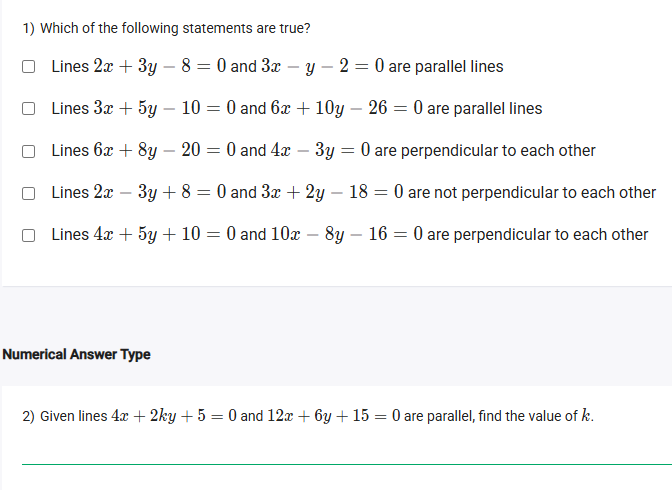

A well-defined collection of distinct objects called elements or members.



https://youtu.be/CjeHgCXhi4k

#### Learning Outcomes

● Find the general equation of a line passing through a point and is perpendicular to a given line.

## Exercise Questions



### 1) The equation of a line passing through the point $(3,4)$ and perpendicular to the line $3x + 4y - 8 = 0$ is

#### Concepts:

- The slope of the given line $3x + 4y - 8 = 0$:
Rearranged to $y = -\frac{3}{4}x + 2$, slope \$ m_1 = -\frac{3}{4} \$.
- The perpendicular slope \$ m_2 \$ satisfies \$ m_1 \cdot m_2 = -1 \$:

$$
m_2 = \frac{4}{3}
$$
- Using point-slope form for a line through $(3,4)$ with this slope:

$$
y - 4 = \frac{4}{3}(x - 3)
$$

$$
3(y - 4) = 4(x - 3) \implies 3y - 12 = 4x - 12 \implies 3y - 4x = 0 \implies 4x - 3y = 0
$$

None of the options match this directly, so multiply both sides to create equivalent forms:

$$
8x - 6y = 0
$$
- Among the options, $8x - 6y = 0$ matches.

**Final Answer:** \$ \boxed{8x - 6y = 0} \$

***

**Concept:**

- When a line is perpendicular to another, its slope is the negative reciprocal.
- Use point-slope or two-point form to get the equation through a given point.





### 2) Given lines $18x - 8y + 30 = 0$ and $4x + ky + 5 = 0$ are perpendicular to each other, find the value of $k$.

#### Concepts:

- Slope of line 1: $18x - 8y + 30 = 0 \implies y = \frac{18}{8}x + \ldots$ so \$ m_1 = \frac{18}{8} = \frac{9}{4} \$
- Slope of line 2: \$4x + ky + 5 = 0 \implies ky = -4x - 5 \implies y = -\frac{4}{k}x - \frac{5}{k} \$, so \$ m_2 = -\frac{4}{k} \$
- For perpendicular lines: $m_1 \cdot m_2 = -1$:

$$
\frac{9}{4} \cdot \left(-\frac{4}{k}\right) = -1
$$

$$
\frac{9}{4} \cdot -\frac{4}{k} = -1 \implies -\frac{9}{k} = -1 \implies k = 9
$$

**Final Answer:** \$ \boxed{9} \$

***

**Concept:**

- The product of slopes of perpendicular lines is $-1$.
- From the general form $Ax + By + C = 0$, slope is \$ -A/B \$.


[^1]

⁂

[^1]: image.jpeg

