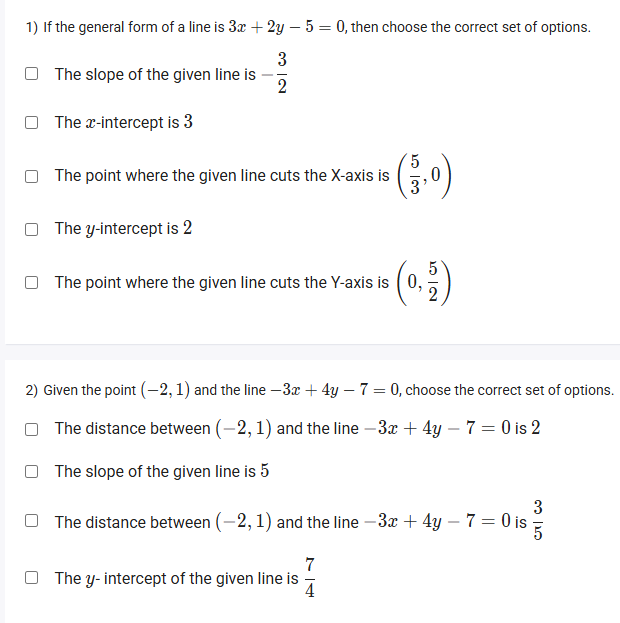
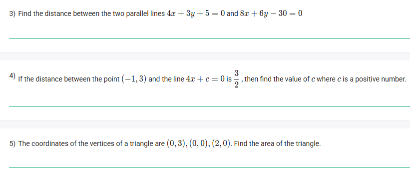

A well-defined collection of distinct objects called elements or members.



https://youtu.be/tYSZ4L0X3kY

#### Learning Outcomes

● Explain the concept of intercepts of a line on the axes.
● Calculate the distance of a point from a line using the general linear expression.
● Determine the distance between two parallel lines.

## Exercise Questions 🤯

Hello! On this Wednesday evening here in India, I can certainly help you solve these problems. They cover some very important formulas in coordinate geometry, including how to analyze linear equations and calculate various distances.


### **Question 1: Analyzing a Linear Equation** (from file `image_015799.png`)

**The Question:**
If the general form of a line is $3x + 2y - 5 = 0$, then choose the correct set of options. (Multiple Select Question)
* The slope of the given line is $-\frac{3}{2}$
* The x-intercept is 3
* The point where the given line cuts the X-axis is $(\frac{5}{3}, 0)$
* The y-intercept is 2
* The point where the given line cuts the Y-axis is $(0, \frac{5}{2})$

**Core Concepts: Finding Properties from the General Form ($Ax+By+C=0$)**

1.  **Slope ($m$):** Rearrange the equation into the slope-intercept form, $y = mx + c$. The coefficient of $x$ is the slope.
2.  **X-Intercept:** This is the point where the line crosses the x-axis, so the y-coordinate is 0. Set $y=0$ and solve for $x$.
3.  **Y-Intercept:** This is the point where the line crosses the y-axis, so the x-coordinate is 0. Set $x=0$ and solve for $y$.

**Detailed Solution:**

Let's analyze the equation $3x + 2y - 5 = 0$.

* **To find the slope:**
    * Rearrange for $y$:
    * $2y = -3x + 5$
    * $y = -\frac{3}{2}x + \frac{5}{2}$
    * The slope ($m$) is the coefficient of $x$. So, the **slope is -3/2**. The first option is **TRUE**.

* **To find the x-intercept:**
    * Set $y=0$:
    * $3x + 2(0) - 5 = 0$
    * $3x - 5 = 0$
    * $3x = 5 \implies x = \frac{5}{3}$.
    * The x-intercept value is 5/3. So, the option "The x-intercept is 3" is **FALSE**.
    * The point where the line cuts the x-axis is indeed **$(\frac{5}{3}, 0)$**. The third option is **TRUE**.

* **To find the y-intercept:**
    * Set $x=0$:
    * $3(0) + 2y - 5 = 0$
    * $2y - 5 = 0$
    * $2y = 5 \implies y = \frac{5}{2}$.
    * The y-intercept value is 5/2. So, the option "The y-intercept is 2" is **FALSE**.
    * The point where the line cuts the y-axis is indeed **$(0, \frac{5}{2})$**. The fifth option is **TRUE**.

**Final Answer:** The correct statements are:
* The slope of the given line is $-\frac{3}{2}$
* The point where the given line cuts the X-axis is $(\frac{5}{3}, 0)$
* The point where the given line cuts the Y-axis is $(0, \frac{5}{2})$



### **Question 2: Distance from a Point to a Line** (from file `image_015799.png`)

**The Question:**
Given the point $(-2, 1)$ and the line $-3x + 4y - 7 = 0$, choose the correct set of options. (Multiple Select Question)
* The distance between $(-2, 1)$ and the line is 2
* The slope of the given line is 5
* The distance between $(-2, 1)$ and the line is $\frac{3}{5}$
* The y-intercept of the given line is $\frac{7}{4}$

**Core Concept: Distance from a Point to a Line**

The shortest distance ($d$) from a point $(x_1, y_1)$ to a line in the general form $Ax + By + C = 0$ is given by the formula:
$$d = \frac{|Ax_1 + By_1 + C|}{\sqrt{A^2 + B^2}}$$

**Detailed Solution:**

Let's analyze the line $-3x + 4y - 7 = 0$ and the point $(-2, 1)$.

* **Slope and y-intercept of the line:**
    * Rearrange to $y=mx+c$: $4y = 3x + 7 \implies y = \frac{3}{4}x + \frac{7}{4}$.
    * The **slope is 3/4**. (So, "The slope...is 5" is **FALSE**).
    * The **y-intercept is 7/4**. (So, "The y-intercept...is 7/4" is **TRUE**).

* **Distance from the point to the line:**
    * Here, $(x_1, y_1) = (-2, 1)$ and for the line, $A=-3, B=4, C=-7$.
    * Substitute into the distance formula:
    $$d = \frac{|(-3)(-2) + (4)(1) + (-7)|}{\sqrt{(-3)^2 + 4^2}}$$ $$d = \frac{|6 + 4 - 7|}{\sqrt{9 + 16}}$$ $$d = \frac{|3|}{\sqrt{25}} = \frac{3}{5}$$
    * The distance is 3/5. (So, "The distance...is 2" is **FALSE**, and "The distance...is 3/5" is **TRUE**).

**Final Answer:** The correct options are:
* The distance between $(-2, 1)$ and the line $-3x + 4y - 7 = 0$ is $\frac{3}{5}$
* The y-intercept of the given line is $\frac{7}{4}$



### **Question 3: Distance Between Parallel Lines** (from file `image_01575e.png`)

**The Question:**
Find the distance between the two parallel lines $4x + 3y + 5 = 0$ and $8x + 6y - 30 = 0$.

**Core Concept: Distance Between Parallel Lines**

To find the distance between two parallel lines, they must first be written with identical A and B coefficients. For two lines $Ax + By + C_1 = 0$ and $Ax + By + C_2 = 0$, the distance ($d$) is:
$$d = \frac{|C_1 - C_2|}{\sqrt{A^2 + B^2}}$$

**Detailed Solution:**

1.  **Line 1:** $4x + 3y + 5 = 0$
2.  **Line 2:** $8x + 6y - 30 = 0$
3.  **Make Coefficients Equal:** Notice that the coefficients in the second line are double those in the first. To make them match, divide the entire second equation by 2:
    * $(8x + 6y - 30) \div 2 = 0 \div 2 \implies 4x + 3y - 15 = 0$.
4.  **Identify Coefficients:** Now we compare our two lines:
    * $4x + 3y + 5 = 0 \implies A=4, B=3, C_1=5$
    * $4x + 3y - 15 = 0 \implies A=4, B=3, C_2=-15$
5.  **Apply the formula:**
    $$d = \frac{|5 - (-15)|}{\sqrt{4^2 + 3^2}}$$ $$d = \frac{|5 + 15|}{\sqrt{16 + 9}}$$ $$d = \frac{|20|}{\sqrt{25}} = \frac{20}{5} = 4$$

**Final Answer:** The distance between the two parallel lines is **4**.



### **Question 4: Finding 'c' from a Given Distance** (from file `image_01575e.png`)

**The Question:**
If the distance between the point $(-1, 3)$ and the line $4x + c = 0$ is $\frac{3}{2}$, then find the value of $c$ where $c$ is a positive number.

**Core Concept: Distance from a Point to a Line**

We use the same formula as in Question 2: $d = \frac{|Ax_1 + By_1 + C|}{\sqrt{A^2 + B^2}}$.

**Detailed Solution:**

1.  **Identify the knowns:**
    * The point is $(x_1, y_1) = (-1, 3)$.
    * The line is $4x + c = 0$. We can write this as $4x + 0y + c = 0$.
    * So, $A=4, B=0, C=c$.
    * The distance is given: $d = \frac{3}{2}$.
2.  **Set up the distance formula equation:**
    $$\frac{3}{2} = \frac{|(4)(-1) + (0)(3) + c|}{\sqrt{4^2 + 0^2}}$$
3.  **Simplify and solve for c:**
    $$\frac{3}{2} = \frac{|-4 + 0 + c|}{\sqrt{16}}$$ $$\frac{3}{2} = \frac{|c - 4|}{4}$$
4.  **Isolate the absolute value term:**
    * Multiply both sides by 4:
    * $4 \times \frac{3}{2} = |c - 4| \implies 6 = |c - 4|$
5.  **Solve the absolute value equation:**
    * This gives two possibilities:
        * $c - 4 = 6 \implies c = 10$
        * $c - 4 = -6 \implies c = -2$
6.  **Apply the final condition:**
    * The problem states that $c$ is a positive number. Therefore, we discard the $c=-2$ solution.

**Final Answer:** The value of $c$ is **10**.



### **Question 5: Area of a Triangle** (from file `image_01575e.png`)

**The Question:**
The coordinates of the vertices of a triangle are $(0, 3)$, $(0, 0)$, $(2, 0)$. Find the area of the triangle.

**Core Concept: Area of a Right-Angled Triangle**

The area of any triangle is given by $\frac{1}{2} \times \text{base} \times \text{height}$. When a triangle is on a coordinate plane, if one side lies on the x-axis and another on the y-axis, it is a right-angled triangle, and its base and height are easy to determine.

**Detailed Solution:**

1.  **Visualize the vertices:**
    * Point A: $(0, 3)$ - on the y-axis.
    * Point B: $(0, 0)$ - the origin.
    * Point C: $(2, 0)$ - on the x-axis.
2.  **Identify the Base and Height:**
    * The segment from the origin (0, 0) to (2, 0) lies on the x-axis. Its length is 2. We can use this as the **base**.
    * The segment from the origin (0, 0) to (0, 3) lies on the y-axis. Its length is 3. Since it's perpendicular to the base, we can use this as the **height**.
3.  **Calculate the area:**
    * Area = $\frac{1}{2} \times \text{base} \times \text{height}$
    * Area = $\frac{1}{2} \times 2 \times 3 = 3$

**Final Answer:** The area of the triangle is **3** square units.
