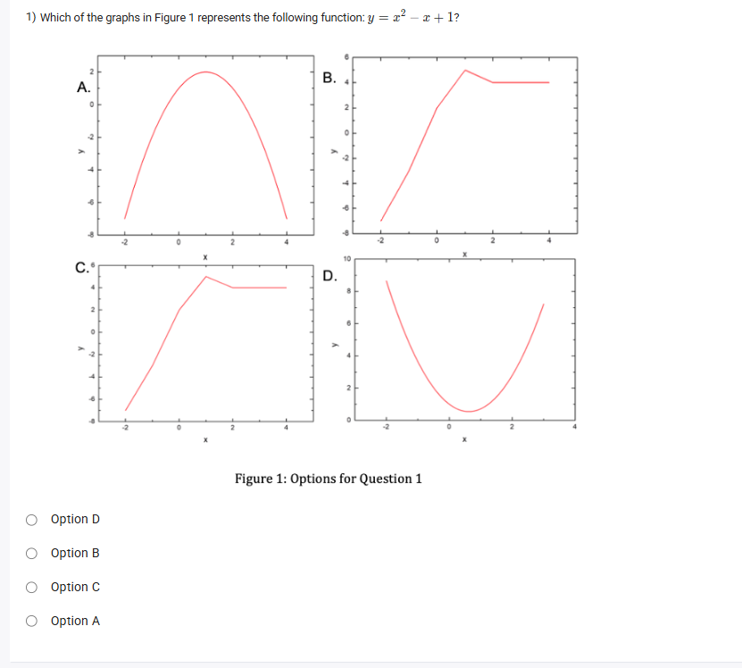
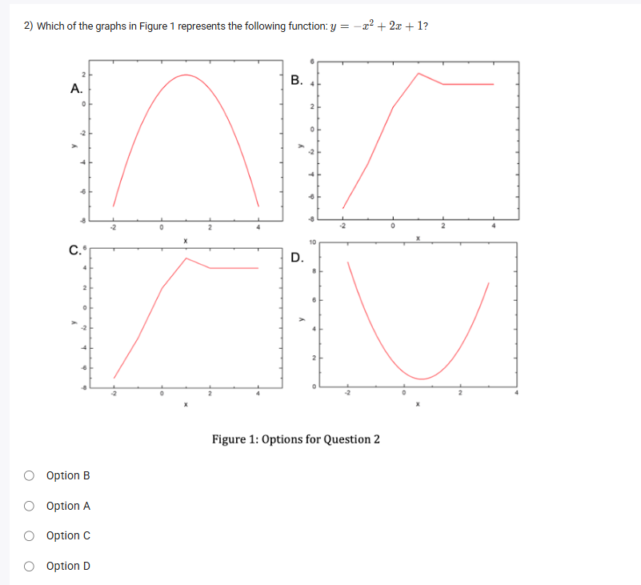
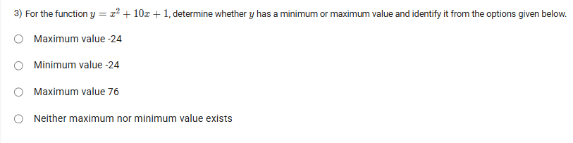

A well-defined collection of distinct objects called elements or members.



https://youtu.be/U4gr4zMosMk

#### Learning Outcomes

1. Compare quadratic functions and linear functions.
2. Define a quadratic function and represent it using a parabola.
3. Identify different terms in a quadratic function and comprehend the importance of their coefficients.
4. Represent the ‘axis of symmetry’ and ‘vertex’ used to represent parabola.

## Exercise Questions 🤯

Hello! On this Wednesday evening here in India, let's go through these questions about quadratic functions. These problems involve understanding the shape and key features of parabolas from their equations.

### **Core Concepts: Understanding Quadratic Functions ($y = ax^2 + bx + c$)**

Before we solve the problems, let's review the basics. The graph of a quadratic function is a U-shaped curve called a **parabola**.

1.  **Direction of Opening:** The sign of the leading coefficient, '$a$', tells you everything about the parabola's direction and whether it has a minimum or maximum point.
    * If **$a > 0$** (positive), the parabola opens **upwards** ($\cup$) and has a **minimum** value at its lowest point.
    * If **$a < 0$** (negative), the parabola opens **downwards** ($\cap$) and has a **maximum** value at its highest point.

2.  **The Vertex:** The vertex is the turning point of the parabola—either the very bottom (minimum) or the very top (maximum). We can find its coordinates $(x_v, y_v)$ with a simple formula:
    * **x-coordinate of the vertex:** $x_v = -\frac{b}{2a}$
    * **y-coordinate of the vertex:** Plug the x-coordinate you just found back into the equation. This y-value **is** the minimum or maximum value of the function.

---


### **Question 1: Identifying the Graph of a Parabola** (from file `image_00850a.png`)

**The Question:**
Which of the graphs in Figure 1 represents the following function: $y = x^2 - x + 1$?

**Detailed Solution:**

1.  **Analyze the Equation:**
    The function is $y = x^2 - x + 1$. Let's identify the coefficients:
    * $a = 1$
    * $b = -1$
    * $c = 1$

2.  **Determine the Direction:**
    * Since $a = 1$ (which is positive), the parabola must open **upwards**.
    * Looking at the four graphs, only **Graph D** shows a parabola opening upwards. Graphs B and C are not parabolas, and Graph A opens downwards.

3.  **(Optional) Confirm by Finding the Vertex:**
    * Let's find the vertex to be absolutely sure.
    * **x-coordinate:** $x_v = -\frac{b}{2a} = -\frac{-1}{2(1)} = \frac{1}{2} = 0.5$.
    * **y-coordinate:** $y_v = (0.5)^2 - (0.5) + 1 = 0.25 - 0.5 + 1 = 0.75$.
    * The vertex is at $(0.5, 0.75)$.
    * Graph D shows a parabola opening upwards with its vertex slightly to the right of the y-axis and above the x-axis, which perfectly matches our calculated vertex.

**Final Answer:** **Option D**.



### **Question 2: Identifying the Graph of a Parabola** (from file `image_0081ff.png`)

**The Question:**
Which of the graphs in Figure 1 represents the following function: $y = -x^2 + 2x + 1$?

**Detailed Solution:**

1.  **Analyze the Equation:**
    The function is $y = -x^2 + 2x + 1$. Let's identify the coefficients:
    * $a = -1$
    * $b = 2$
    * $c = 1$

2.  **Determine the Direction:**
    * Since $a = -1$ (which is negative), the parabola must open **downwards**.
    * Looking at the four graphs, only **Graph A** shows a parabola opening downwards.

3.  **(Optional) Confirm by Finding the Vertex:**
    * **x-coordinate:** $x_v = -\frac{b}{2a} = -\frac{2}{2(-1)} = -\frac{2}{-2} = 1$.
    * **y-coordinate:** $y_v = -(1)^2 + 2(1) + 1 = -1 + 2 + 1 = 2$.
    * The vertex is at $(1, 2)$.
    * Graph A shows a parabola opening downwards with its peak (vertex) at the point $(1, 2)$, which is a perfect match.

**Final Answer:** **Option A**.



### **Question 3: Finding the Minimum/Maximum Value** (from file `image_0081a4.png`)

**The Question:**
For the function $y = x^2 + 10x + 1$, determine whether $y$ has a minimum or maximum value and identify it from the options given below.
* Maximum value -24
* Minimum value -24
* Maximum value 76
* Neither maximum nor minimum value exists

**Detailed Solution:**

1.  **Analyze the Equation:**
    The function is $y = x^2 + 10x + 1$. The coefficients are:
    * $a = 1$
    * $b = 10$
    * $c = 1$

2.  **Determine if it's a Minimum or Maximum:**
    * Since $a = 1$ (positive), the parabola opens **upwards**.
    * An upward-opening parabola has a lowest point, which is a **minimum value**.
    * This immediately eliminates the "Maximum value" options.

3.  **Find the Minimum Value (the y-coordinate of the vertex):**
    * First, find the x-coordinate of the vertex:
    $$x_v = -\frac{b}{2a} = -\frac{10}{2(1)} = -5$$
    * Now, substitute this x-value back into the original equation to find the y-coordinate, which is our minimum value:
    $$y_{min} = (-5)^2 + 10(-5) + 1$$ $$y_{min} = 25 - 50 + 1$$ $$y_{min} = -24$$

**Final Answer:** The function has a **Minimum value -24**.
