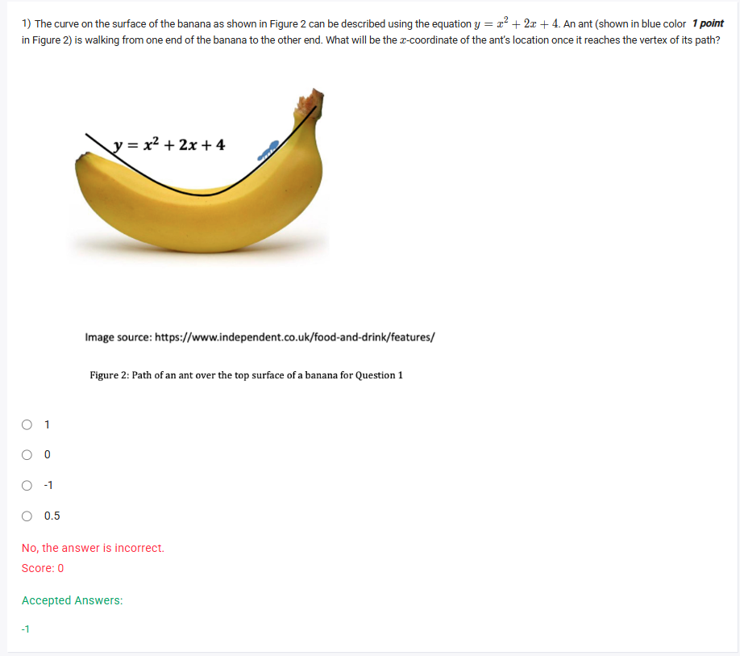
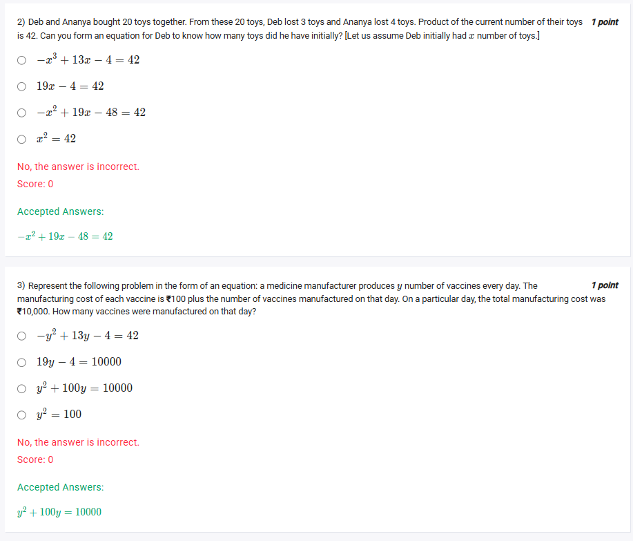
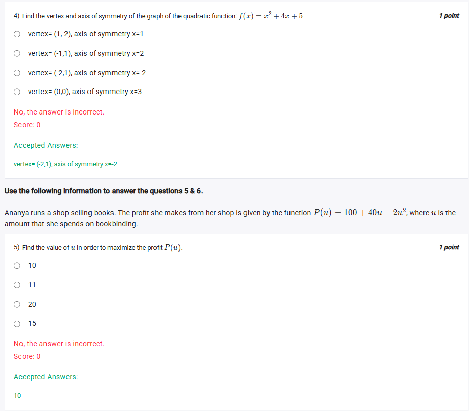
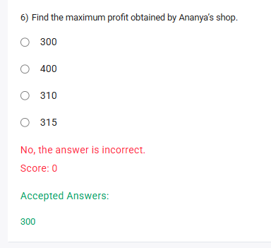

A well-defined collection of distinct objects called elements or members.



https://youtu.be/dvJKbgIPG8Q

#### Learning Outcomes

1. Determine the minimum and maximum value of a quadratic function.
2. Explain the concept of range and domain of a quadratic function.
3. Demonstrate the ability to apply these concepts in real life scenarios.

## Exercise Questions 🤯

Hello! On this Wednesday evening here in India, I'd be glad to help you with this set of problems. They are excellent examples of how quadratic functions are used to model real-world situations, from the path of an ant to maximizing business profits.

### **Core Concepts: The Parabola ($y = ax^2 + bx + c$)**

All these problems revolve around the properties of parabolas. Let's quickly review the key formula.

* **The Vertex:** The vertex is the highest or lowest point of the parabola. Its coordinates $(x_v, y_v)$ are found using:
    * **x-coordinate:** $x_v = -\frac{b}{2a}$
    * **y-coordinate:** Plug $x_v$ back into the function to find $y_v$.
* **Maximum vs. Minimum:**
    * If '$a$' is positive, the parabola opens upwards ($\cup$), and the vertex is a **minimum**.
    * If '$a$' is negative, the parabola opens downwards ($\cap$), and the vertex is a **maximum**.
* **Axis of Symmetry:** This is the vertical line that cuts the parabola in half. Its equation is simply $x = x_v$.

---

### **Question 1: Ant on a Banana** (from file `image_0079c2.png`)

**The Question:**
The curve on the surface of the banana as shown in Figure 2 can be described using the equation $y = x^2 + 2x + 4$. An ant (shown in blue color in Figure 2) is walking from one end of the banana to the other end. What will be the x-coordinate of the ant's location once it reaches the vertex of its path?

**Core Concept:** The question asks for the **x-coordinate of the vertex** of the parabola.

**Detailed Solution:**

1.  **Identify the coefficients** from the equation $y = x^2 + 2x + 4$:
    * $a = 1$
    * $b = 2$
    * $c = 4$
2.  **Apply the formula for the x-coordinate of the vertex:**
    $$x_v = -\frac{b}{2a}$$ $$x_v = -\frac{2}{2(1)} = -1$$

**Final Answer:** The x-coordinate of the ant at the vertex is **-1**.



### **Question 2: Deb and Ananya's Toys** (from file `image_0076dc.png`)

**The Question:**
Deb and Ananya bought 20 toys together. From these 20 toys, Deb lost 3 toys and Ananya lost 4 toys. Product of the current number of their toys is 42. Can you form an equation for Deb to know how many toys did he have initially? [Let us assume Deb initially had x number of toys.]

**Core Concept:** Translating a word problem into a mathematical equation by defining expressions for each quantity.

**Detailed Solution:**

1.  **Define initial quantities:**
    * Number of toys Deb had initially = $x$.
    * Total toys = 20.
    * Number of toys Ananya had initially = $20 - x$.

2.  **Define current quantities (after losing some):**
    * Number of toys Deb has now = $x - 3$.
    * Number of toys Ananya has now = $(20 - x) - 4 = 16 - x$.

3.  **Form the equation based on the product:**
    * The product of their current number of toys is 42.
    * (Deb's current toys) $\times$ (Ananya's current toys) = 42
    * $(x - 3)(16 - x) = 42$

4.  **Expand the equation to match the options:**
    * Use the FOIL method: $x(16) + x(-x) - 3(16) - 3(-x) = 42$
    * $16x - x^2 - 48 + 3x = 42$
    * Combine like terms: $-x^2 + 19x - 48 = 42$

**Final Answer:** The correct equation is **$-x^2 + 19x - 48 = 42$**.



### **Question 3: Vaccine Manufacturing Cost** (from file `image_0076dc.png`)

**The Question:**
Represent the following problem in the form of an equation: a medicine manufacturer produces y number of vaccines every day. The manufacturing cost of each vaccine is ₹100 plus the number of vaccines manufactured on that day. On a particular day, the total manufacturing cost was ₹10,000. How many vaccines were manufactured on that day?

**Core Concept:** Total Cost = (Number of Units) $\times$ (Cost per Unit).

**Detailed Solution:**

1.  **Define the quantities from the problem:**
    * Number of vaccines produced = $y$.
    * Cost per vaccine = "₹100 plus the number of vaccines", which translates to $100 + y$.
    * Total manufacturing cost = ₹10,000.

2.  **Set up the equation:**
    * Total Cost = (Number of Units) $\times$ (Cost per Unit)
    * $10000 = y \times (100 + y)$

3.  **Expand and rearrange the equation to match the options:**
    * $10000 = 100y + y^2$
    * This is commonly written with the highest power first: $y^2 + 100y = 10000$.

**Final Answer:** The correct equation is **$y^2 + 100y = 10000$**.



### **Question 4: Vertex and Axis of Symmetry** (from file `image_007662.png`)

**The Question:**
Find the vertex and axis of symmetry of the graph of the quadratic function: $f(x) = x^2 + 4x + 5$.

**Core Concept:** The vertex is the point $(x_v, y_v)$ and the axis of symmetry is the vertical line $x = x_v$.

**Detailed Solution:**

1.  **Identify the coefficients** from $f(x) = x^2 + 4x + 5$:
    * $a = 1$
    * $b = 4$
    * $c = 5$

2.  **Find the x-coordinate of the vertex:**
    $$x_v = -\frac{b}{2a} = -\frac{4}{2(1)} = -2$$

3.  **Determine the axis of symmetry:**
    * The axis of symmetry is the line $x = x_v$, so it is **$x = -2$**.

4.  **Find the y-coordinate of the vertex:**
    * Substitute $x = -2$ back into the function:
    * $y_v = f(-2) = (-2)^2 + 4(-2) + 5$
    * $y_v = 4 - 8 + 5 = 1$

5.  **State the vertex:**
    * The vertex is the point $(x_v, y_v)$, which is **$(-2, 1)$**.

**Final Answer:** The correct option is **vertex= (-2,1), axis of symmetry x=-2**.



### **Question 5: Maximizing Profit (Finding the Input)** (from file `image_007662.png`)

**The Question:**
Ananya runs a shop selling books. The profit she makes from her shop is given by the function $P(u) = 100 + 40u - 2u^2$, where u is the amount that she spends on bookbinding. Find the value of u in order to maximize the profit $P(u)$.

**Core Concept:** A downward-opening parabola (negative 'a' value) has a maximum value at its vertex. This question asks for the input value ($u$) that gives this maximum profit, which is the u-coordinate of the vertex.

**Detailed Solution:**

1.  **Rearrange the function and identify coefficients:**
    * $P(u) = -2u^2 + 40u + 100$
    * $a = -2$
    * $b = 40$
    * $c = 100$
    * Since 'a' is negative, this parabola opens downwards and has a maximum.

2.  **Find the u-coordinate of the vertex:**
    * $u_{vertex} = -\frac{b}{2a} = -\frac{40}{2(-2)} = -\frac{40}{-4} = 10$

**Final Answer:** The value of u that maximizes the profit is **10**.



### **Question 6: Finding the Maximum Profit** (from file `image_007622.png`)

**The Question:**
Find the maximum profit obtained by Ananya's shop.

**Core Concept:** This is the follow-up to the previous question. The maximum profit is the actual maximum value of the function, which is the y-coordinate (or in this case, the P-coordinate) of the vertex.

**Detailed Solution:**

1.  **From the previous question, we know that profit is maximized when $u = 10$.**

2.  **Calculate the profit $P(u)$ for $u = 10$:**
    * $P(10) = 100 + 40(10) - 2(10)^2$
    * $P(10) = 100 + 400 - 2(100)$
    * $P(10) = 500 - 200$
    * $P(10) = 300$

**Final Answer:** The maximum profit is **300**.
