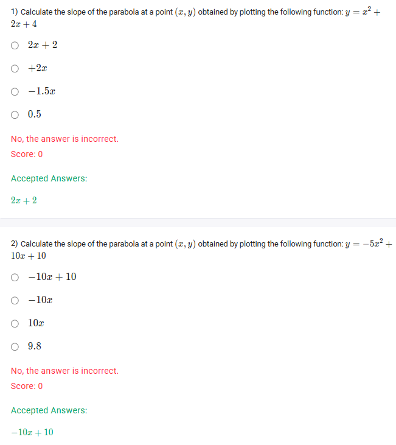
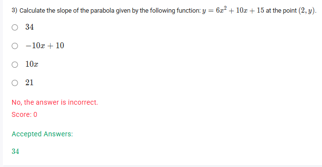

A well-defined collection of distinct objects called elements or members.



https://youtu.be/1_Y2cZMrcfY

#### Learning Outcomes

1. Define the slope of a quadratic function.
2. Compute the slope of any given parabola.
3. Differentiate between slopes of linear equations and slopes of quadratic equations.

## Exercise Questions 🤯

Hello! On this Wednesday evening here in India, I see you're moving into some exciting new concepts! These questions are an introduction to **Differential Calculus**. They ask for the "slope of a parabola at a point," which is a bit different from the slope of a straight line. Let's cover the main idea first.

### **Core Concept: The Slope of a Curve (The Derivative)**

Unlike a straight line which has the same slope everywhere, the steepness (slope) of a curve like a parabola is constantly changing. The "slope at a specific point" is defined as the slope of the straight line that is tangent to the curve at that exact point.

To find this slope, we use a powerful tool called the **derivative**. The derivative is a new function that we can calculate from the original function, and its job is to tell us the slope at any given x-value.

**The Power Rule for Derivatives**
For functions like the ones in your questions (polynomials), we can use a simple rule called the Power Rule to find the derivative.

* If a term is $ax^n$, its derivative is $(a \cdot n)x^{n-1}$.
* The derivative of a term like $ax$ is just $a$.
* The derivative of a constant term (like +4 or +15) is **0**.

We apply this rule to each term in the function to find the overall derivative, which represents the slope. Let's use this to solve your questions.

---

### **Question 1: Slope of a Parabola**

**The Question:**
Calculate the slope of the parabola at a point $(x, y)$ obtained by plotting the following function: $y = x^2 + 2x + 4$.

**Core Concept:** We need to find the derivative of the function using the Power Rule. The resulting expression will be the formula for the slope at any point $x$.

**Detailed Solution:**

1.  **Start with the function:**
    $y = x^2 + 2x + 4$
2.  **Apply the Power Rule to each term:**
    * For the $x^2$ term: Here, $a=1$ and $n=2$. The derivative is $(1 \cdot 2)x^{2-1} = 2x^1 = 2x$.
    * For the $2x$ term: The derivative is just the coefficient, which is $2$.
    * For the constant term $4$: The derivative is $0$.
3.  **Combine the results:**
    * The derivative (slope function) is the sum of the individual derivatives: $2x + 2 + 0$.

**Final Answer:** The slope of the parabola at any point $(x, y)$ is **$2x + 2$**.



### **Question 2: Slope of a Parabola**

**The Question:**
Calculate the slope of the parabola at a point $(x, y)$ obtained by plotting the following function: $y = -5x^2 + 10x + 10$.

**Core Concept:** Again, we find the derivative of the function to get the general formula for its slope.

**Detailed Solution:**

1.  **Start with the function:**
    $y = -5x^2 + 10x + 10$
2.  **Apply the Power Rule to each term:**
    * For the $-5x^2$ term: Here, $a=-5$ and $n=2$. The derivative is $(-5 \cdot 2)x^{2-1} = -10x^1 = -10x$.
    * For the $10x$ term: The derivative is the coefficient, $10$.
    * For the constant term $10$: The derivative is $0$.
3.  **Combine the results:**
    * The derivative (slope function) is: $-10x + 10 + 0$.

**Final Answer:** The slope of the parabola at any point $(x, y)$ is **$-10x + 10$**.



### **Question 3: Slope of a Parabola at a Specific Point**

**The Question:**
Calculate the slope of the parabola given by the following function: $y = 6x^2 + 10x + 15$ at the point $(2, y)$.

**Core Concept:** This is a two-step process:
1.  First, find the derivative to get the general formula for the slope at any $x$.
2.  Second, substitute the specific x-value from the given point into the derivative formula to find the slope at that exact point.

**Detailed Solution:**

1.  **Step 1: Find the derivative (the general slope function).**
    * The function is $y = 6x^2 + 10x + 15$.
    * Derivative of $6x^2$: $(6 \cdot 2)x^{2-1} = 12x$.
    * Derivative of $10x$: $10$.
    * Derivative of $15$: $0$.
    * The slope at any point $x$ is given by the derivative: $Slope = 12x + 10$.

2.  **Step 2: Evaluate the slope at the specific point.**
    * The given point is $(2, y)$. We only need the x-coordinate, which is $x = 2$.
    * Substitute $x=2$ into our slope function:
    * Slope at $x=2$ is $12(2) + 10$.
    * $24 + 10 = 34$.

**Final Answer:** The slope of the parabola at the point $(2, y)$ is **34**.
