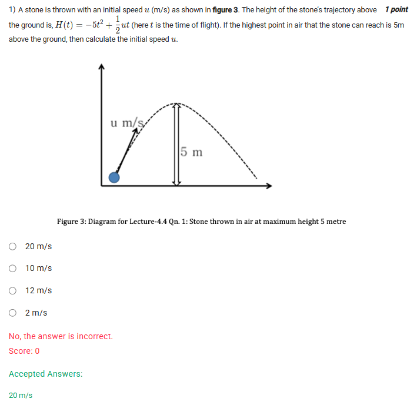
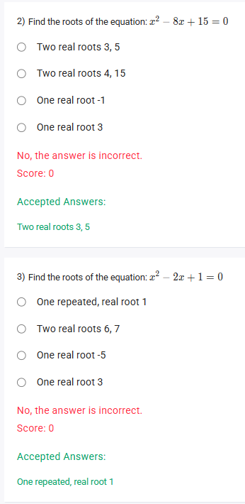

A well-defined collection of distinct objects called elements or members.



https://youtu.be/RzIBZbGov4w

#### Learning Outcomes

1. Define the standard form of quadratic equations and relate this with the quadratic function.
2. Compute roots of equations and zeros of a function.
3. Solve quadratic equations using the graphing technique.

## Exercise Questions

Hello! On this Wednesday evening here in India, I'd be happy to explain these problems. The first question is a great real-world application of parabolas, while the other two are fundamental to solving quadratic equations.


### **Question 1: Projectile Motion of a Stone** (from file `image_00117f.png`)

**The Question:**
A stone is thrown with an initial speed $u$ (m/s). The height of the stone's trajectory above the ground is, $H(t) = -5t^2 + \frac{1}{2}ut$ (here $t$ is the time of flight). If the highest point in air that the stone can reach is 5m above the ground, then calculate the initial speed $u$.

**Core Concept: Maximum Value of a Quadratic Function**

The path of a projectile under gravity is a parabola. The function given, $H(t) = -5t^2 + \frac{1}{2}ut$, is a quadratic equation where the coefficient of the $t^2$ term is negative (-5). This means the parabola opens downwards ($\cap$), and its **vertex** represents the **highest point** of the trajectory.

We can find the time ($t$) it takes to reach this vertex and the maximum height (the y-value of the vertex) using the vertex formula. For a function $y = at^2 + bt + c$:
* Time to reach vertex: $t_{vertex} = -\frac{b}{2a}$
* The maximum height is the value of the function at that time, $H(t_{vertex})$.

**Detailed Solution:**

1.  **Identify the coefficients** from the function $H(t) = -5t^2 + (\frac{u}{2})t$:
    * $a = -5$
    * $b = \frac{u}{2}$

2.  **Find the time ($t$) to reach the highest point:**
    * $t_{vertex} = -\frac{b}{2a} = -\frac{u/2}{2(-5)} = -\frac{u/2}{-10} = \frac{u}{20}$

3.  **Use the given maximum height to find $u$:**
    * We are told the maximum height is 5m. This means when $t = \frac{u}{20}$, the value of $H(t)$ is 5.
    * Let's substitute $t = \frac{u}{20}$ back into the original equation and set it equal to 5:
        $$5 = -5\left(\frac{u}{20}\right)^2 + \frac{u}{2}\left(\frac{u}{20}\right)$$
4.  **Solve the equation for $u$:**
    $$5 = -5\left(\frac{u^2}{400}\right) + \frac{u^2}{40}$$ $$5 = -\frac{5u^2}{400} + \frac{u^2}{40}$$
    * Simplify the first fraction:
    $$5 = -\frac{u^2}{80} + \frac{u^2}{40}$$
    * Find a common denominator (80):
    $$5 = -\frac{u^2}{80} + \frac{2u^2}{80}$$$$5 = \frac{-u^2 + 2u^2}{80}$$$$5 = \frac{u^2}{80}$$
    * Isolate $u^2$:
    $$u^2 = 5 \times 80 = 400$$
    * Take the square root (speed must be positive):
    $$u = \sqrt{400} = 20$$

**Final Answer:** The initial speed $u$ is **20 m/s**.



### **Question 2: Finding Roots of a Quadratic Equation** (from file `image_000ddb.png`)

**The Question:**
Find the roots of the equation: $x^2 - 8x + 15 = 0$.

**Core Concept: Roots of an Equation**

The "roots" (or "solutions") of an equation are the values of the variable (in this case, $x$) that make the statement true. For a quadratic equation, we can find the roots by factoring or by using the quadratic formula. Factoring is often quicker if the numbers are simple.

**Method: Factoring**
To factor an equation of the form $x^2 + bx + c = 0$, we look for two numbers that **multiply** to give $c$ and **add** to give $b$.

**Detailed Solution:**

1.  **Analyze the equation:** $x^2 - 8x + 15 = 0$.
    * We need two numbers that multiply to **+15**.
    * We need the same two numbers to add to **-8**.
2.  **Find the two numbers:**
    * Factors of 15: (1, 15), (3, 5).
    * To get a positive product and a negative sum, both numbers must be negative.
    * Let's try (-3) and (-5):
        * $(-3) \times (-5) = +15$ (This works)
        * $(-3) + (-5) = -8$ (This also works)
3.  **Rewrite the equation in factored form:**
    * The equation becomes $(x - 3)(x - 5) = 0$.
4.  **Solve for the roots:**
    * For the product of two terms to be zero, at least one of the terms must be zero.
    * Either $x - 3 = 0 \implies x = 3$
    * Or $x - 5 = 0 \implies x = 5$

**Final Answer:** The equation has **Two real roots 3, 5**.



### **Question 3: Finding a Repeated Root** (from file `image_000ddb.png`)

**The Question:**
Find the roots of the equation: $x^2 - 2x + 1 = 0$.

**Core Concept: The Discriminant and Repeated Roots**

Sometimes, a quadratic equation has only one unique solution, which is called a "repeated root". This happens when the quadratic expression is a perfect square. We can test for this using the **discriminant** ($\Delta$), which is the part under the square root in the quadratic formula: $\Delta = b^2 - 4ac$.

* If $\Delta > 0$: Two distinct real roots.
* If $\Delta = 0$: One repeated real root.
* If $\Delta < 0$: No real roots.

**Detailed Solution:**

**Method 1: Factoring**

1.  **Analyze the equation:** $x^2 - 2x + 1 = 0$.
2.  We are looking for two numbers that multiply to +1 and add to -2. The only pair is (-1) and (-1).
3.  **Rewrite in factored form:**
    * $(x - 1)(x - 1) = 0$, which is the same as $(x - 1)^2 = 0$.
4.  **Solve for the root:**
    * The only way for this to be true is if $x - 1 = 0$.
    * $x = 1$.
    * Since the factor $(x-1)$ appears twice, this is a repeated root.

**Method 2: Using the Discriminant**

1.  **Identify coefficients** from $x^2 - 2x + 1 = 0$:
    * $a = 1$, $b = -2$, $c = 1$.
2.  **Calculate the discriminant:**
    * $\Delta = b^2 - 4ac = (-2)^2 - 4(1)(1) = 4 - 4 = 0$.
3.  **Interpret the result:**
    * Since the discriminant is 0, we know there is exactly one repeated real root. We can find it using the simplified quadratic formula for this case: $x = \frac{-b}{2a} = \frac{-(-2)}{2(1)} = \frac{2}{2} = 1$.

**Final Answer:** The equation has **One repeated, real root 1**.
