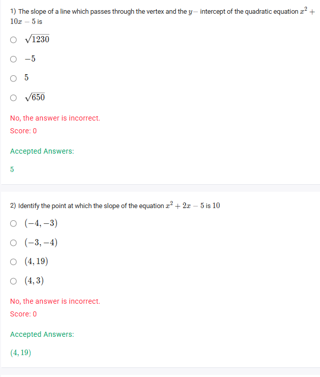
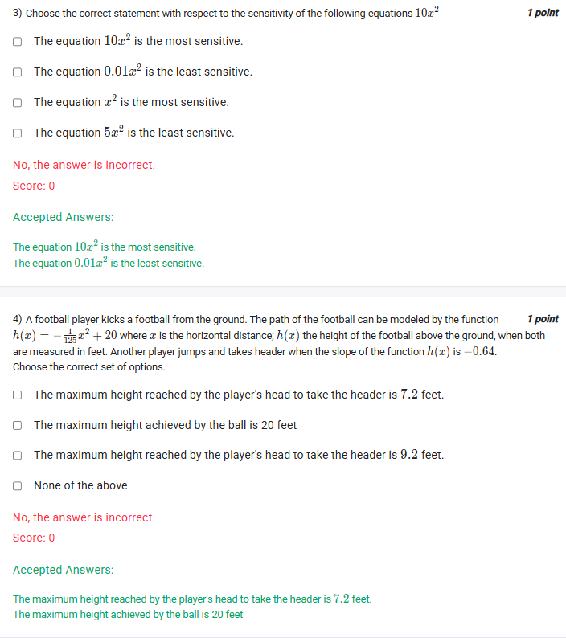

A well-defined collection of distinct objects called elements or members.



https://youtu.be/kaByg1VQxqk

## Exercise Questions 🤯

Hello! On this Wednesday evening here in India, I'd be happy to guide you through these questions. They are great examples of how the concepts of parabolas and their slopes (derivatives) are applied in different scenarios.


### **Question 1: Slope Between Vertex and Y-Intercept** (from file `image_000569.png`)

**The Question:**
The slope of a line which passes through the vertex and the $y-$intercept of the quadratic equation $x^2 + 10x - 5$ is \_\_\_\_\_\_\_\_\_\_.

**Core Concepts: Vertex, Y-Intercept, and Slope**

This is a three-step problem:
1.  **Find the Vertex:** For a parabola $y = ax^2 + bx + c$, the vertex $(x_v, y_v)$ is found using $x_v = -\frac{b}{2a}$, and then plugging that value back into the equation to find $y_v$.
2.  **Find the Y-Intercept:** The y-intercept is the point where the graph crosses the y-axis. This always happens when $x=0$. For $y = ax^2 + bx + c$, this point is simply $(0, c)$.
3.  **Find the Slope:** Use the standard slope formula, $m = \frac{y_2 - y_1}{x_2 - x_1}$, with the two points you found.

**Detailed Solution:**

Let the equation be $y = x^2 + 10x - 5$.
1.  **Find the Vertex:**
    * The coefficients are $a=1, b=10, c=-5$.
    * x-coordinate of the vertex: $x_v = -\frac{10}{2(1)} = -5$.
    * y-coordinate of the vertex: $y_v = (-5)^2 + 10(-5) - 5 = 25 - 50 - 5 = -30$.
    * So, the **Vertex is at $(-5, -30)$**.

2.  **Find the Y-Intercept:**
    * Set $x=0$ in the equation: $y = (0)^2 + 10(0) - 5 = -5$.
    * So, the **Y-Intercept is at $(0, -5)$**.

3.  **Calculate the slope between these two points:**
    * Let $(x_1, y_1) = (-5, -30)$ and $(x_2, y_2) = (0, -5)$.
    * $m = \frac{y_2 - y_1}{x_2 - x_1} = \frac{-5 - (-30)}{0 - (-5)} = \frac{-5 + 30}{0 + 5} = \frac{25}{5} = 5$.

**Final Answer:** The slope is **5**.



### **Question 2: Point with a Given Slope** (from file `image_000569.png`)

**The Question:**
Identify the point at which the slope of the equation $x^2 + 2x - 5$ is 10.

**Core Concept: Finding a Point with a Specific Slope Using the Derivative**

The "slope of the equation" at a point is found using its derivative.
1.  Find the derivative of the function, which gives you a formula for the slope at any $x$.
2.  Set this slope formula equal to the desired slope (in this case, 10) and solve for $x$.
3.  Substitute the value of $x$ you found back into the *original* equation to find the corresponding $y$-value.

**Detailed Solution:**

Let the equation be $y = x^2 + 2x - 5$.
1.  **Find the derivative (the slope function):**
    * Using the power rule:
        * The derivative of $x^2$ is $2x$.
        * The derivative of $2x$ is $2$.
        * The derivative of $-5$ is $0$.
    * The slope at any point $x$ is given by the function: $Slope = 2x + 2$.

2.  **Set the slope equal to 10 and solve for x:**
    * $2x + 2 = 10$
    * $2x = 8$
    * $x = 4$

3.  **Find the y-coordinate at x = 4:**
    * Use the original equation: $y = x^2 + 2x - 5$.
    * $y = (4)^2 + 2(4) - 5$
    * $y = 16 + 8 - 5 = 19$.

4.  **Identify the point:**
    * The point $(x, y)$ where the slope is 10 is $(4, 19)$.

**Final Answer:** The point is **(4, 19)**.



### **Question 3: Sensitivity of Equations** (from file `image_00027b.png`)

**The Question:**
Choose the correct statement with respect to the sensitivity of the following equations $10x^2$, $0.01x^2$, $x^2$.

**Core Concept: Sensitivity in Quadratic Functions**

In the context of a simple quadratic function $y = ax^2$, "sensitivity" refers to how quickly the output ($y$) changes in response to a small change in the input ($x$).
* A **larger** absolute value of the coefficient '$a$' results in a narrower, steeper parabola. This means $y$ changes very rapidly, making the equation **more sensitive**.
* A **smaller** absolute value of '$a$' results in a wider, flatter parabola. This means $y$ changes slowly, making the equation **less sensitive**.

**Detailed Solution:**

1.  **Identify the 'a' coefficient for each equation:**
    * For $y = 10x^2$, the coefficient is $a = 10$.
    * For $y = 0.01x^2$, the coefficient is $a = 0.01$.
    * For $y = x^2$, the coefficient is $a = 1$.

2.  **Compare the coefficients:**
    * The largest coefficient is 10.
    * The smallest coefficient is 0.01.

3.  **Determine sensitivity:**
    * The equation with the largest coefficient ($10x^2$) is the **most sensitive**.
    * The equation with the smallest coefficient ($0.01x^2$) is the **least sensitive**.

**Final Answer:** The correct statements are **"The equation $10x^2$ is the most sensitive"** and **"The equation $0.01x^2$ is the least sensitive"**.



### **Question 4: Football Trajectory** (from file `image_00027b.png`)

**The Question:**
A football player kicks a football from the ground. The path of the football can be modeled by the function $h(x) = -\frac{1}{125}x^2 + 20$ where $x$ is the horizontal distance, $h(x)$ the height of the football above the ground, when both are measured in feet. Another player jumps and takes header when the slope of the function $h(x)$ is -0.64. Choose the correct set of options.
* The maximum height reached by the player's head to take the header is 7.2 feet.
* The maximum height achieved by the ball is 20 feet.

**Core Concepts:**
This is a two-part problem involving a single quadratic function.
1.  **Maximum Height of the Ball:** The path is a downward-opening parabola. Its maximum height occurs at the vertex.
2.  **Height at the Header:** This involves finding the specific point $(x, h(x))$ on the path where the slope (derivative) is equal to -0.64.

**Detailed Solution:**

Let the height function be $h(x) = -\frac{1}{125}x^2 + 20$.

**Part 1: Find the maximum height achieved by the ball.**

1.  This occurs at the vertex of the parabola. For $h(x) = ax^2 + bx + c$, the x-coordinate of the vertex is $x_v = -\frac{b}{2a}$.
2.  In our function, $a = -1/125$ and $b = 0$.
3.  $x_v = -\frac{0}{2(-1/125)} = 0$.
4.  The maximum height is the value of the function at this x-coordinate:
    * $h_{max} = h(0) = -\frac{1}{125}(0)^2 + 20 = 20$.
5.  So, the statement **"The maximum height achieved by the ball is 20 feet" is TRUE**.

**Part 2: Find the height of the ball at the header.**

1.  The header occurs when the slope is -0.64. First, we need to find the slope function (the derivative) of $h(x)$.
    * $h'(x) = 2 \cdot (-\frac{1}{125})x^{2-1} + 0 = -\frac{2}{125}x$.
2.  Set the slope equal to -0.64 and solve for the horizontal distance $x$:
    * $-\frac{2}{125}x = -0.64$
    * $x = (-0.64) \times (-\frac{125}{2}) = 0.64 \times 62.5 = 40$.
    * The header happens at a horizontal distance of 40 feet.
3.  Now, find the height of the ball at $x = 40$ using the original function:
    * $h(40) = -\frac{1}{125}(40)^2 + 20$
    * $h(40) = -\frac{1}{125}(1600) + 20$
    * $h(40) = -12.8 + 20 = 7.2$.
4.  The height of the ball when the player heads it is 7.2 feet. The statement "The maximum height reached by the player's head to take the header is 7.2 feet" is slightly misworded but refers to this value. Thus, the statement is **TRUE**.

**Final Answer:** Both statements are correct. The correct options are:
* **The maximum height achieved by the ball is 20 feet**
* **The maximum height reached by the player's head to take the header is 7.2 feet**
