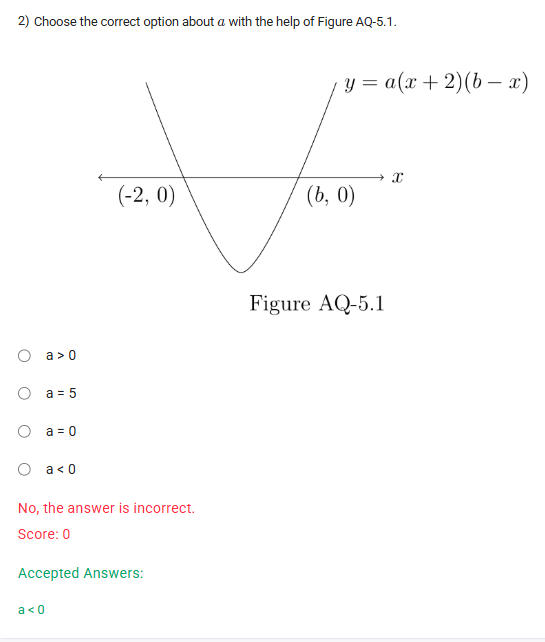

A well-defined collection of distinct objects called elements or members.



https://youtu.be/ZRXWkzFSZzU

#### Learning Outcomes

1. The student will be able to solve the quadratic equation in an algebraic manner using factorization.
2. Students can identify the intercept form of the quadratic equation and convert the intercept form into the normal form.

## Exercise Questions 🤯

Hello! On this Wednesday evening here in India, I can certainly help you with these questions, which focus on creating and analyzing quadratic equations from their roots and graphs.


### **Question 1: Forming a Quadratic Equation from its Roots** (from file `image_fffac0.png`)

**The Question:**
Choose the correct standard form of a quadratic equation with roots $\frac{7}{2}$ and $-\frac{10}{3}$.

**Core Concept: From Roots to Standard Form**

If a quadratic equation has roots $r_1$ and $r_2$, it can be written in factored form as:
$$(x - r_1)(x - r_2) = 0$$
To get to the standard form ($ax^2 + bx + c = 0$), we expand this expression and clear any fractions.

**Detailed Solution:**

1.  **Identify the roots:**
    * $r_1 = \frac{7}{2}$
    * $r_2 = -\frac{10}{3}$

2.  **Write the equation in factored form:**
    $$\left(x - \frac{7}{2}\right)\left(x - \left(-\frac{10}{3}\right)\right) = 0$$ $$\left(x - \frac{7}{2}\right)\left(x + \frac{10}{3}\right) = 0$$
    (Note: This is one of the options, but it is not the *standard form* with integer coefficients).

3.  **Clear the fractions inside the parentheses:**
    * Multiply the first parenthesis by 2 and the second by 3. To keep the equation balanced, we can think of this as:
    $$\frac{1}{2}(2x - 7) \cdot \frac{1}{3}(3x + 10) = 0$$ $$\frac{1}{6}(2x - 7)(3x + 10) = 0$$
4.  **Multiply the entire equation by 6 to eliminate the fraction:**
    $$(2x - 7)(3x + 10) = 0$$
5.  **Expand the expression using the FOIL method (First, Outer, Inner, Last):**
    * (First) $2x \cdot 3x = 6x^2$
    * (Outer) $2x \cdot 10 = +20x$
    * (Inner) $-7 \cdot 3x = -21x$
    * (Last) $-7 \cdot 10 = -70$
    * Combine them: $6x^2 + 20x - 21x - 70 = 0$

6.  **Simplify by combining like terms:**
    $$6x^2 - x - 70 = 0$$

**Final Answer:** The correct standard form is **$6x^2 - x - 70 = 0$**.



### **Question 2: Analyzing the Graph of a Parabola** (from file `image_fffa7b.png`)

**The Question:**
Choose the correct option about $a$ with the help of Figure AQ-5.1.
(The figure shows an upward-opening parabola with equation $y = a(x + 2)(b - x)$)

**Core Concept: Parabola Direction and the Leading Coefficient**

The leading coefficient of a quadratic equation determines whether its parabola opens upwards or downwards. For an equation $y = Ax^2 + Bx + C$:
* If $A > 0$ (positive), the parabola opens **upwards** ($\cup$).
* If $A < 0$ (negative), the parabola opens **downwards** ($\cap$).

This question is tricky because the equation is in factored form. We must first determine the sign of the $x^2$ term after expansion.

**Detailed Solution:**

1.  **Analyze the graph:** The parabola in the figure clearly opens **upwards**. This means its leading coefficient ($A$) must be positive.

2.  **Analyze the equation:** The equation is $y = a(x + 2)(b - x)$.
3.  **Find the $x^2$ term:** To find the leading coefficient, we only need to multiply the terms containing $x$ from each part of the equation:
    * $a \times (x) \times (-x) = a(-x^2) = -ax^2$
4.  **Relate the equation to the graph:**
    * The leading coefficient of the expanded equation is $-a$.
    * Since the parabola opens upwards, this leading coefficient must be positive.
    * Therefore, we have the inequality: $-a > 0$.
5.  **Solve for $a$:**
    * To solve for $a$, we must multiply (or divide) both sides by -1. When you multiply or divide an inequality by a negative number, you **must flip the inequality sign**.
    * $a < 0$

**Final Answer:** The correct option is **$a < 0$**.



### **Question 3: Finding Roots of Quadratic Functions** (from file `image_fff71c.png`)

**The Question:**
Choose the set of correct options regarding quadratic functions $p(x) = x^2 - 7x + 10$ and $q(x) = x^2 + 7x + 10$. (Multiple Select Question)

**Core Concept: Finding Roots by Factoring**

To find the roots of a quadratic equation $x^2 + bx + c = 0$, we look for two numbers that multiply to give the constant term ($c$) and add to give the coefficient of the x-term ($b$).

**Detailed Solution:**

**Part 1: Find the roots of $p(x) = x^2 - 7x + 10$**

1.  We need two numbers that **multiply to +10** and **add to -7**.
2.  To get a positive product and a negative sum, both numbers must be negative. The numbers are **-5 and -2**.
3.  The factored form is $(x - 5)(x - 2) = 0$.
4.  The roots are $x=5$ and $x=2$.
5.  So, the statement **"p(x) has two roots 5 and 2" is TRUE**.

**Part 2: Find the roots of $q(x) = x^2 + 7x + 10$**

1.  We need two numbers that **multiply to +10** and **add to +7**.
2.  The numbers are **+5 and +2**.
3.  The factored form is $(x + 5)(x + 2) = 0$.
4.  The roots are $x=-5$ and $x=-2$.
5.  So, the statement **"q(x) has two roots -5 and -2" is TRUE**.

**Final Answer:** The correct options are:
* **$p(x)$ has two roots 5 and 2**
* **$q(x)$ has two roots -5 and -2**



### **Question 4: Analyzing Roots of a Quadratic Equation** (from file `image_fff71c.png`)

**The Question:**
Identify the incorrect options for the quadratic equation $x^2 - 15x + 54 = 0$. (Multiple Select Question)
* 9 is a root
* Both the roots are equal
* There are no roots
* 6 is a root

**Core Concept: Finding and Analyzing Roots**

First, find the roots of the equation. Then, evaluate each statement to see if it is true or false. The question asks for the **incorrect** statements.

**Detailed Solution:**

1.  **Find the roots of $x^2 - 15x + 54 = 0$:**
    * We need two numbers that **multiply to +54** and **add to -15**.
    * Let's list factor pairs of 54: (1, 54), (2, 27), (3, 18), (6, 9).
    * The pair (6, 9) adds to 15. To get a sum of -15, both numbers must be negative: **-6 and -9**.
    * The factored form is $(x - 6)(x - 9) = 0$.
    * The roots are $x=6$ and $x=9$.

2.  **Evaluate the given options:**
    * **"9 is a root"**: This is **TRUE**.
    * **"Both the roots are equal"**: This is **FALSE**. The roots are 6 and 9, which are distinct.
    * **"There are no roots"**: This is **FALSE**. There are two real roots, 6 and 9.
    * **"6 is a root"**: This is **TRUE**.

3.  **Identify the incorrect options:**
    * The question asks us to choose the statements that are incorrect. Based on our analysis, two statements are false.

**Final Answer:** The incorrect options are:
* **Both the roots are equal**
* **There are no roots**
