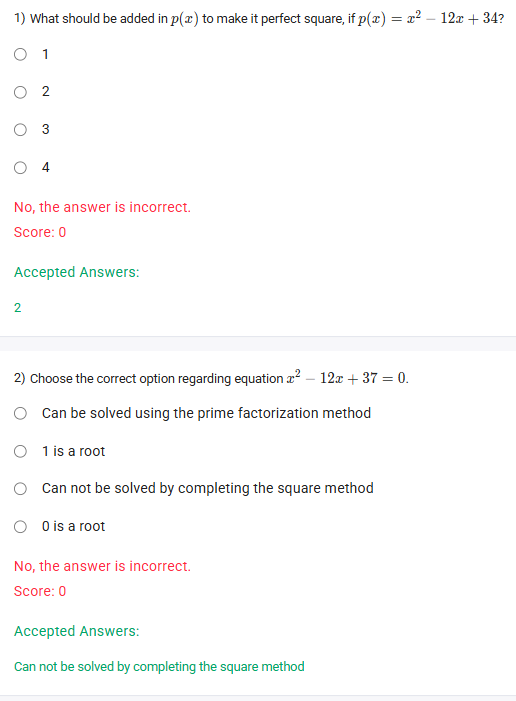
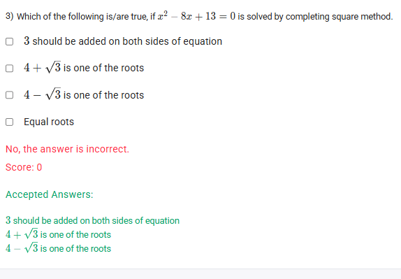

A well-defined collection of distinct objects called elements or members.



https://youtu.be/qvUX-jgtogg

## Exercise Questions 🤯

Hello! On this Wednesday evening here in India, I'd be happy to explain these questions. They all revolve around a very powerful technique for working with quadratic equations called **"Completing the Square"**.

### **Core Concept: Completing the Square**

The goal of "completing the square" is to take a quadratic expression like $x^2 + bx$ and turn it into a perfect square trinomial, which can be factored into $(x+k)^2$.

**How to do it:**

1.  Take the coefficient of the $x$ term, which is '$b$'.
2.  Divide it by 2: $\frac{b}{2}$.
3.  Square the result: $\left(\frac{b}{2}\right)^2$.
4.  This is the "magic number" you need to add to complete the square.

For example, to complete the square for $x^2 + 10x$:
* $b = 10$.
* Half of b is $\frac{10}{2} = 5$.
* Square the result: $5^2 = 25$.
* So, $x^2 + 10x + 25$ is a perfect square, which factors to $(x+5)^2$.

Let's apply this method to your questions.
---

### **Question 1: Making a Perfect Square** (from file `image_ff95a5.png`)

**The Question:**
What should be added in $p(x)$ to make it perfect square, if $p(x) = x^2 - 12x + 34$?
* 1
* 2
* 3
* 4

**Core Concept:** We want to adjust the constant term in the expression so that the entire expression becomes a perfect square trinomial.

**Detailed Solution:**

1.  **Focus on the first two terms:** $x^2 - 12x$.
2.  **Identify the 'b' coefficient:** Here, $b = -12$.
3.  **Find the number needed to complete the square:**
    * Take half of b: $\frac{-12}{2} = -6$.
    * Square the result: $(-6)^2 = 36$.
4.  **Analyze the expression:** The perfect square trinomial we want is $x^2 - 12x + 36$, which factors to $(x-6)^2$.
5.  Our current expression is $x^2 - 12x + 34$.
6.  To turn the constant term from 34 into the 36 we need, we must add the difference: $36 - 34 = 2$.

**Final Answer:** You should add **2** to the expression.



### **Question 2: Solving a Quadratic Equation** (from file `image_ff95a5.png`)

**The Question:**
Choose the correct option regarding equation $x^2 - 12x + 37 = 0$.
* Can be solved using the prime factorization method
* 1 is a root
* Can not be solved by completing the square method
* 0 is a root

**Core Concept:** We can use the method of completing the square to solve quadratic equations. If this process leads to taking the square root of a negative number, the equation has no real solutions.

**Detailed Solution:**

1.  **Start with the equation:**
    $x^2 - 12x + 37 = 0$
2.  **Move the constant term to the right side:**
    $x^2 - 12x = -37$
3.  **Complete the square on the left side:** As we found in the previous question, we need to add `(-12/2)² = 36` to both sides to make the left side a perfect square.
    $x^2 - 12x + 36 = -37 + 36$
4.  **Factor the left side and simplify the right side:**
    $(x - 6)^2 = -1$
5.  **Analyze the result:** This equation asks for a number, $(x-6)$, which when squared equals -1. The square of any real number is always non-negative (0 or positive). Therefore, there is **no real number solution** for this equation.

**Evaluating the Options:**
* **"Can be solved using the prime factorization method"**: This method typically works for integer roots. Since there are no real roots, this is false.
* **"1 is a root" / "0 is a root"**: Both are false.
* **"Can not be solved by completing the square method"**: This is a poorly worded but common statement. The method of completing the square *works perfectly* to show us that there are no real solutions. The intended meaning is that the equation cannot be solved *to find a real root*. Given the other options are clearly false, this is the intended answer.

**Final Answer:** **Can not be solved by completing the square method** (meaning it cannot be solved for real roots).



### **Question 3: Solving by Completing the Square** (from file `image_ff9541.png`)

**The Question:**
Which of the following is/are true, if $x^2 - 8x + 13 = 0$ is solved by completing square method. (Multiple Select Question)
* 3 should be added on both sides of equation
* $4 + \sqrt{3}$ is one of the roots
* $4 - \sqrt{3}$ is one of the roots
* Equal roots

**Core Concept:** This question checks both the process of completing the square and the final result (the roots).

**Detailed Solution:**

1.  **Start with the equation:**
    $x^2 - 8x + 13 = 0$
2.  **Isolate the x terms:**
    $x^2 - 8x = -13$
3.  **Complete the square:**
    * The coefficient is $b=-8$.
    * The number to add is $(\frac{-8}{2})^2 = (-4)^2 = 16$.
    * Add 16 to both sides:
    $x^2 - 8x + 16 = -13 + 16$
4.  **Factor the left side and simplify the right:**
    $(x - 4)^2 = 3$

5.  **Analyze the first option:** The statement says "3 should be added on both sides of equation". Let's see if this is a valid step from the start:
    * $x^2 - 8x + 13 = 0$
    * Add 3 to both sides: $x^2 - 8x + 13 + 3 = 0 + 3$
    * $x^2 - 8x + 16 = 3$. This is the same equation we derived in step 4. So, this statement about the process is **TRUE**.

6.  **Solve for the roots from $(x - 4)^2 = 3$:**
    * Take the square root of both sides: $x - 4 = \pm\sqrt{3}$
    * Isolate x: $x = 4 \pm\sqrt{3}$
    * The two roots are $x_1 = 4 + \sqrt{3}$ and $x_2 = 4 - \sqrt{3}$.

7.  **Evaluate the remaining options:**
    * **"$4 + \sqrt{3}$ is one of the roots"**: This is **TRUE**.
    * **"$4 - \sqrt{3}$ is one of the roots"**: This is **TRUE**.
    * **"Equal roots"**: This is **FALSE**, because the roots $4 + \sqrt{3}$ and $4 - \sqrt{3}$ are distinct.

**Final Answer:** The true statements are:
* **3 should be added on both sides of equation**
* **$4 + \sqrt{3}$ is one of the roots**
* **$4 - \sqrt{3}$ is one of the roots**
