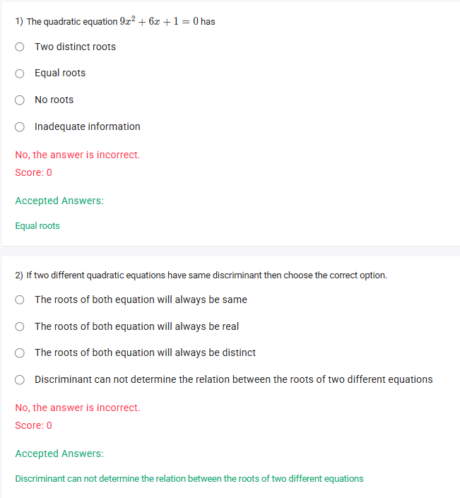
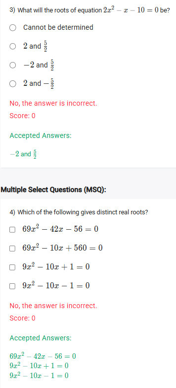

A well-defined collection of distinct objects called elements or members.



https://youtu.be/1shGS3xfmwc

#### Learning Outcomes

1. The student can solve quadratic equations with irrational roots.
2. The student will be able to solve the quadratic equation using the quadratic formula.
3. The student can choose the appropriate method to solve a quadratic equation.
4. The student can appreciate the use of discriminant in finding the nature of roots for quadratic equations.
5. The student can understand the concept of the 'axis of symmetry'.

## Exercise Questions 🤯

Good morning! Here in India on this Saturday, let's tackle these questions about quadratic equations. The key to understanding most of these problems lies in a powerful tool called the **discriminant**.

### **Core Concept: The Discriminant ($ax^2 + bx + c = 0$)**

For any quadratic equation, the **roots** (or solutions) can be found using the quadratic formula:
$$x = \frac{-b \pm \sqrt{b^2 - 4ac}}{2a}$$
The part under the square root, **$b^2 - 4ac$**, is called the **discriminant**, often represented by the symbol delta ($\Delta$). The value of the discriminant tells you about the *nature* of the roots without having to fully solve the equation.

* If **$\Delta > 0$** (positive), you will get two different answers because of the $\pm$ sign. This means the equation has **two distinct real roots**.
* If **$\Delta = 0$**, the square root term becomes zero, and you only get one answer. This means the equation has **one repeated real root** (also called "equal roots").
* If **$\Delta < 0$** (negative), the square root is of a negative number, which is not a real number. This means the equation has **no real roots**.

---

### **Question 1: Nature of Roots** (from file `image_a4dfbe.png`)

**The Question:**
The quadratic equation $9x^2 + 6x + 1 = 0$ has
* Two distinct roots
* Equal roots
* No roots
* Inadequate information

**Core Concept:** We can determine the nature of the roots by calculating the discriminant ($\Delta = b^2 - 4ac$).

**Detailed Solution:**

1.  **Identify the coefficients** from the equation $9x^2 + 6x + 1 = 0$:
    * $a = 9$
    * $b = 6$
    * $c = 1$
2.  **Calculate the discriminant:**
    * $\Delta = b^2 - 4ac$
    * $\Delta = (6)^2 - 4(9)(1)$
    * $\Delta = 36 - 36 = 0$
3.  **Interpret the result:**
    * Since the discriminant is exactly 0, the equation has one repeated real root, which is the same as having "equal roots".

**Final Answer:** The equation has **Equal roots**.



### **Question 2: Same Discriminant** (from file `image_a4dfbe.png`)

**The Question:**
If two different quadratic equations have same discriminant then choose the correct option.
* The roots of both equation will always be same
* The roots of both equation will always be real
* The roots of both equation will always be distinct
* Discriminant can not determine the relation between the roots of two different equations

**Core Concept:** The discriminant only determines the *nature* of the roots (how many and what type), not their actual values. The values of the roots also depend on the '$a$' and '$b$' coefficients from the full quadratic formula.

**Detailed Solution:**

Let's test this with an example.
* **Equation 1:** $x^2 - 4x + 3 = 0$.
    * Discriminant: $\Delta = (-4)^2 - 4(1)(3) = 16 - 12 = 4$.
    * Roots: $(x-1)(x-3)=0 \implies x=1, x=3$.
* **Equation 2:** $x^2 - 6x + 8 = 0$.
    * Discriminant: $\Delta = (-6)^2 - 4(1)(8) = 36 - 32 = 4$.
    * Roots: $(x-2)(x-4)=0 \implies x=2, x=4$.

Both equations have the same discriminant ($\Delta = 4$), which correctly tells us that both have two distinct real roots. However, the roots themselves (1, 3 vs 2, 4) are completely different.

Therefore, the discriminant only tells you about the *type* of roots within one equation. It cannot be used to compare the actual root *values* of two different equations.

**Final Answer:** **Discriminant can not determine the relation between the roots of two different equations**.



### **Question 3: Finding the Roots** (from file `image_a4dc56.png`)

**The Question:**
What will the roots of equation $2x^2 - x - 10 = 0$ be?

**Core Concept:** When factoring is not immediately obvious, the quadratic formula is a reliable method to find the exact roots of any quadratic equation.

**Detailed Solution:**

1.  **Identify the coefficients** from the equation $2x^2 - x - 10 = 0$:
    * $a = 2$
    * $b = -1$
    * $c = -10$
2.  **Apply the quadratic formula:**
    $$x = \frac{-b \pm \sqrt{b^2 - 4ac}}{2a}$$ $$x = \frac{-(-1) \pm \sqrt{(-1)^2 - 4(2)(-10)}}{2(2)}$$
3.  **Simplify the expression:**
    $$x = \frac{1 \pm \sqrt{1 - (-80)}}{4}$$$$x = \frac{1 \pm \sqrt{1 + 80}}{4}$$$$x = \frac{1 \pm \sqrt{81}}{4}$$ $$x = \frac{1 \pm 9}{4}$$
4.  **Calculate the two separate roots:**
    * Root 1: $x_1 = \frac{1 + 9}{4} = \frac{10}{4} = \frac{5}{2}$
    * Root 2: $x_2 = \frac{1 - 9}{4} = \frac{-8}{4} = -2$

**Final Answer:** The roots are **-2 and 5/2**.



### **Question 4: Identifying Distinct Real Roots** (from file `image_a4dc56.png`)

**The Question:**
Which of the following gives distinct real roots? (Multiple Select Question)
* $69x^2 - 42x - 56 = 0$
* $69x^2 - 10x + 560 = 0$
* $9x^2 - 10x + 1 = 0$
* $9x^2 - 10x - 1 = 0$

**Core Concept:** An equation has **distinct real roots** if and only if its discriminant ($\Delta = b^2 - 4ac$) is **greater than 0** (positive).

**Detailed Solution:**

We need to calculate the discriminant for each equation.

* **Equation 1:** $69x^2 - 42x - 56 = 0$
    * $\Delta = (-42)^2 - 4(69)(-56) = 1764 + 15456 = 17220$.
    * Since $\Delta > 0$, this equation has **distinct real roots**.

* **Equation 2:** $69x^2 - 10x + 560 = 0$
    * $\Delta = (-10)^2 - 4(69)(560) = 100 - 154560 = -154460$.
    * Since $\Delta < 0$, this equation has no real roots.

* **Equation 3:** $9x^2 - 10x + 1 = 0$
    * $\Delta = (-10)^2 - 4(9)(1) = 100 - 36 = 64$.
    * Since $\Delta > 0$, this equation has **distinct real roots**.

* **Equation 4:** $9x^2 - 10x - 1 = 0$
    * $\Delta = (-10)^2 - 4(9)(-1) = 100 + 36 = 136$.
    * Since $\Delta > 0$, this equation has **distinct real roots**.

**Final Answer:** The equations that give distinct real roots are:
* $69x^2 - 42x - 56 = 0$
* $9x^2 - 10x + 1 = 0$
* $9x^2 - 10x - 1 = 0$
