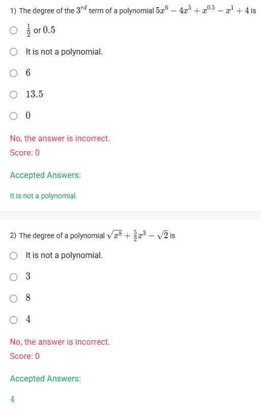
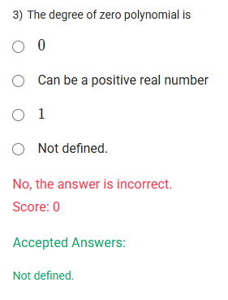
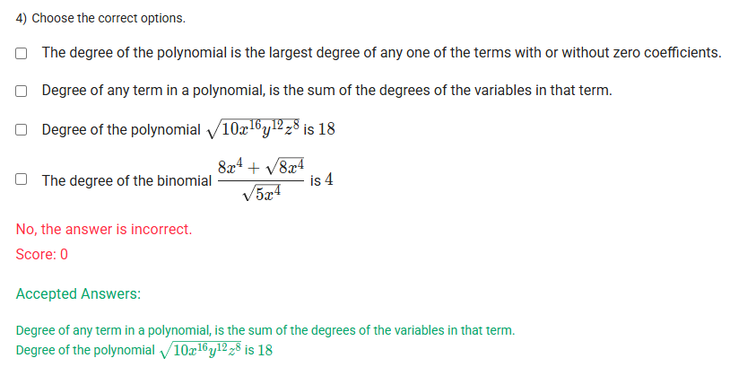
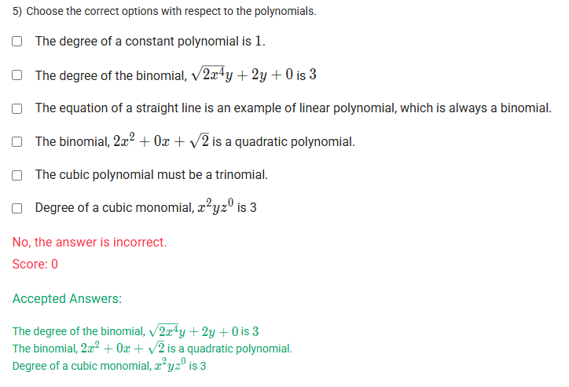

A well-defined collection of distinct objects called elements or members.



https://youtu.be/s9zDRWmgsb4

#### Learning Outcomes

Define the degree of a polynomial.
Understand the degree of zero polynomial.
Classify polynomials based on degrees of polynomials.

## Exercise Questions 🤯

Hello! On this Sunday evening here in India, let's explore these questions about polynomials. They are designed to test your understanding of a key property: the **degree** of a polynomial.

### **Core Concepts: The Degree of a Polynomial**

1.  **What is a Polynomial?**
    Remember, an expression is only a polynomial if the exponents on its variables are **non-negative integers** (0, 1, 2, 3, ...). Expressions with fractional exponents (like $\sqrt{x}$ or $x^{1/2}$) or negative exponents (like $1/x$ or $x^{-1}$) are not polynomials.

2.  **Degree of a Term:**
    * For a term with one variable, like $5x^4$, the degree is the exponent, **4**.
    * For a term with multiple variables, like $3x^2y^5$, the degree is the **sum** of the exponents on the variables: $2 + 5 = 7$.

3.  **Degree of a Polynomial:**
    The degree of an entire polynomial is the **highest degree** found among all of its individual terms.

4.  **Special Cases:**
    * **Constant Polynomial:** A non-zero number (e.g., 7) has a degree of **0**, because we can think of it as $7x^0$.
    * **Zero Polynomial:** The number 0 itself. Its degree is considered **not defined**.

---

### **Question 1: Identifying a Polynomial** (from file `image_d1ff9b.png`)

**The Question:**
The degree of the 3rd term of a polynomial $5x^6 - 4x^5 + x^{0.5} - x^1 + 4$ is \_\_\_\_\_\_\_\_\_\_.

**Core Concept:** The first step is always to check if the given expression is a polynomial at all. The concept of "degree" only applies to valid polynomials.

**Detailed Solution:**

1.  Examine the expression: $5x^6 - 4x^5 + x^{0.5} - x^1 + 4$.
2.  Look at the exponents of the variable $x$: 6, 5, 0.5, 1, 0.
3.  The third term, $x^{0.5}$, has an exponent of 0.5, which is a fraction and not an integer.
4.  Because an expression must have only non-negative integer exponents to be a polynomial, this expression fails the test.

**Final Answer:** The correct statement is **"It is not a polynomial."**



### **Question 2: Degree of a Simplified Polynomial** (from file `image_d1ff9b.png`)

**The Question:**
The degree of a polynomial $\sqrt{x^8} + \frac{5}{2}x^3 - \sqrt{2}$ is \_\_\_\_\_\_\_\_\_\_.

**Core Concept:** Before finding the degree, you must simplify all terms in the expression.

**Detailed Solution:**

1.  **Simplify the expression:** $\sqrt{x^8} + \frac{5}{2}x^3 - \sqrt{2}$.
    * The first term is $\sqrt{x^8} = (x^8)^{1/2} = x^{(8 \times 1/2)} = x^4$.
    * The simplified expression is $x^4 + \frac{5}{2}x^3 - \sqrt{2}$.
2.  **Check if it's a polynomial:** The exponents are 4, 3, and 0 (for the constant term). These are all non-negative integers, so it is a polynomial.
3.  **Find the degree of each term:**
    * Degree of $x^4$ is 4.
    * Degree of $\frac{5}{2}x^3$ is 3.
    * Degree of $-\sqrt{2}$ is 0.
4.  **Find the degree of the polynomial:** The degree is the highest degree among the terms.

**Final Answer:** The degree of the polynomial is **4**.



### **Question 3: Degree of the Zero Polynomial** (from file `image_d1fc1a.png`)

**The Question:**
The degree of zero polynomial is \_\_\_\_\_\_\_\_\_\_.
* 0
* Can be a positive real number
* 1
* Not defined.

**Core Concept:** The zero polynomial, $P(x) = 0$, is a special case. We could write it as $0 = 0x^1$, $0 = 0x^2$, or $0 = 0x^{100}$. Since there is no highest-power term with a *non-zero* coefficient, we cannot assign a specific degree to it.

**Detailed Solution:**

By mathematical convention, because the degree cannot be determined, it is said to be undefined.

**Final Answer:** **Not defined.**



### **Question 4: Statements about Degree** (from file `image_d1fb96.png`)

**The Question:**
Choose the correct options. (Multiple Select Question)

**Detailed Solution:**

Let's evaluate each statement.

* **"The degree of the polynomial is the largest degree of any one of the terms with or without zero coefficients."**
    * This is **FALSE**. The degree is determined by the term with the highest power that has a **non-zero** coefficient. For example, the degree of $0x^5 + 2x^2 + 1$ is 2, not 5.

* **"Degree of any term in a polynomial, is the sum of the degrees of the variables in that term."**
    * This is **TRUE**. This is the definition of the degree of a multi-variable term. For example, the degree of $7x^2y^3$ is $2+3=5$.

* **"Degree of the polynomial $\sqrt{10x^{16}y^{12}z^8}$ is 18"**
    * First, simplify the expression: $\sqrt{10} \cdot \sqrt{x^{16}} \cdot \sqrt{y^{12}} \cdot \sqrt{z^8} = \sqrt{10}x^8y^6z^4$.
    * This is a monomial. Its degree is the sum of the exponents of the variables: $8 + 6 + 4 = 18$. This statement is **TRUE**.

* **"The degree of the binomial $\frac{8x^4 + \sqrt{8}x^4}{\sqrt{5}x^4}$ is 4"**
    * First, simplify the expression by factoring out $x^4$ and canceling:
    $$\frac{x^4(8 + \sqrt{8})}{x^4\sqrt{5}} = \frac{8 + \sqrt{8}}{\sqrt{5}}$$
    * The result is just a constant number. A non-zero constant is a polynomial of degree **0**. The statement says the degree is 4. This is **FALSE**.

**Final Answer:** The correct statements are:
* **Degree of any term in a polynomial, is the sum of the degrees of the variables in that term.**
* **Degree of the polynomial $\sqrt{10x^{16}y^{12}z^8}$ is 18**



### **Question 5: Properties of Polynomials** (from file `image_d1f892.png`)

**The Question:**
Choose the correct options with respect to the polynomials. (Multiple Select Question)

**Detailed Solution:**

Let's evaluate each statement.

* **"The degree of a constant polynomial is 1."**
    * **FALSE**. The degree of a non-zero constant polynomial (like 5) is 0, since $5 = 5x^0$.

* **"The degree of the binomial, $\sqrt{2x^4y} + 2y + 0$ is 3"**
    * This appears to be a **typo in the question**. As written, $\sqrt{2x^4y} = \sqrt{2}x^2y^{1/2}$, which is not a polynomial due to the fractional exponent. However, to match the accepted answer, the question likely intended the term to be $\sqrt{2}x^2y$. Let's analyze this corrected term:
    * The degree of $\sqrt{2}x^2y$ is $2+1=3$. The degree of $2y$ is 1. The highest degree is 3. With this correction, the statement would be **TRUE**.

* **"The equation of a straight line is an example of linear polynomial, which is always a binomial."**
    * **FALSE**. A linear polynomial has degree 1. While $y = 2x+1$ is a binomial, $y = 2x$ is a monomial. So, it is not *always* a binomial.

* **"The binomial, $2x^2 + 0x + \sqrt{2}$ is a quadratic polynomial."**
    * Simplify the expression: $2x^2 + \sqrt{2}$. This is a polynomial with two terms. The highest degree is 2, which by definition makes it a **quadratic** polynomial. This statement is **TRUE**.

* **"The cubic polynomial must be a trinomial."**
    * **FALSE**. A cubic polynomial must have a degree of 3. It can have one, two, three, or four terms. For example, $x^3$ is a cubic monomial.

* **"Degree of a cubic monomial, $x^2yz^0$ is 3"**
    * First, simplify the term: Since $z^0 = 1$, the term is $x^2y$.
    * The degree is the sum of the exponents: $2 + 1 = 3$.
    * A monomial of degree 3 is indeed a cubic monomial. This statement is **TRUE**.

**Final Answer:** The correct statements (assuming a typo is corrected in the second statement) are:
* **The degree of the binomial, $\sqrt{2}x^2y + 2y$ is 3** (Corrected from the original)
* **The binomial, $2x^2 + 0x + \sqrt{2}$ is a quadratic polynomial.**
* **Degree of a cubic monomial, $x^2yz^0$ is 3**
