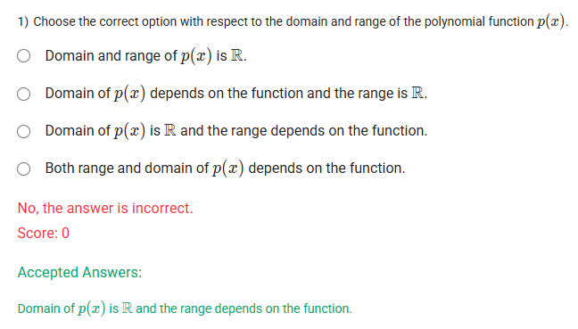
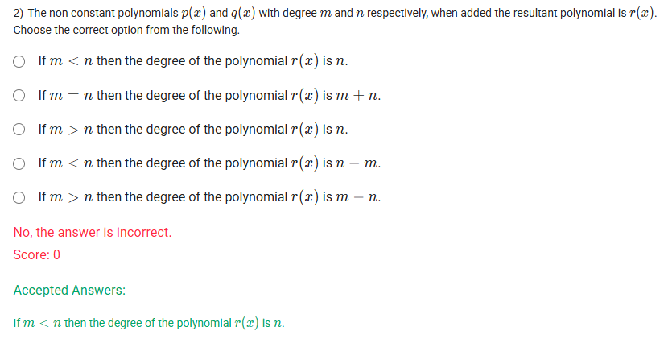
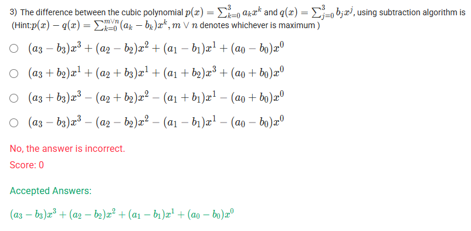
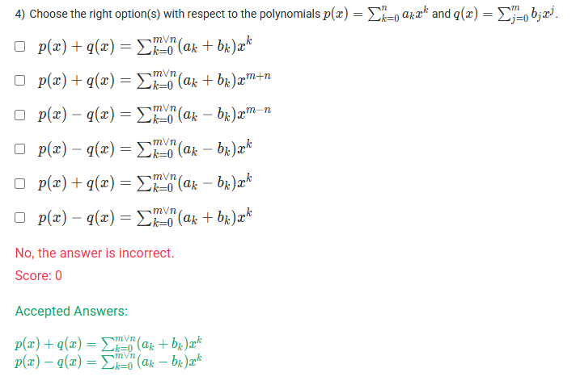
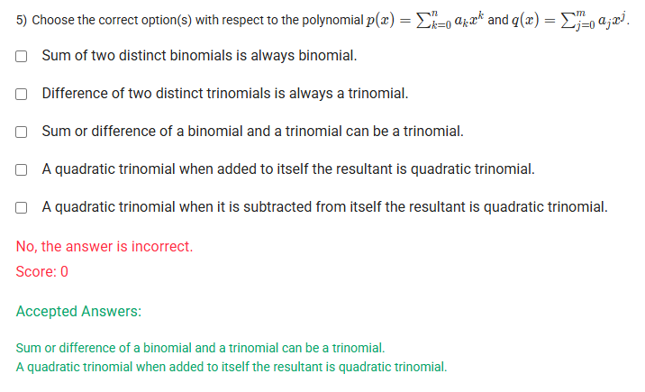

A well-defined collection of distinct objects called elements or members.



https://youtu.be/KJXkTzKAZ6k

#### Learning Outcomes

Understand n-degree polynomials of one variable.
Compute the sum of polynomials.
Compute the difference between polynomials.

## Exercise Questions 🤯

Good evening! Here in India on this Sunday, let's work through these questions. They explore the fundamental properties of polynomials, such as their domain and range, and what happens when we add and subtract them.

### **Core Concepts: Properties and Arithmetic of Polynomials**

1.  **Domain and Range of a Polynomial:**
    * **Domain:** The domain is the set of all possible input x-values. For any polynomial function (e.g., $y = x^2 + 2x + 1$), you can plug in any real number for $x$ without causing a mathematical error like division by zero. Therefore, the domain of any polynomial is **all real numbers**, denoted as $\mathbb{R}$.
    * **Range:** The range is the set of all possible output y-values. This **depends on the specific polynomial**.
        * For **odd-degree** polynomials (like lines, cubics), the range is also all real numbers ($\mathbb{R}$).
        * For **even-degree** polynomials (like quadratics), the range is restricted. For example, $y=x^2$ has a range of $y \ge 0$.

2.  **Adding and Subtracting Polynomials:**
    This is done by **combining like terms**—terms that have the exact same variable parts (e.g., $x^2$ terms are combined with other $x^2$ terms).

---

### **Question 1: Domain and Range of a Polynomial** (from file `image_d1ed54.png`)

**The Question:**
Choose the correct option with respect to the domain and range of the polynomial function $p(x)$.
* Domain and range of $p(x)$ is $\mathbb{R}$.
* Domain of $p(x)$ depends on the function and the range is $\mathbb{R}$.
* Domain of $p(x)$ is $\mathbb{R}$ and the range depends on the function.
* Both range and domain of $p(x)$ depends on the function.

**Detailed Solution:**

1.  **Domain:** As defined in the core concepts, a polynomial function is defined for any real number input. There are no restrictions. Therefore, the **domain is always $\mathbb{R}$**.
2.  **Range:** The range is not always $\mathbb{R}$. For example, the polynomial $p(x) = x^2$ is an even-degree polynomial, and its range is only the set of non-negative real numbers ($y \ge 0$). The polynomial $p(x) = x^3$ is an odd-degree polynomial, and its range is all real numbers. Therefore, the **range depends on the specific function**.

**Final Answer:** The correct statement is **"Domain of $p(x)$ is $\mathbb{R}$ and the range depends on the function."**



### **Question 2: Degree of a Sum of Polynomials** (from file `image_d1ec9a.png`)

**The Question:**
The non constant polynomials $p(x)$ and $q(x)$ with degree $m$ and $n$ respectively, when added the resultant polynomial is $r(x)$. Choose the correct option from the following.
* If $m < n$ then the degree of the polynomial $r(x)$ is $n$.
* If $m = n$ then the degree of the polynomial $r(x)$ is $m+n$.
* If $m > n$ then the degree of the polynomial $r(x)$ is $n$.
* If $m < n$ then the degree of the polynomial $r(x)$ is $n-m$.
* If $m > n$ then the degree of the polynomial $r(x)$ is $m-n$.

**Core Concept: Degree of a Sum**
When you add two polynomials, the degree of the resulting polynomial is determined by the highest degree of the original polynomials. If the degrees are different, the highest degree term will always survive the addition.

**Detailed Solution:**

1.  Let the highest power term in $p(x)$ be $a_m x^m$ (where $a_m \neq 0$).
2.  Let the highest power term in $q(x)$ be $b_n x^n$ (where $b_n \neq 0$).
3.  If we are given that **$m < n$**, then $n$ is the higher degree.
4.  When we add $p(x) + q(x)$, the term $b_n x^n$ from $q(x)$ has no term of the same degree in $p(x)$ to be combined with. Therefore, it will be the highest degree term in the resulting polynomial $r(x)$.
5.  Thus, the degree of $r(x)$ will be $n$. (Similarly, if $m > n$, the degree of the result would be $m$).

**Final Answer:** **If $m < n$ then the degree of the polynomial $r(x)$ is $n$.**



### **Question 3: Subtraction of Polynomials** (from file `image_d1e9af.png`)

**The Question:**
The difference between the cubic polynomial $p(x) = \sum_{k=0}^{3} a_k x^k$ and $q(x) = \sum_{j=0}^{3} b_j x^j$, using subtraction algorithm is \_\_\_\_\_\_\_\_\_\_.

**Core Concept: Polynomial Subtraction**
To subtract one polynomial from another, you subtract the coefficients of the "like terms" (terms with the same power of x).
$p(x) - q(x) = (a_3x^3 + ... + a_0) - (b_3x^3 + ... + b_0)$

**Detailed Solution:**

1.  **Expand the polynomials:**
    * $p(x) = a_3x^3 + a_2x^2 + a_1x^1 + a_0x^0$
    * $q(x) = b_3x^3 + b_2x^2 + b_1x^1 + b_0x^0$
2.  **Set up the subtraction:**
    $p(x) - q(x) = (a_3x^3 + a_2x^2 + a_1x + a_0) - (b_3x^3 + b_2x^2 + b_1x + b_0)$
3.  **Distribute the negative sign** to every term in the second polynomial:
    $p(x) - q(x) = a_3x^3 + a_2x^2 + a_1x + a_0 - b_3x^3 - b_2x^2 - b_1x - b_0$
4.  **Group the like terms together:**
    $p(x) - q(x) = (a_3x^3 - b_3x^3) + (a_2x^2 - b_2x^2) + (a_1x - b_1x) + (a_0 - b_0)$
5.  **Factor out the common powers of x:**
    $p(x) - q(x) = (a_3 - b_3)x^3 + (a_2 - b_2)x^2 + (a_1 - b_1)x^1 + (a_0 - b_0)x^0$

**Final Answer:** $(a_3 - b_3)x^3 + (a_2 - b_2)x^2 + (a_1 - b_1)x^1 + (a_0 - b_0)x^0$



### **Question 4: Summation Notation for Polynomials** (from file `image_d1e935.png`)

**The Question:**
Choose the right option(s) with respect to the polynomials $p(x) = \sum_{k=0}^{n} a_k x^k$ and $q(x) = \sum_{j=0}^{m} b_j x^j$. (Multiple Select Question)

**Core Concept: Summation Notation**
The summation symbol $\sum$ is a compact way to write a sum. When adding or subtracting two polynomials represented this way, we can combine them into a single summation by adding or subtracting the coefficients ($a_k$ and $b_k$) for each corresponding power of $x^k$.

**Detailed Solution:**

1.  **Addition $p(x) + q(x)$:**
    * The sum of the two polynomials is the sum of their corresponding terms.
    * $\sum a_k x^k + \sum b_k x^k = \sum (a_k x^k + b_k x^k)$
    * We can factor out the common $x^k$ term: $\sum (a_k + b_k)x^k$.
    * This matches the **first option**.

2.  **Subtraction $p(x) - q(x)$:**
    * The difference of the two polynomials is the difference of their corresponding terms.
    * $\sum a_k x^k - \sum b_k x^k = \sum (a_k x^k - b_k x^k)$
    * We can factor out the common $x^k$ term: $\sum (a_k - b_k)x^k$.
    * This matches the **fourth option**.

3.  The other options are incorrect because they incorrectly manipulate the exponents (e.g., $x^{m+n}$) or swap the operations inside the parentheses.

**Final Answer:** The correct options are:
* $p(x) + q(x) = \sum_{k=0}^{m\lor n} (a_k + b_k)x^k$
* $p(x) - q(x) = \sum_{k=0}^{m\lor n} (a_k - b_k)x^k$



### **Question 5: Adding and Subtracting Polynomials** (from file `image_d1e8d1.png`)

**The Question:**
Choose the correct option(s) with respect to the polynomial $p(x) = \sum_{k=0}^{n} a_k x^k$ and $q(x) = \sum_{j=0}^{m} a_j x^j$. (Multiple Select Question)

**Core Concept:** We can test absolute statements ("always") with counterexamples. If we can find one case where the statement is false, the statement is false.

**Detailed Solution:**

* **"Sum of two distinct binomials is always binomial."**
    * **FALSE**. The highest power terms can cancel out.
    * Counterexample: Let $p(x) = x^2 + 1$ and $q(x) = -x^2 + 2x$. Their sum is $(x^2+1) + (-x^2+2x) = 2x+1$, which is a binomial. Wait, let me try another one. Let $p(x)=x+1$ and $q(x)=-x+2$. Their sum is $3$, a monomial. This counterexample proves the statement is false.

* **"Difference of two distinct trinomials is always a trinomial."**
    * **FALSE**. Terms can cancel.
    * Counterexample: Let $p(x) = x^2 + 2x + 3$ and $q(x) = x^2 + 2x + 1$. Their difference is $(x^2+2x+3) - (x^2+2x+1) = 2$, which is a monomial.

* **"Sum or difference of a binomial and a trinomial can be a trinomial."**
    * **TRUE**. This is a "can be" statement, so we just need one example.
    * Example: $(x^2 + 1) + (x^2 + x + 5) = 2x^2 + x + 6$. The result is a trinomial.

* **"A quadratic trinomial when added to itself the resultant is quadratic trinomial."**
    * **TRUE**. Let the quadratic trinomial be $ax^2 + bx + c$ (where $a, b, c$ are non-zero).
    * Adding it to itself gives: $(ax^2 + bx + c) + (ax^2 + bx + c) = 2ax^2 + 2bx + 2c$.
    * The result still has degree 2 (so it's quadratic) and still has three non-zero terms (so it's a trinomial).

* **"A quadratic trinomial when it is subtracted from itself the resultant is quadratic trinomial."**
    * **FALSE**. Subtracting anything from itself results in 0. The zero polynomial is not a quadratic trinomial.

**Final Answer:** The correct options are:
* **Sum or difference of a binomial and a trinomial can be a trinomial.**
* **A quadratic trinomial when added to itself the resultant is quadratic trinomial.**
