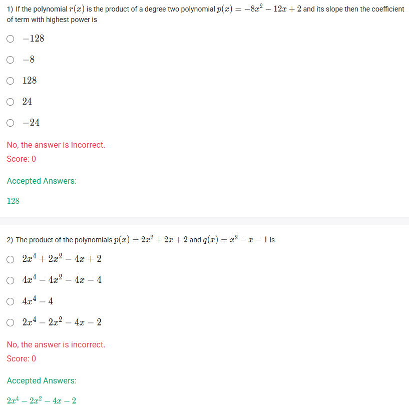
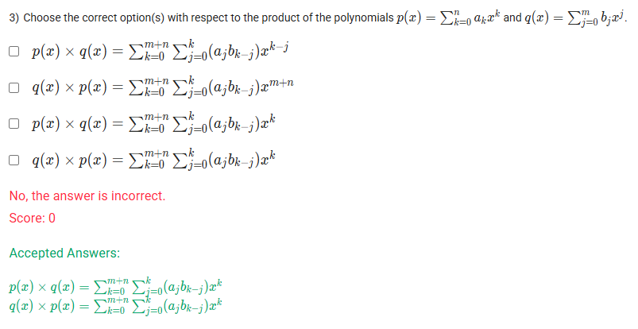
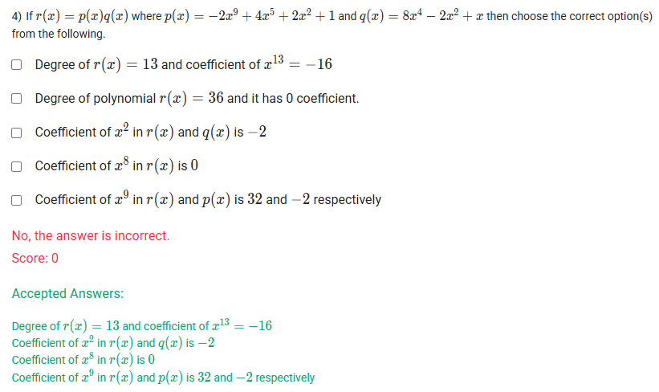

A well-defined collection of distinct objects called elements or members.



https://youtu.be/WOqISzw8jYs

#### Learning Outcomes

Compute the product of two general polynomials using corresponding coefficients.

## Exercise Questions 🤯

Good evening! Here in India on this Sunday, let's work through these questions, which focus on the multiplication of polynomials and understanding the properties of the resulting product.

### **Core Concepts: Multiplication of Polynomials**

1.  **The Process:** To multiply two polynomials, you must multiply **every term** in the first polynomial by **every term** in the second polynomial. Afterwards, you combine any "like terms" (terms with the same power of x) to simplify.

2.  **Degree of the Product:** The degree of the product of two non-zero polynomials is simply the **sum** of their individual degrees.
    * `degree(p(x) * q(x)) = degree(p(x)) + degree(q(x))`

3.  **Leading Coefficient of the Product:** The leading coefficient of the product is the **product** of the leading coefficients of the original polynomials.

4.  **Slope of a Polynomial:** The "slope" of a polynomial at any point is given by its **derivative**. For a term $ax^n$, its derivative is $(a \cdot n)x^{n-1}$.

---

### **Question 1: Product of a Polynomial and its Slope** (from file `image_d19339.png`)

**The Question:**
If the polynomial $r(x)$ is the product of a degree two polynomial $p(x) = -8x^2 - 12x + 2$ and its slope then the coefficient of term with highest power is \_\_\_\_\_\_\_\_\_\_.

**Core Concept:** The term with the highest power in the product polynomial, $r(x)$, is the product of the highest power terms of the original polynomials.

**Detailed Solution:**

1.  **Identify the first polynomial, $p(x)$:**
    * $p(x) = -8x^2 - 12x + 2$.
    * Its highest power term is $-8x^2$. Its degree is 2.

2.  **Find the slope of $p(x)$ by finding its derivative, $p'(x)$:**
    * The derivative of $-8x^2$ is $(2 \cdot -8)x^{2-1} = -16x$.
    * The derivative of $-12x$ is $-12$.
    * The derivative of $2$ is $0$.
    * So, the slope is $p'(x) = -16x - 12$.
    * Its highest power term is $-16x$. Its degree is 1.

3.  **Find the highest power term of the product, $r(x)$:**
    * $r(x) = p(x) \times p'(x)$.
    * The highest power term of $r(x)$ is the product of the highest power terms of $p(x)$ and $p'(x)$.
    * Highest Term = $(-8x^2) \times (-16x) = 128x^3$.

4.  **Identify the coefficient:**
    * The coefficient of the highest power term ($x^3$) is 128.

**Final Answer:** **128**



### **Question 2: Product of Two Polynomials** (from file `image_d19339.png`)

**The Question:**
The product of the polynomials $p(x) = 2x^2 + 2x + 2$ and $q(x) = x^2 - x - 1$ is \_\_\_\_\_\_\_\_\_\_.

**Core Concept:** Use the distributive property to multiply every term in $p(x)$ by every term in $q(x)$.

**Detailed Solution:**

1.  **Set up the multiplication:**
    $(2x^2 + 2x + 2)(x^2 - x - 1)$

2.  **Distribute each term of the first polynomial:**
    * Multiply by $2x^2$: $2x^2(x^2 - x - 1) = 2x^4 - 2x^3 - 2x^2$
    * Multiply by $2x$: $2x(x^2 - x - 1) = 2x^3 - 2x^2 - 2x$
    * Multiply by $2$: $2(x^2 - x - 1) = 2x^2 - 2x - 2$

3.  **Add the results and combine like terms:**
    $$(2x^4 - 2x^3 - 2x^2) + (2x^3 - 2x^2 - 2x) + (2x^2 - 2x - 2)$$ $$= 2x^4 + (-2x^3 + 2x^3) + (-2x^2 - 2x^2 + 2x^2) + (-2x - 2x) - 2$$ $$= 2x^4 + 0x^3 - 2x^2 - 4x - 2$$

**Final Answer:** $2x^4 - 2x^2 - 4x - 2$



### **Question 3: Multiplication Formula in Summation Notation** (from file `image_d19281.png`)

**The Question:**
Choose the correct option(s) with respect to the product of the polynomials $p(x) = \sum_{k=0}^{n} a_k x^k$ and $q(x) = \sum_{j=0}^{m} b_j x^j$.

**Core Concept: The Cauchy Product for Polynomials**

This formula looks complex, but it's a formal way of saying what we do when we multiply. The coefficient of a term like $x^k$ in the final product is found by summing up all the products of coefficients ($a_j b_i$) where the powers add up to $k$ (i.e., $j+i=k$).

The formula is:
$$p(x) \times q(x) = \sum_{k=0}^{m+n} \left( \sum_{j=0}^{k} a_j b_{k-j} \right) x^k$$

**Detailed Solution:**

1.  **Degree of the Product:** The highest power in the result will be $x^{m+n}$. So the outer sum must go from $k=0$ to $m+n$.
2.  **Coefficient of $x^k$:** As stated in the concept, the coefficient for any term $x^k$ is the sum of products of coefficients $a_j$ and $b_{k-j}$ for all possible $j$ from 0 to $k$. This is written as $\sum_{j=0}^{k} a_j b_{k-j}$.
3.  **Putting it together:** This gives the formula $p(x) \times q(x) = \sum_{k=0}^{m+n} \left( \sum_{j=0}^{k} a_j b_{k-j} \right) x^k$.
4.  **Commutativity:** Since polynomial multiplication is commutative, $p(x) \times q(x) = q(x) \times p(x)$. This means the same formula holds for the product in the reverse order.

Let's check the options:
* The **third option** matches the formula for $p(x) \times q(x)$ exactly. **TRUE**.
* The **fourth option** gives the same correct formula for $q(x) \times p(x)$. **TRUE**.
* The other options incorrectly alter the exponents or the indices of the sums.

**Final Answer:** The correct options are:
* $p(x) \times q(x) = \sum_{k=0}^{m+n} \sum_{j=0}^{k} (a_j b_{k-j}) x^k$
* $q(x) \times p(x) = \sum_{k=0}^{m+n} \sum_{j=0}^{k} (a_j b_{k-j}) x^k$



### **Question 4: Analyzing the Product of Polynomials** (from file `image_d18f94.png`)

**The Question:**
If $r(x) = p(x)q(x)$ where $p(x) = -2x^9 + 4x^5 + 2x^2 + 1$ and $q(x) = 8x^4 - 2x^2 + x$ then choose the correct option(s) from the following.

**Detailed Solution:**

Let's evaluate each statement.

* **"Degree of $r(x)=13$ and coefficient of $x^{13}=-16$"**
    * Degree of $r(x) = \text{deg}(p) + \text{deg}(q) = 9 + 4 = 13$.
    * The coefficient of the highest power term ($x^{13}$) is the product of the leading coefficients of $p(x)$ and $q(x)$.
    * Coefficient = $(-2) \times (8) = -16$.
    * This statement is **TRUE**.

* **"Degree of polynomial $r(x)=36$ and it has 0 coefficient."**
    * **FALSE**. The degree is 13, not 36 ($9 \times 4$).

* **"Coefficient of $x^2$ in $r(x)$ and $q(x)$ is -2"**
    * In $q(x) = 8x^4 - 2x^2 + x$, the coefficient of $x^2$ is indeed -2.
    * To get the $x^2$ term in $r(x)$, we find all pairs of terms from $p(x)$ and $q(x)$ that multiply to give a power of 2:
        * $(2x^2 \text{ from } p) \times (\text{constant term from } q) = 2x^2 \times 0 = 0$
        * $(\text{constant term from } p) \times (-2x^2 \text{ from } q) = 1 \times (-2x^2) = -2x^2$
    * The total coefficient of $x^2$ in $r(x)$ is $0 + (-2) = -2$.
    * The statement is **TRUE**.

* **"Coefficient of $x^8$ in $r(x)$ is 0"**
    * To get an $x^8$ term, we need terms with powers that sum to 8. Let's check the possibilities:
        * $p(x)$ has powers 9, 5, 2, 0.
        * $q(x)$ has powers 4, 2, 1.
        * Can we combine any pair to get 8? (9+?) no, (5+?) no, (2+?) no, (0+?) no.
    * Since there is no way to form an $x^8$ term, its coefficient must be 0. This statement is **TRUE**.

* **"Coefficient of $x^9$ in $r(x)$ and $p(x)$ is 32 and -2 respectively"**
    * The coefficient of $x^9$ in $p(x)$ is clearly -2.
    * To get the $x^9$ term in $r(x)$, we find all pairs with powers that sum to 9:
        * $(-2x^9 \text{ from } p) \times (\text{constant from } q) = -2x^9 \times 0 = 0$
        * $(4x^5 \text{ from } p) \times (8x^4 \text{ from } q) = 32x^9$
    * The total coefficient of $x^9$ in $r(x)$ is $0 + 32 = 32$.
    * The statement is **TRUE**.

**Final Answer:** The correct statements are:
* **Degree of $r(x) = 13$ and coefficient of $x^{13} = -16$**
* **Coefficient of $x^2$ in $r(x)$ and $q(x)$ is -2**
* **Coefficient of $x^8$ in $r(x)$ is 0**
* **Coefficient of $x^9$ in $r(x)$ and $p(x)$ is 32 and -2 respectively**
