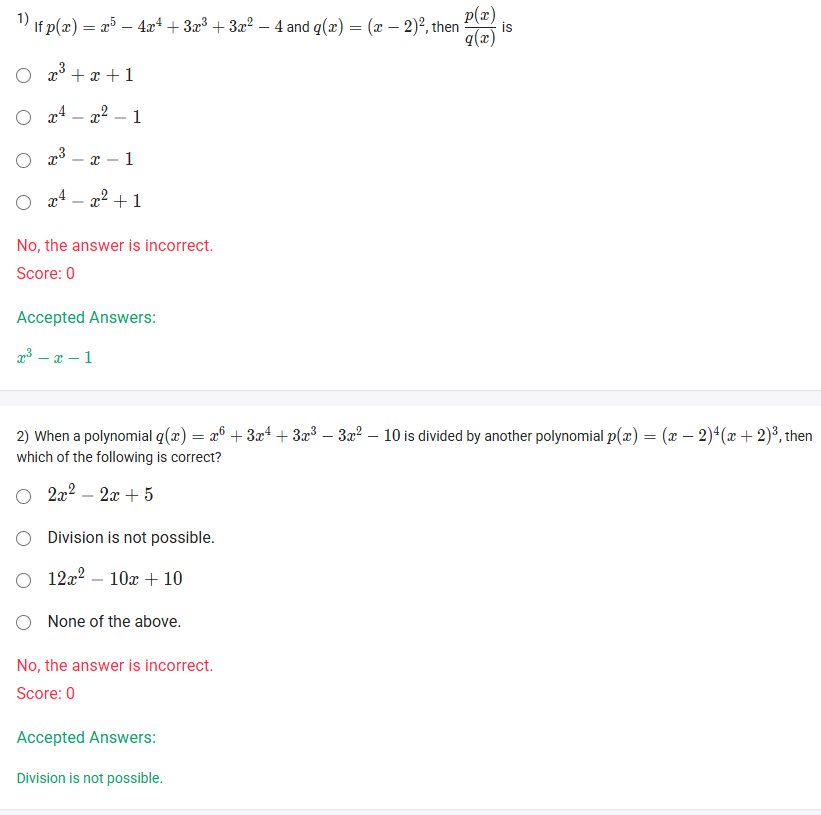
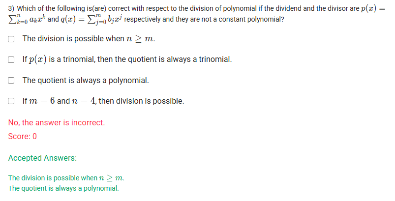

A well-defined collection of distinct objects called elements or members.



https://youtu.be/2eWP19N8wn4


#### Learning Outcomes

Compute the quotient and remainder from division of one polynomial by another.
Determine the feasibility of division of polynomials based on degrees of numerator and denominator.

## Exercise Questions 🤯




Good evening\! Here in India on this Sunday, let's explore these questions about the division of polynomials. This is a key algebraic skill with important rules about when and how it can be performed.

### **Core Concepts: Division of Polynomials**

1.  **The Division Algorithm:** When you divide a polynomial $p(x)$ (the dividend) by another polynomial $q(x)$ (the divisor), you get a unique **quotient** polynomial $s(x)$ and a **remainder** polynomial $r(x)$. The relationship is:
    $$p(x) = q(x) \cdot s(x) + r(x)$$
    where the degree of the remainder $r(x)$ is strictly less than the degree of the divisor $q(x)$.

2.  **When is Division "Possible"?** For the standard process of long division to yield a non-zero quotient, the degree of the dividend must be **greater than or equal to** the degree of the divisor. If the dividend's degree is smaller, the quotient is simply 0 and the remainder is the dividend itself.

3.  **Polynomial Long Division:** This is an algorithm similar to long division with numbers. You divide the leading term of the dividend by the leading term of the divisor to find the next term of the quotient, then multiply, subtract, and bring down the next term.

-----

{{\< border \>}}

### **Question 1: Polynomial Long Division** (from file `image_d187ba.png`)

**The Question:**
If $p(x) = x^5 - 4x^4 + 3x^3 + 3x^2 - 4$ and $q(x) = (x - 2)^2$, then $\\frac{p(x)}{q(x)}$ is \_\_\_\_\_\_\_\_\_\_.

**Core Concept:** This requires performing polynomial long division. First, we need to expand the divisor $q(x)$.

**Detailed Solution:**

1.  **Expand the divisor:**

      * $q(x) = (x - 2)^2 = (x - 2)(x - 2) = x^2 - 2x - 2x + 4 = x^2 - 4x + 4$.

2.  **Set up the long division:**

      * It's important to include placeholder terms for missing powers in the dividend (like $0x$).
      * The dividend is $x^5 - 4x^4 + 3x^3 + 3x^2 + 0x - 4$.
      * The divisor is $x^2 - 4x + 4$.

3.  **Perform the division step-by-step:**

    ```
              x³         - x   - 1
            ____________________
    x²-4x+4 | x⁵ - 4x⁴ + 3x³ + 3x² + 0x - 4
           -(x⁵ - 4x⁴ + 4x³)
           ____________________
                 0  -  x³ + 3x² + 0x
                    -(- x³ + 4x² - 4x)
                    ____________________
                          - x² + 4x - 4
                         -(- x² + 4x - 4)
                         _________________
                                0 
    ```

      * **Step A:** $x^5 \\div x^2 = x^3$. Multiply $x^3$ by the divisor and subtract.
      * **Step B:** Bring down the next term. The new leading term is $-x^3$.
      * **Step C:** $-x^3 \\div x^2 = -x$. Multiply $-x$ by the divisor and subtract.
      * **Step D:** Bring down the next term. The new leading term is $-x^2$.
      * **Step E:** $-x^2 \\div x^2 = -1$. Multiply $-1$ by the divisor and subtract.
      * The remainder is 0.

**Final Answer:** The quotient is **$x^3 - x - 1$**.
{{\< /border \>}}

{{\< border \>}}

### **Question 2: Possibility of Division** (from file `image_d187ba.png`)

**The Question:**
When a polynomial $q(x) = x^6 + 3x^4 + 3x^3 - 3x^2 - 10$ is divided by another polynomial $p(x) = (x-2)^4(x+2)^3$, then which of the following is correct?

**Core Concept:** The standard algorithm for polynomial division requires the degree of the dividend to be greater than or equal to the degree of the divisor.

**Detailed Solution:**

1.  **Find the degree of the dividend:**

      * The dividend is $q(x) = x^6 + 3x^4 + 3x^3 - 3x^2 - 10$.
      * The highest power of $x$ is 6, so the **degree of the dividend is 6**.

2.  **Find the degree of the divisor:**

      * The divisor is $p(x) = (x-2)^4(x+2)^3$.
      * We don't need to expand it fully. The highest power term from $(x-2)^4$ will be $x^4$. The highest power term from $(x+2)^3$ will be $x^3$.
      * When we multiply these, the highest power term of the resulting polynomial will be $x^4 \\times x^3 = x^7$.
      * So, the **degree of the divisor is 7**.

3.  **Compare the degrees:**

      * Degree of Dividend (6) \< Degree of Divisor (7).
      * Since the degree of the polynomial we are dividing by is larger than the degree of the polynomial being divided, the standard long division is not possible in a way that yields a non-zero polynomial quotient. The result is a rational expression, not a simplified polynomial.

**Final Answer:** **Division is not possible.**
{{\< /border \>}}

{{\< border \>}}

### **Question 3: Conceptual Division of Polynomials** (from file `image_d18737.png`)

**The Question:**
Which of the following is(are) correct with respect to the division of polynomial if the dividend and the divisor are $p(x) = \\sum\_{k=0}^{n} a\_k x^k$ and $q(x) = \\sum\_{j=0}^{m} b\_j x^j$ respectively and they are not a constant polynomial? (Multiple Select Question)

**Core Concept:** This question tests the fundamental rules and definitions of the polynomial division algorithm.

**Detailed Solution:**

Let the degree of the dividend $p(x)$ be $n$ and the degree of the divisor $q(x)$ be $m$.

  * **"The division is possible when $n \\ge m$."**

      * **TRUE**. As explained in the core concepts, for the long division process to proceed and yield a meaningful, non-zero quotient polynomial, the degree of the dividend must be greater than or equal to the degree of the divisor.

  * **"If $p(x)$ is a trinomial, then the quotient is always a trinomial."**

      * **FALSE**. The number of terms in the quotient is not directly related to the number of terms in the dividend. For example, dividing the trinomial $x^2+x+1$ by the binomial $x+1$ gives a quotient of $x$ (a monomial) with a remainder of 1.

  * **"The quotient is always a polynomial."**

      * **TRUE**. In the context of the Division Algorithm ($p(x) = q(x) \\cdot s(x) + r(x)$), the term "quotient" specifically refers to the polynomial $s(x)$. By definition, the algorithm produces a polynomial quotient and a polynomial remainder.

  * **"If $m = 6$ and $n = 4$, then division is possible."**

      * **FALSE**. Here, the degree of the divisor ($m=6$) is greater than the degree of the dividend ($n=4$). This violates the condition $n \\ge m$.

**Final Answer:** The correct statements are:

  * **The division is possible when $n \\ge m$.**
  * **The quotient is always a polynomial.**
    {{\< /border \>}}