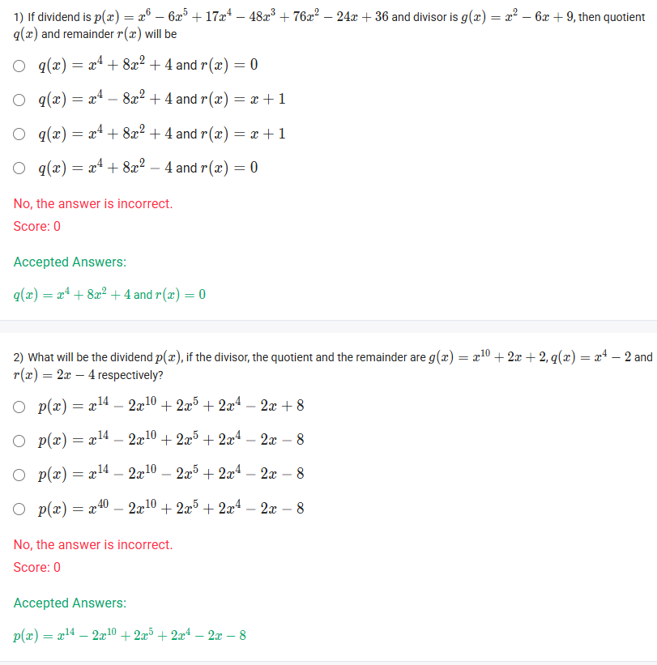
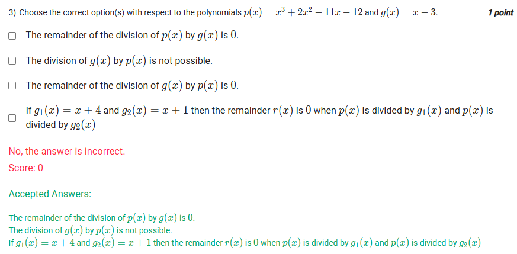
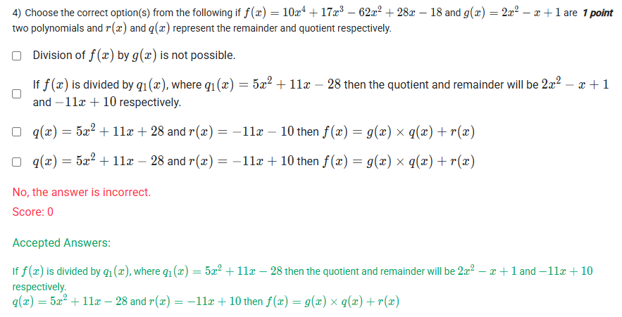

A well-defined collection of distinct objects called elements or members.



https://youtu.be/Y1_T6augNFo

#### Learning Outcomes

Describe four steps of algorithm for long division of polynomials with corresponding examples.

## Exercise Questions 🤯






Good evening\! Here in India on this Sunday, let's explore these questions about polynomial division. They cover the full process, from the hands-on long division algorithm to the very useful Remainder Theorem.

### **Core Concepts: The Division Algorithm and Remainder Theorem**

1.  **The Division Algorithm:** This is the fundamental rule of polynomial division. It states that for any dividend $p(x)$ and divisor $g(x)$, you can always find a unique quotient $q(x)$ and remainder $r(x)$ such that:
    $$p(x) = g(x) \cdot q(x) + r(x)$$
    The degree of the remainder $r(x)$ will always be less than the degree of the divisor $g(x)$.

2.  **The Remainder Theorem:** This is a powerful shortcut. It says that if you divide a polynomial $p(x)$ by a simple linear factor like $(x-c)$, the remainder of that division will be equal to the value of the polynomial at $c$, which is $p(c)$.

3.  **The Factor Theorem:** As a direct result, if the remainder is 0 (meaning $p(c)=0$), then $(x-c)$ is a factor of $p(x)$.

-----

{{\< border \>}}

### **Question 1: Polynomial Long Division** (from file `image_d17fd9.png`)

**The Question:**
If dividend is $p(x) = x^6 - 6x^5 + 17x^4 - 48x^3 + 76x^2 - 24x + 36$ and divisor is $g(x) = x^2 - 6x + 9$, then quotient $q(x)$ and remainder $r(x)$ will be \_\_\_\_\_\_\_\_\_\_.

**Core Concept:** This requires performing polynomial long division.

**Detailed Solution:**

We will divide $x^6 - 6x^5 + 17x^4 - 48x^3 + 76x^2 - 24x + 36$ by $x^2 - 6x + 9$.

```
          x⁴         + 8x²         + 4
        ________________________________
x²-6x+9 | x⁶ - 6x⁵ + 17x⁴ - 48x³ + 76x² - 24x + 36
       -(x⁶ - 6x⁵ +  9x⁴)
       ________________________________
             0  +  8x⁴ - 48x³ + 76x²
                -(8x⁴ - 48x³ + 72x²)
                ____________________
                      0  +  4x² - 24x + 36
                         -(4x² - 24x + 36)
                         _________________
                                0 
```

**Step-by-step Explanation:**

1.  Divide the first term of the dividend ($x^6$) by the first term of the divisor ($x^2$) to get $x^4$. Write $x^4$ in the quotient.
2.  Multiply $x^4$ by the entire divisor ($x^2 - 6x + 9$) to get $x^6 - 6x^5 + 9x^4$. Subtract this from the dividend.
3.  Bring down the next term. The new leading term is $8x^4$.
4.  Divide $8x^4$ by $x^2$ to get $8x^2$. Write $+8x^2$ in the quotient.
5.  Multiply $8x^2$ by the divisor and subtract.
6.  Bring down the next terms. The new leading term is $4x^2$.
7.  Divide $4x^2$ by $x^2$ to get $4$. Write $+4$ in the quotient.
8.  Multiply $4$ by the divisor and subtract. The result is 0.

**Final Answer:** The quotient is $q(x) = x^4 + 8x^2 + 4$ and the remainder is $r(x) = 0$.
{{\< /border \>}}

{{\< border \>}}

### **Question 2: Reconstructing the Dividend** (from file `image_d17fd9.png`)

**The Question:**
What will be the dividend $p(x)$, if the divisor, the quotient and the remainder are $g(x) = x^{10} + 2x + 2$, $q(x) = x^4 - 2$ and $r(x) = 2x - 4$ respectively?

**Core Concept:** We use the Division Algorithm formula directly: $p(x) = g(x) \\cdot q(x) + r(x)$.

**Detailed Solution:**

1.  **First, multiply the divisor $g(x)$ by the quotient $q(x)$:**

      * $(x^{10} + 2x + 2)(x^4 - 2)$
      * Distribute each term:
          * $x^{10}(x^4 - 2) = x^{14} - 2x^{10}$
          * $2x(x^4 - 2) = 2x^5 - 4x$
          * $2(x^4 - 2) = 2x^4 - 4$
      * Combine these results: $x^{14} - 2x^{10} + 2x^5 + 2x^4 - 4x - 4$

2.  **Now, add the remainder $r(x)$:**

      * $p(x) = (x^{14} - 2x^{10} + 2x^5 + 2x^4 - 4x - 4) + (2x - 4)$

3.  **Combine like terms to get the final dividend:**

      * $p(x) = x^{14} - 2x^{10} + 2x^5 + 2x^4 + (-4x + 2x) + (-4 - 4)$
      * $p(x) = x^{14} - 2x^{10} + 2x^5 + 2x^4 - 2x - 8$

**Final Answer:** $p(x) = x^{14} - 2x^{10} + 2x^5 + 2x^4 - 2x - 8$
{{\< /border \>}}

{{\< border \>}}

### **Question 3: Remainder Theorem and Divisibility** (from file `image_d17cae.png`)

**The Question:**
Choose the correct option(s) with respect to the polynomials $p(x) = x^3 + 2x^2 - 11x - 12$ and $g(x) = x - 3$.

**Detailed Solution:**

Let's evaluate each statement.

  * **"The remainder of the division of $p(x)$ by $g(x)$ is 0."**

      * We can use the Remainder Theorem. The divisor is $g(x) = x - 3$, so $c=3$. The remainder is $p(3)$.
      * $p(3) = (3)^3 + 2(3)^2 - 11(3) - 12 = 27 + 2(9) - 33 - 12 = 27 + 18 - 33 - 12 = 45 - 45 = 0$.
      * The remainder is 0. This statement is **TRUE**.

  * **"The division of $g(x)$ by $p(x)$ is not possible."**

      * The degree of the dividend $g(x)$ is 1. The degree of the divisor $p(x)$ is 3.
      * Since the degree of the dividend is less than the degree of the divisor, standard polynomial division is not possible. This statement is **TRUE**.

  * **"The remainder of the division of $g(x)$ by $p(x)$ is 0."**

      * **FALSE**. As stated above, the division is not possible. In this case, the quotient is 0 and the remainder is $g(x)$ itself, which is $x-3$, not 0.

  * **"If $g\_1(x) = x+4$ and $g\_2(x) = x+1$ then the remainder $r(x)$ is 0 when $p(x)$ is divided by $g\_1(x)$ and $p(x)$ is divided by $g\_2(x)$"**

      * This is asking if $(x+4)$ and $(x+1)$ are both factors of $p(x)$. We use the Remainder Theorem again.
      * For $g\_1(x) = x+4$, we check $p(-4)$:
          * $p(-4) = (-4)^3 + 2(-4)^2 - 11(-4) - 12 = -64 + 2(16) + 44 - 12 = -64 + 32 + 44 - 12 = -76 + 76 = 0$. The remainder is 0.
      * For $g\_2(x) = x+1$, we check $p(-1)$:
          * $p(-1) = (-1)^3 + 2(-1)^2 - 11(-1) - 12 = -1 + 2(1) + 11 - 12 = -1 + 2 + 11 - 12 = 13 - 13 = 0$. The remainder is 0.
      * Since the remainder is 0 in both cases, this statement is **TRUE**.

**Final Answer:** The correct options are:

  * **The remainder of the division of $p(x)$ by $g(x)$ is 0.**
  * **The division of $g(x)$ by $p(x)$ is not possible.**
  * **If $g\_1(x) = x+4$ and $g\_2(x) = x+1$ then the remainder $r(x)$ is 0 when $p(x)$ is divided by $g\_1(x)$ and $p(x)$ is divided by $g\_2(x)$**
    {{\< /border \>}}

{{\< border \>}}

### **Question 4: Analyzing a Division** (from file `image_d17c37.png`)

**The Question:**
Choose the correct option(s) from the following if $f(x) = 10x^4 + 17x^3 - 62x^2 + 28x - 18$ and $g(x) = 2x^2 - x + 1$ are two polynomials and $r(x)$ and $q(x)$ represent the remainder and quotient respectively.

**Detailed Solution:**

First, we must perform the long division of $f(x)$ by $g(x)$ to find the actual quotient and remainder.

```
          5x²   + 11x  - 28
        ____________________
2x²-x+1 | 10x⁴ + 17x³ - 62x² + 28x - 18
       -(10x⁴ -  5x³ +  5x²)
       ____________________
              22x³ - 67x² + 28x
             -(22x³ - 11x² + 11x)
             ____________________
                   -56x² + 17x - 18
                  -(-56x² + 28x - 28)
                  ___________________
                         -11x + 10
```

From the division, we have found:

  * **Quotient:** $q(x) = 5x^2 + 11x - 28$
  * **Remainder:** $r(x) = -11x + 10$

Now let's evaluate the options:

  * **"Division of $f(x)$ by $g(x)$ is not possible."**

      * **FALSE**. The degree of the dividend (4) is greater than the degree of the divisor (2), so division is possible.

  * **"If $f(x)$ is divided by $q\_1(x)$, where $q\_1(x) = 5x^2 + 11x - 28$ then the quotient and remainder will be $2x^2 - x + 1$ and $-11x + 10$ respectively."**

      * We found that $f(x) = g(x) \\cdot q(x) + r(x)$. The statement uses $q\_1(x)$ which is our calculated quotient, $q(x)$. It says if we divide $f(x)$ by $q(x)$, the new quotient will be $g(x)$ and the remainder will be $r(x)$. This is the symmetric property of the Division Algorithm. This statement is **TRUE**.

  * **"$q(x) = 5x^2 + 11x + 28$ and $r(x) = -11x - 10$ then $f(x) = g(x) \\times q(x) + r(x)$"**

      * **FALSE**. The signs in both the quotient and remainder are incorrect compared to our calculation.

  * **"$q(x) = 5x^2 + 11x - 28$ and $r(x) = -11x + 10$ then $f(x) = g(x) \\times q(x) + r(x)$"**

      * **TRUE**. This correctly states the quotient and remainder that we found and places them in the correct Division Algorithm formula.

**Final Answer:** The correct options are:

  * **If $f(x)$ is divided by $q\_1(x)$, where $q\_1(x) = 5x^2 + 11x - 28$ then the quotient and remainder will be $2x^2 - x + 1$ and $-11x + 10$ respectively.**
  * **$q(x) = 5x^2 + 11x - 28$ and $r(x) = -11x + 10$ then $f(x) = g(x) \\times q(x) + r(x)$**
    {{\< /border \>}}