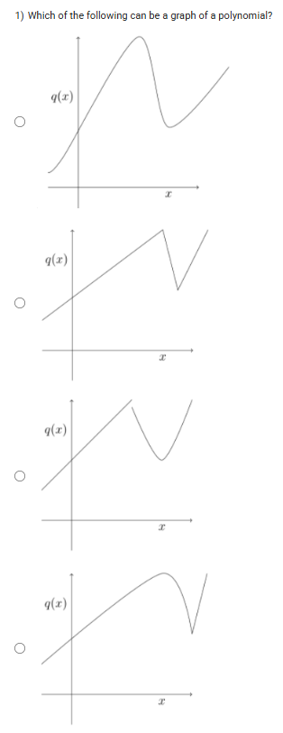
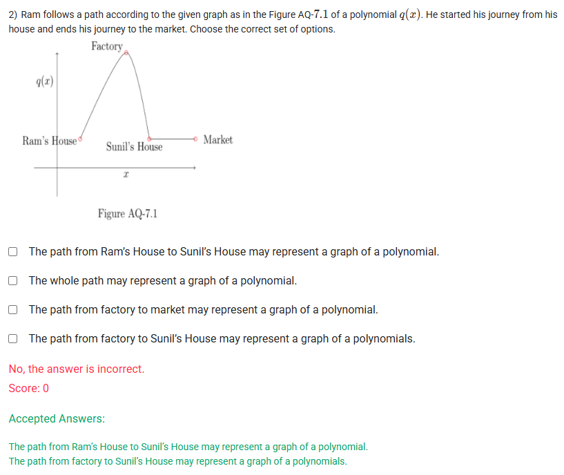

A well-defined collection of distinct objects called elements or members.



https://youtu.be/5M_oX0EjiEk

#### Learning Outcomes

 Identify the graph of a polynomial.
 List out the properties of the graph of a polynomial function.

## Exercise Questions 🤯

Good evening! Here in India on this Sunday, let's look at these questions about the graphical representation of polynomials. There are two key visual clues that help us identify the graph of a polynomial function.

### **Core Concepts: The Graph of a Polynomial**

Not every graph is a polynomial. For a graph to represent a polynomial function, it must have two important properties:

1.  **Continuity:** The graph must be a single, unbroken curve. You can draw the entire graph without lifting your pen from the paper. There are no jumps, breaks, or holes.
2.  **Smoothness:** The graph must have only smooth, rounded turns. It **cannot** have any sharp corners, cusps, or V-shapes.

Any graph that violates either of these rules cannot be the graph of a polynomial function.

---

### **Question 1: Identifying a Polynomial Graph** (from file `image_d174b4.png`)

**The Question:**
Which of the following can be a graph of a polynomial?

**Detailed Solution:**

Let's apply our two rules (continuity and smoothness) to each of the four graphs.

* **Graph 1:** This graph is a single, unbroken curve (it's continuous). It has rounded peaks and valleys with no sharp points (it's smooth). Since it is both continuous and smooth, this **can be a graph of a polynomial**.

* **Graph 2:** This graph is continuous, but it has a sharp, V-shaped point. This violates the smoothness rule. Therefore, this **cannot be a graph of a polynomial**. (This type of corner is often characteristic of an absolute value function).

* **Graph 3:** This graph has a sharp corner where the function changes direction abruptly. It is not smooth. Therefore, this **cannot be a graph of a polynomial**.

* **Graph 4:** This graph also has a sharp cusp. It is not smooth. Therefore, this **cannot be a graph of a polynomial**.

**Final Answer:** Only the **first graph** can be a graph of a polynomial.



### **Question 2: Identifying Polynomial Segments** (from file `image_d17193.png`)

**The Question:**
Ram follows a path according to the given graph as in the Figure AQ-7.1 of a polynomial $q(x)$. He started his journey from his house and ends his journey to the market. Choose the correct set of options.

**Detailed Solution:**

Let's analyze the entire path first. The peak at the "Factory" is a smooth, rounded turn, which is characteristic of a polynomial's local maximum. However, at "Sunil's House," the path abruptly changes from a curve to a flat horizontal line. This creates a "corner" where the function is not smooth. Therefore, the *entire path from start to finish* cannot be represented by a single polynomial.

Now let's evaluate each option:

* **"The path from Ram's House to Sunil's House may represent a graph of a polynomial."**
    * This segment of the path starts at Ram's House, goes up to a smooth peak at the Factory, and comes down to Sunil's House. This entire portion is a single, smooth, and continuous curve. This **can** be represented by a polynomial (likely a cubic or higher-degree polynomial). This statement is **TRUE**.

* **"The whole path may represent a graph of a polynomial."**
    * As discussed, the sharp "join" at Sunil's House where the curve meets the flat line means the entire path is not smooth. This statement is **FALSE**.

* **"The path from factory to market may represent a graph of a polynomial."**
    * This segment includes the non-smooth join at Sunil's House. Therefore, it cannot be represented by a single polynomial. This statement is **FALSE**.

* **"The path from factory to Sunil's House may represent a graph of a polynomial."**
    * This is just the downward-sloping part of the smooth curve. Since it's a piece of a smooth, continuous curve, it **can** be represented by a polynomial. This statement is **TRUE**.

**Final Answer:** The correct statements are:
* **The path from Ram's House to Sunil's House may represent a graph of a polynomial.**
* **The path from factory to Sunil's House may represent a graph of a polynomial.**
