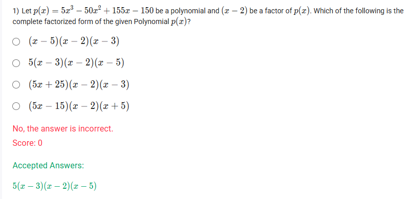
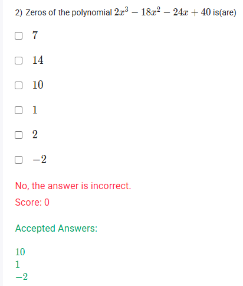
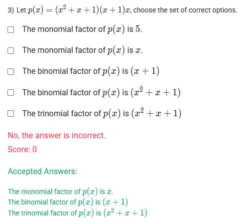
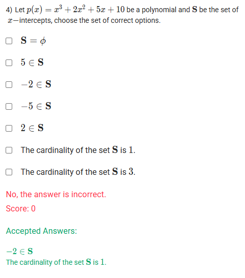
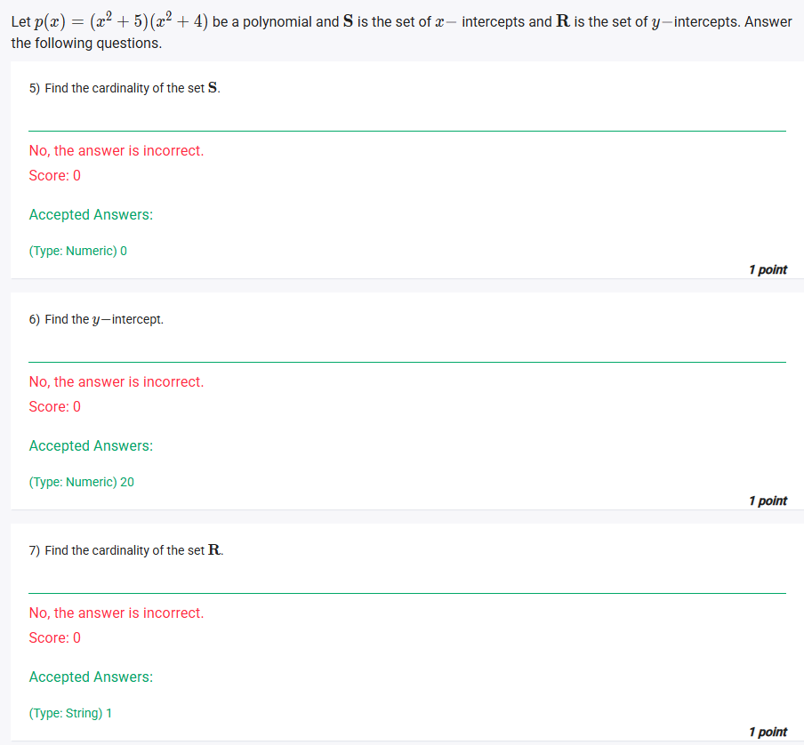

A well-defined collection of distinct objects called elements or members.



https://youtu.be/-E21FQ567F8

#### Learning Outcomes

 Identify zeros of a polynomial function.
 Demonstrate the methods to factorize polynomials.
 Find the zeros and X-intercepts of polynomial functions by factoring.

## Exercise Questions








Good evening\! Here in India on this Sunday, let's work through these questions. They cover the very important and related concepts of a polynomial's factors, its roots (or zeros), and its intercepts on a graph.

### **Core Concepts: Factors, Roots, and Intercepts**

1.  **Roots / Zeros / x-intercepts:** These three terms are used almost interchangeably.

      * The **roots** or **zeros** of a polynomial $p(x)$ are the values of $x$ that make the polynomial equal to zero (i.e., where $p(x) = 0$).
      * These are also the x-coordinates of the **x-intercepts**, which are the points where the graph of the polynomial crosses the x-axis.

2.  **The Factor Theorem:** This theorem creates a direct link between roots and factors. It states that if $c$ is a root of a polynomial $p(x)$, then $(x-c)$ must be a factor of that polynomial.

3.  **The y-intercept:** This is the point where the graph crosses the y-axis. It is always found by setting $x=0$ and calculating the value of the polynomial, $p(0)$. A function can have only one y-intercept.

-----

{{\< border \>}}

### **Question 1: Complete Factorization** (from file `image_d11dde.png`)

**The Question:**
Let $p(x) = 5x^3 - 50x^2 + 155x - 150$ be a polynomial and $(x-2)$ be a factor of $p(x)$. Which of the following is the complete factorized form of the given Polynomial $p(x)$?

**Core Concept:** If we know one factor of a polynomial, we can find the others by dividing the polynomial by the known factor. The result of the division (the quotient) will be the remaining factor(s).

**Detailed Solution:**

1.  **Factor out the common constant:** Notice that all coefficients are divisible by 5. Let's factor that out first to make the numbers smaller.
    $p(x) = 5(x^3 - 10x^2 + 31x - 30)$

2.  **Divide by the known factor:** We are given that $(x-2)$ is a factor. We will divide the cubic part, $x^3 - 10x^2 + 31x - 30$, by $(x-2)$. We can use synthetic division for this.

    ```
    2 | 1  -10   31  -30
      |    2  -16   30
      --------------------
        1  -8   15    0 
    ```

    The remainder is 0 (as expected since it's a factor), and the quotient is a quadratic: $1x^2 - 8x + 15$.

3.  **Factor the remaining quadratic:** Now we need to factor $x^2 - 8x + 15$. We look for two numbers that multiply to +15 and add to -8. These numbers are -3 and -5.

      * So, $x^2 - 8x + 15 = (x-3)(x-5)$.

4.  **Combine all factors:** The complete factorization is the constant we factored out first, plus all the linear factors we found.

      * $p(x) = 5(x-2)(x-3)(x-5)$.

**Final Answer:** **$5(x-3)(x-2)(x-5)$**
{{\< /border \>}}

{{\< border \>}}

### **Question 2: Finding the Zeros of a Polynomial** (from file `image_d11af5.png`)

**The Question:**
Zeros of the polynomial $2x^3 - 18x^2 - 24x + 40$ is(are) \_\_\_\_\_\_\_\_\_\_.

**Core Concept:** A "zero" of a polynomial is a value of $x$ that makes the polynomial equal to 0. Since the options are provided, the quickest way to solve this is to test each potential zero using the Remainder Theorem: if $p(c)=0$, then $c$ is a zero.

**Detailed Solution:**

Let $p(x) = 2x^3 - 18x^2 - 24x + 40$. Let's test the values given in the accepted answers.

  * **Test $x = 1$:**
    $p(1) = 2(1)^3 - 18(1)^2 - 24(1) + 40 = 2 - 18 - 24 + 40 = -16 - 24 + 40 = -40 + 40 = 0$.
    Since $p(1)=0$, **1 is a zero**.

  * **Test $x = 10$:**
    $p(10) = 2(10)^3 - 18(10)^2 - 24(10) + 40 = 2(1000) - 18(100) - 240 + 40 = 2000 - 1800 - 240 + 40 = 200 - 200 = 0$.
    Since $p(10)=0$, **10 is a zero**.

  * **Test $x = -2$:**
    $p(-2) = 2(-2)^3 - 18(-2)^2 - 24(-2) + 40 = 2(-8) - 18(4) + 48 + 40 = -16 - 72 + 88 = -88 + 88 = 0$.
    Since $p(-2)=0$, **-2 is a zero**.

**Final Answer:** The zeros are **10, 1, and -2**.
{{\< /border \>}}

{{\< border \>}}

### **Question 3: Identifying Factors** (from file `image_d11a7a.png`)

**The Question:**
Let $p(x) = (x^2 + x + 1)(x+1)x$, choose the set of correct options. (Multiple Select Question)

**Core Concept:** The factors of a polynomial are the expressions that are multiplied together to create it. We can classify these factors by their number of terms (monomial, binomial, trinomial).

**Detailed Solution:**

The polynomial is already given to us in its factored form: $p(x) = (x^2 + x + 1)(x + 1)x$.
Let's look at each of the expressions being multiplied:

  * **$x$**: This factor has one term. It is a **monomial**.
  * **$(x + 1)$**: This factor has two terms. It is a **binomial**.
  * **$(x^2 + x + 1)$**: This factor has three terms. It is a **trinomial**.

Now we can evaluate the options:

  * "The monomial factor of $p(x)$ is $x$." -\> **TRUE**.
  * "The binomial factor of $p(x)$ is $(x + 1)$." -\> **TRUE**.
  * "The trinomial factor of $p(x)$ is $(x^2 + x + 1)$." -\> **TRUE**.

**Final Answer:** The correct options are:

  * **The monomial factor of $p(x)$ is $x$.**
  * **The binomial factor of $p(x)$ is $(x + 1)$.**
  * **The trinomial factor of $p(x)$ is $(x^2 + x + 1)$.**
    {{\< /border \>}}

{{\< border \>}}

### **Question 4: Finding x-intercepts** (from file `image_d11779.png`)

**The Question:**
Let $p(x) = x^3 + 2x^2 + 5x + 10$ be a polynomial and **S** be the set of x-intercepts, choose the set of correct options.

**Core Concept:** The x-intercepts are the real roots of the polynomial. For a four-term polynomial like this, a good strategy is to try **factoring by grouping**.

**Detailed Solution:**

1.  **Set the polynomial to zero** to find the roots:
    $x^3 + 2x^2 + 5x + 10 = 0$
2.  **Group the first two terms and the last two terms:**
    $(x^3 + 2x^2) + (5x + 10) = 0$
3.  **Factor out the greatest common factor from each group:**
      * From the first group, factor out $x^2$: $x^2(x + 2)$
      * From the second group, factor out $5$: $5(x + 2)$
4.  **Rewrite the equation:**
    $x^2(x + 2) + 5(x + 2) = 0$
5.  **Factor out the common binomial factor, $(x+2)$:**
    $(x + 2)(x^2 + 5) = 0$
6.  **Solve for x from each factor:**
      * **First factor:** $x + 2 = 0 \\implies x = -2$. This is a real root.
      * **Second factor:** $x^2 + 5 = 0 \\implies x^2 = -5$. There is no real number whose square is negative, so this factor gives **no real roots**.
7.  **Determine the set S and its cardinality:**
      * The only real root is -2. Therefore, the set of x-intercepts is $S = {-2}$.
      * The cardinality of S (the number of elements in it) is 1.

**Final Answer:** The correct statements are:

  * **$-2 \\in S$**
  * **The cardinality of the set S is 1.**
    {{\< /border \>}}

{{\< border \>}}

### **Questions 5, 6, & 7: Intercepts of a Factored Polynomial** (from file `image_d116a0.png`)

**The Questions:**
Let $p(x) = (x^9 + 5)(x^2 + 4)$ be a polynomial and **S** is the set of x-intercepts and **R** is the set of y-intercepts. Answer the following questions.
5\) Find the cardinality of the set **S**.
6\) Find the y-intercept.
7\) Find the cardinality of the set **R**.

**Detailed Solution:**

#### **5) Find the cardinality of the set S (x-intercepts).**

1.  **Find x-intercepts by setting p(x) = 0:**
    $(x^9 + 5)(x^2 + 4) = 0$
2.  **Set each factor to zero and solve:**
      * **First factor:** $x^9 + 5 = 0 \\implies x^9 = -5$. This gives one real solution, $x = \\sqrt[9]{-5}$ (the odd root of a negative number is a real number).
      * **Second factor:** $x^2 + 4 = 0 \\implies x^2 = -4$. This has **no real solutions**.
3.  **Conclusion:** There is only one real root, so there is only one x-intercept. The set is $S = {\\sqrt[9]{-5}}$.
4.  The cardinality of S is the number of elements in it, which is 1.

**Note:** The accepted answer in your image is "0". This is incorrect based on the standard definition of polynomials over real numbers. The equation $x^9=-5$ has one real solution. The provided answer key is likely flawed.

**My Answer:** The cardinality of the set **S** is **1**.

-----

#### **6) Find the y-intercept.**

1.  **Find the y-intercept by setting x = 0:**
    $p(0) = ((0)^9 + 5)((0)^2 + 4)$
2.  **Calculate the result:**
    $p(0) = (0 + 5)(0 + 4) = (5)(4) = 20$.

**Final Answer:** The y-intercept is **20**.

-----

#### **7) Find the cardinality of the set R (y-intercepts).**

1.  A function can only cross the y-axis once. If it crossed more than once, it would fail the vertical line test and would not be a function.
2.  We found the single y-intercept to be 20. The point is $(0, 20)$.
3.  The set of y-intercepts is $R = { (0, 20) }$.
4.  The cardinality of R is the number of elements in it.

**Final Answer:** The cardinality of the set **R** is **1**.
{{\< /border \>}}