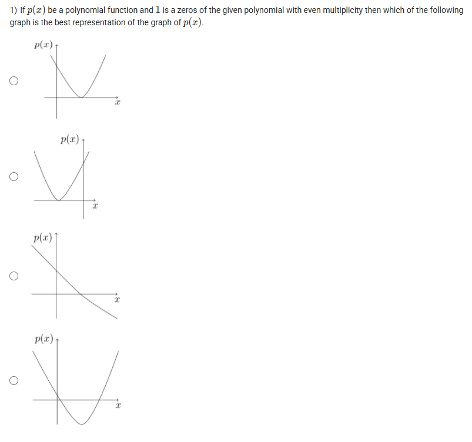
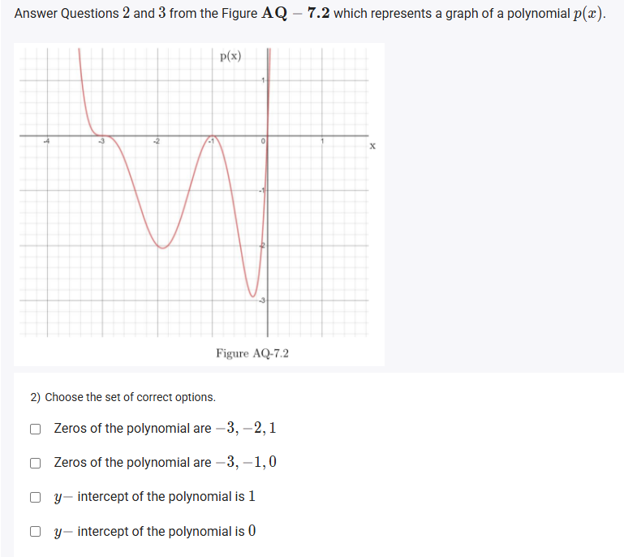
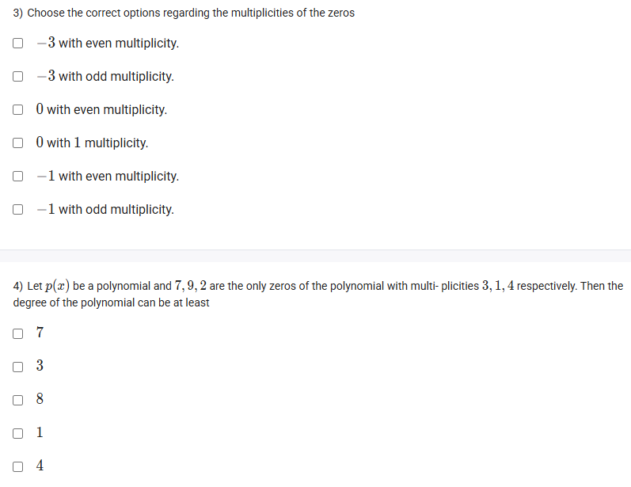
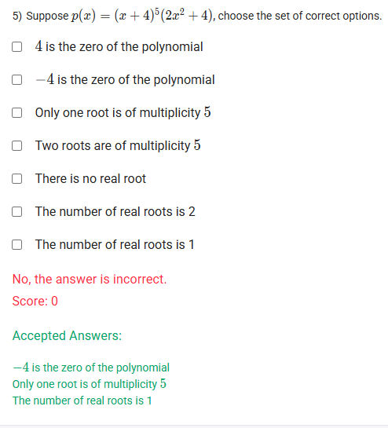

A well-defined collection of distinct objects called elements or members.



https://youtu.be/-flkMRCNTPE

#### Learning Outcomes

 Visualize the graphical behavior of a polynomial from its algebraic expression.
 Identify zeros and their multiplicities of a polynomial from its graph.
 Identify the properties of the graph of a polynomial for even degree factor, odd degree factor, and linear factor.
 Find the Y-intercept of a polynomial from the algebraic expression.

## Exercise Questions 🤯

Good evening! Here in India on this Sunday, let's explore these questions. They are excellent for understanding a key concept in polynomials: the **multiplicity of zeros** and how it shapes the graph of the function.

### **Core Concepts: The Multiplicity of a Zero**

The "zeros" or "roots" of a polynomial are the x-values where its graph intersects the x-axis. The **multiplicity** of a zero tells us *how* the graph behaves at that intersection. It's the number of times a particular factor appears in the factored form of the polynomial.

1.  **Odd Multiplicity (1, 3, 5, etc.)**
    * If a zero has an odd multiplicity, the graph **crosses** the x-axis at that point.
    * If the multiplicity is 1, it crosses like a straight line.
    * If the multiplicity is 3, 5, or higher, it flattens out as it crosses.

2.  **Even Multiplicity (2, 4, 6, etc.)**
    * If a zero has an even multiplicity, the graph **touches** the x-axis and **bounces** back without crossing. It is tangent to the x-axis at that point.

3.  **Degree of a Polynomial**
    * The degree of a polynomial is, at minimum, the sum of the multiplicities of all its distinct zeros.

---

### **Question 1: Graph of a Zero with Even Multiplicity** (from file `image_d10f7c.png`)

**The Question:**
If $p(x)$ be a polynomial function and 1 is a zeros of the given polynomial with even multiplicity then which of the following graph is the best representation of the graph of $p(x)$.

**Core Concept:** As defined above, a zero with **even multiplicity** means the graph must touch the x-axis at that point and "bounce" off, without crossing to the other side.

**Detailed Solution:**

1.  We are looking for a graph that has a zero at $x=1$.
2.  The multiplicity at this zero is **even**. This means the graph must be tangent to the x-axis at $x=1$.
3.  Let's examine the options:
    * **The first two graphs** both show a parabola whose vertex (turning point) is exactly at $(1, 0)$. This "touch and turn" behavior is the classic sign of a zero with even multiplicity.
    * The third graph shows a line crossing the axis, which would be a zero of odd multiplicity (specifically, 1).
    * The fourth graph shows a parabola that does not have a zero at $x=1$.

**Final Answer:** The **first (and second) option** correctly represents a polynomial with a zero at $x=1$ having even multiplicity.



### **Question 2: Zeros and Intercepts from a Graph** (from file `image_d10ee1.png`)

**The Question:**
Choose the set of correct options from the graph of a polynomial $p(x)$.
* Zeros of the polynomial are -3, -2, 1
* Zeros of the polynomial are -3, -1, 0
* y-intercept of the polynomial is 1
* y-intercept of the polynomial is 0

**Core Concept:**
* **Zeros (x-intercepts):** The points where the graph crosses or touches the horizontal x-axis.
* **y-intercept:** The point where the graph crosses the vertical y-axis (where $x=0$).

**Detailed Solution:**

1.  **Find the Zeros:** Look at the provided graph. The curve intersects the x-axis at three points: $x = -3$, $x = -1$, and $x = 0$.
2.  **Find the y-intercept:** Look at where the curve intersects the y-axis. It passes through the origin, $(0, 0)$. Therefore, the y-intercept is 0.

**Final Answer:** The correct options are:
* **Zeros of the polynomial are -3, -1, 0**
* **y-intercept of the polynomial is 0**



### **Question 3: Multiplicities from a Graph** (from file `image_d10bf1.png`)

**The Question:**
Choose the correct options regarding the multiplicities of the zeros (from the graph in Question 2).

**Core Concept:** We apply the graphical rules for multiplicity to the zeros we identified in the previous question.

**Detailed Solution:**

1.  **At the zero $x = -3$**: The graph **crosses** the x-axis. This indicates an **odd multiplicity**.
2.  **At the zero $x = -1$**: The graph **touches** the x-axis and "bounces" back up. This indicates an **even multiplicity**.
3.  **At the zero $x = 0$**: The graph **crosses** the x-axis. This indicates an **odd multiplicity**. The simplest odd multiplicity is 1.

Now, let's evaluate the options:
* **"-3 with even multiplicity."**: FALSE.
* **"-3 with odd multiplicity."**: TRUE.
* **"0 with even multiplicity."**: FALSE.
* **"0 with 1 multiplicity."**: TRUE (since 1 is an odd number, and the graph crosses here).
* **"-1 with even multiplicity."**: TRUE.
* **"-1 with odd multiplicity."**: FALSE.

**Final Answer:** The correct statements are:
* **-3 with odd multiplicity.**
* **0 with 1 multiplicity.**
* **-1 with even multiplicity.**



### **Question 4: Degree from Zeros and Multiplicities** (from file `image_d10bf1.png`)

**The Question:**
Let $p(x)$ be a polynomial and 7, 9, 2 are the only zeros of the polynomial with multiplicities 3, 1, 4 respectively. Then the degree of the polynomial can be at least \_\_\_\_\_\_\_\_\_\_.

**Core Concept:** The minimum possible degree of a polynomial is the sum of the multiplicities of all its distinct zeros.

**Detailed Solution:**

1.  **List the zeros and their multiplicities:**
    * Zero at $x=7$ has multiplicity 3.
    * Zero at $x=9$ has multiplicity 1.
    * Zero at $x=2$ has multiplicity 4.
2.  **Sum the multiplicities:**
    * Minimum Degree = $3 + 1 + 4 = 8$.
3.  This means the polynomial, when factored, would look something like $p(x) = c(x-7)^3(x-9)^1(x-2)^4$, where $c$ is a constant. The highest power of $x$ would be $x^3 \cdot x^1 \cdot x^4 = x^8$.

**Final Answer:** The degree of the polynomial can be at least **8**.



### **Question 5: Zeros of a Factored Polynomial** (from file `image_d10b5e.png`)

**The Question:**
Suppose $p(x) = (x+4)^5(2x^2 + 4)$, choose the set of correct options.

**Core Concept:** To find the real zeros of a factored polynomial, set each factor equal to zero and solve for $x$. The multiplicity of a zero is the exponent on its corresponding factor.

**Detailed Solution:**

To find the zeros, we set $p(x) = 0$:
$$(x+4)^5(2x^2 + 4) = 0$$
This means either the first factor is zero, or the second factor is zero.

1.  **Analyze the first factor:**
    * $(x+4)^5 = 0$
    * $x+4 = 0$
    * $x = -4$.
    * This gives us a real zero at **-4**. The multiplicity is the exponent, so the **multiplicity is 5**.

2.  **Analyze the second factor:**
    * $2x^2 + 4 = 0$
    * $2x^2 = -4$
    * $x^2 = -2$
    * There is no real number whose square is negative. Therefore, this factor gives **no real roots**.

3.  **Combine the findings and evaluate the options:**
    * The only real zero is -4.
    * The multiplicity of this zero is 5.
    * The total number of real roots is 1.

Let's check the statements:
* **"4 is the zero of the polynomial"**: FALSE.
* **"-4 is the zero of the polynomial"**: TRUE.
* **"Only one root is of multiplicity 5"**: TRUE. (The root -4 is the only one, and its multiplicity is 5).
* **"Two roots are of multiplicity 5"**: FALSE.
* **"There is no real root"**: FALSE.
* **"The number of real roots is 2"**: FALSE.
* **"The number of real roots is 1"**: TRUE.

**Final Answer:** The correct options are:
* **-4 is the zero of the polynomial**
* **Only one root is of multiplicity 5**
* **The number of real roots is 1**
