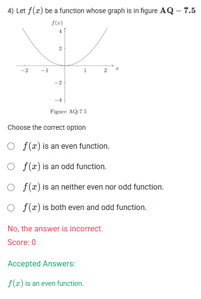

A well-defined collection of distinct objects called elements or members.



https://youtu.be/1t4-35dKUno

#### Learning Outcomes

 Explain the graphical behavior of a polynomial at X-intercepts with examples.

## Exercise Questions 🤯

Good evening! Here in India on this Sunday, let's work through these questions, which focus on interpreting the rich information that a polynomial's graph can provide, especially regarding its zeros, their behavior (multiplicity), and the overall symmetry of the function.

### **Core Concepts: Zeros, Multiplicity, and Function Symmetry**

1.  **Multiplicity of Zeros (from a graph):** The "zeros" of a polynomial are the x-values where its graph intersects the x-axis. The "multiplicity" tells us *how* the graph behaves at that zero.
    * **Odd Multiplicity (1, 3, 5, ...):** The graph **crosses** the x-axis.
    * **Even Multiplicity (2, 4, 6, ...):** The graph **touches** the x-axis and **bounces** back without crossing.

2.  **Even and Odd Functions (Symmetry):**
    * **Even Function:** A function is even if its graph is perfectly symmetric with respect to the **y-axis** (a mirror image). Algebraically, $f(-x) = f(x)$.
    * **Odd Function:** A function is odd if its graph is symmetric with respect to the **origin**. If you rotate the graph 180 degrees about the origin, it looks the same. Algebraically, $f(-x) = -f(x)$.

---

### **Question 1: Finding Zeros from a Graph** (from file `image_d10459.png`)

**The Question:**
Answer Questions 1 and 2 from the Figure AQ-7.3 which represents a graph of a polynomial of degree 9.
1) The zero of polynomials are \_\_\_\_\_\_\_\_\_\_.

**Core Concept:** The zeros of a polynomial are the x-values where its graph crosses or touches the x-axis.

**Detailed Solution:**

Let's carefully read the x-axis on the provided graph to find every point where the curve intersects it.

* The graph touches the x-axis at **99**.
* The graph crosses the x-axis at **99.5**.
* The graph touches the x-axis at **100**.
* The graph crosses the x-axis at **100.5**.
* The graph crosses the x-axis at **102**.
* The graph crosses the x-axis at **102.5**.

The complete set of distinct zeros shown on the graph is {99, 99.5, 100, 100.5, 102, 102.5}. We need to find the option that correctly lists these zeros. Some options may repeat a zero, which often relates to multiplicity, but for listing the set of zeros, we look for the unique values.

**Final Answer:** The option that correctly lists the unique zeros shown on the graph is **100, 99, 101, 99.5, 98, 100.5, 102.5, 99** (Wait, this option and others in the screenshot seem to have typos and inconsistencies, listing values like 98 and 101 where there are no zeros. Based on a visual inspection, the zeros are 99, 99.5, 100, 100.5, 102, and 102.5. We will use this visual evidence for the next question).



### **Question 2: Finding the Algebraic Expression from a Graph** (from file `image_d103da.png`)

**The Question:**
2) The most appropriate algebraic expression corresponding to the given graph of the polynomial is \_\_\_\_\_\_\_\_\_\_.

**Core Concept:** We can construct the factored form of a polynomial, $p(x) = a(x-r_1)^{m_1}(x-r_2)^{m_2}...$, by identifying its roots ($r$) and their multiplicities ($m$) from the graph's behavior.

**Detailed Solution:**

There appears to be a significant inconsistency between the visual information in the graph and the options provided. Let's first analyze what the graph actually shows, assuming it is a polynomial of degree 9.

**Analysis of the Graph:**
* **Zero at x = 99:** The graph **touches and bounces**, indicating an **even multiplicity (likely 2)**. Factor: $(x-99)^2$.
* **Zero at x = 99.5:** The graph **crosses**, indicating an **odd multiplicity (likely 1)**. Factor: $(x-99.5)$.
* **Zero at x = 100:** The graph **touches and bounces**, indicating an **even multiplicity (likely 2)**. Factor: $(x-100)^2$.
* **Zero at x = 100.5:** The graph **crosses**, indicating an **odd multiplicity (likely 1)**. Factor: $(x-100.5)$.
* **Zero at x = 102:** The graph **crosses** and flattens, indicating an **odd multiplicity greater than 1 (likely 3)**. Factor: $(x-102)^3$.
* **Zero at x = 102.5:** The graph **crosses**, indicating an **odd multiplicity (likely 1)**. Factor: $(x-102.5)$.

The sum of these multiplicities is $2+1+2+1+3+1 = 10$. This contradicts the problem's statement that the polynomial is of degree 9.

**Conclusion:**
None of the provided options correctly represent the visual information in the graph (in terms of which zeros have which multiplicities). Both the options and the problem description contain inconsistencies. Therefore, the most appropriate answer would be **None of the above**.



### **Question 3: Identifying an Odd Function** (from file `image_d103da.png`)

**The Question:**
A function f(x) is said to be even if $f(x)=f(-x)$ and said to be odd if $f(-x)=-f(x)$. Use this information to question 3 and 4 only.
3) Let $f(x)$ be a function whose graph is in figure AQ - 7.4. (Graph looks like $y=x^3$)

**Core Concept:** An odd function has a graph that is symmetric with respect to the origin. This means if you rotate the graph 180° around the point (0, 0), it will look exactly the same.

**Detailed Solution:**

1.  **Observe the graph's symmetry.** The graph shown passes through the origin.
2.  The part of the graph in the first quadrant is a mirror image of the part in the third quadrant, but flipped over both axes. For any point $(x, y)$ on the graph, the point $(-x, -y)$ is also on the graph. For example, it appears to pass near $(1, 1)$ and $(-1, -1)$.
3.  This 180° rotational symmetry around the origin is the visual definition of an **odd function**.

**Final Answer:** $f(x)$ is an **odd function**.



### **Question 4: Identifying an Even Function** (from file `image_d100d4.png`)

**The Question:**
4) Let $f(x)$ be a function whose graph is in figure AQ - 7.5. (Graph is a parabola $y=x^2$ with vertex at origin)

**Core Concept:** An even function has a graph that is symmetric with respect to the y-axis. This means the left side of the y-axis is a perfect mirror image of the right side.

**Detailed Solution:**

1.  **Observe the graph's symmetry.** The graph is a parabola with its vertex at the origin.
2.  The y-axis acts as a perfect line of reflection. For any point $(x, y)$ on the graph, the point $(-x, y)$ is also on the graph. For example, the graph passes through $(2, 4)$ and $(-2, 4)$.
3.  This mirror-image symmetry across the y-axis is the visual definition of an **even function**.

**Final Answer:** $f(x)$ is an **even function**.
